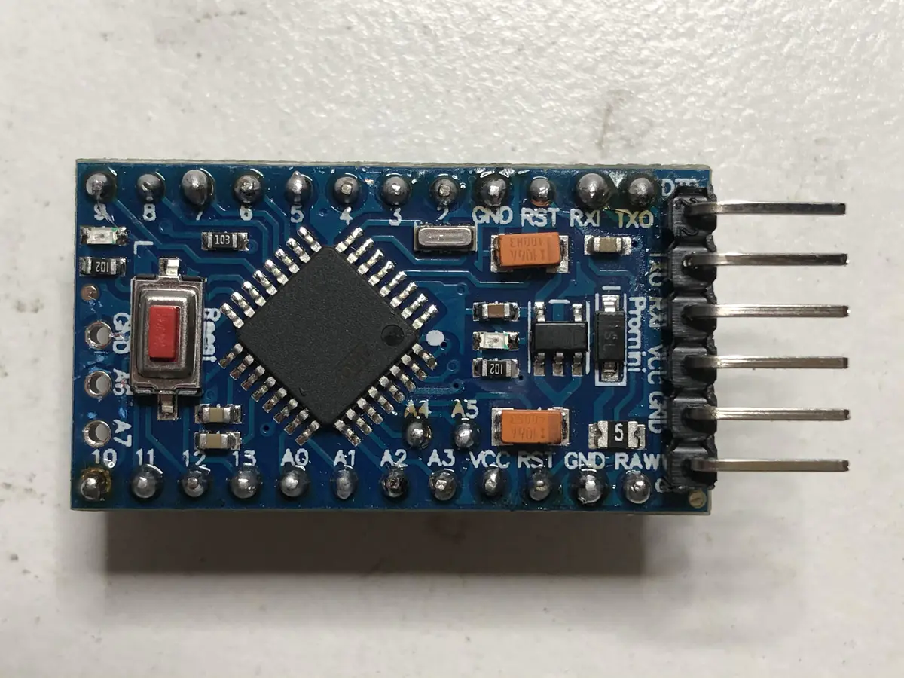
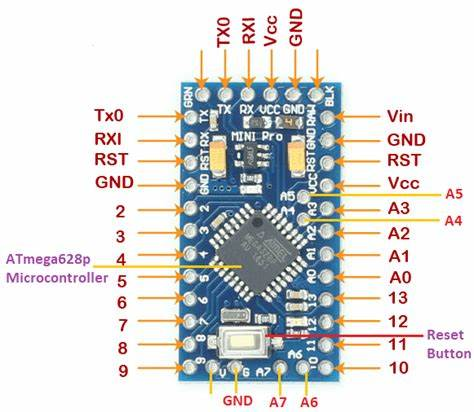
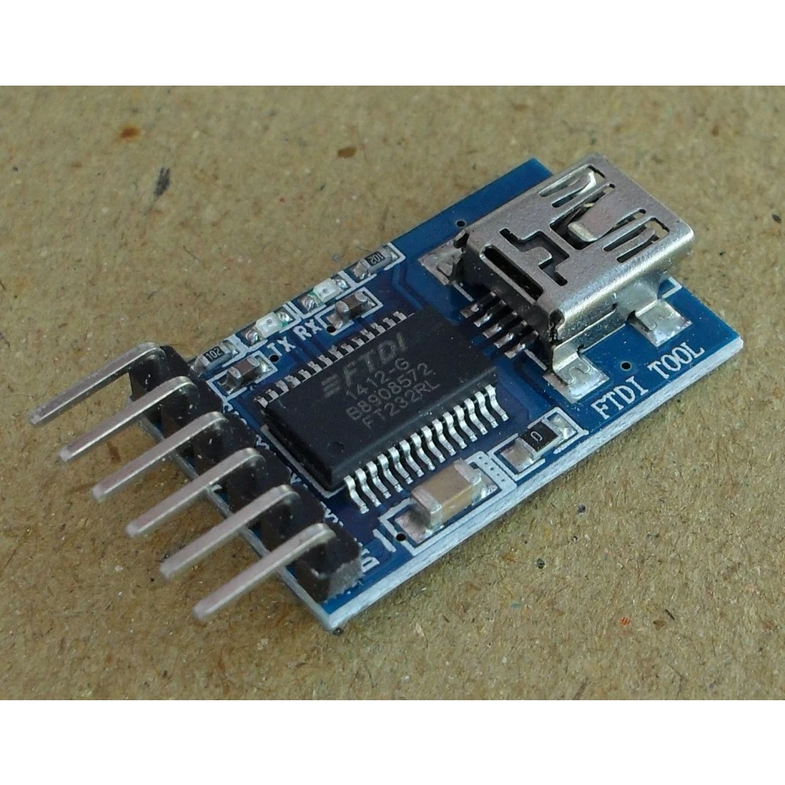
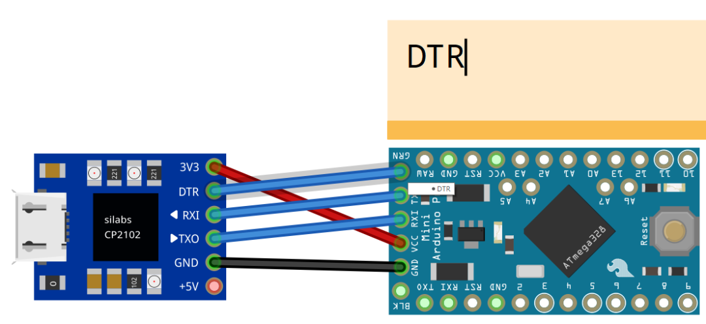
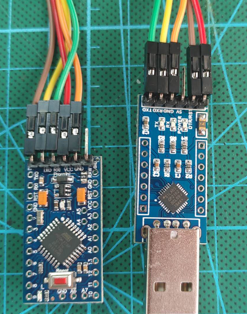
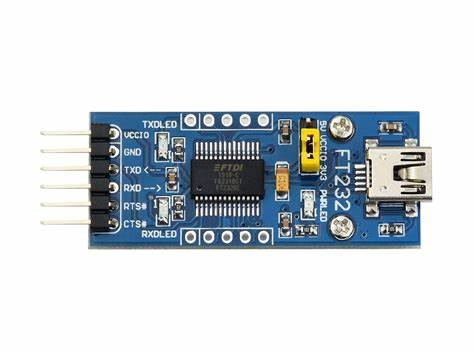
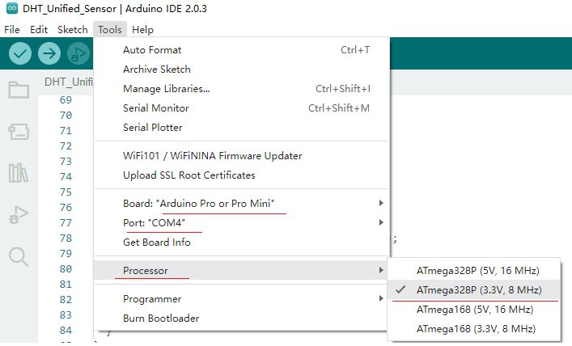

# Arduino Pro Mini 初步

## 1 Arduino Pro Mini 简介

Arduino Pro Mini 是基于ATmega328单片机的开发板，有两个版本:

* VCC:5v / CPU:16MHz
* VCC:3.3v / CPU:8MHz

## 2 Arduino Pro Mini烧录程序

Arduino Pro mini 是不带USB程序下载口的，需要开发者自己搭建USB下载模块。

Ardunio Pro Mini烧写程序使用UART的，可以使用常见的3线UART，也可以使用带流控的5线UART

**带流控的5线UART**

**3线UART**

这个是标准的方式，实际的USB下载模块有差异需要做对应处理。

### 2.1 USB-TTL模块连接Arduino Pro mini

目前，我们有2种类型的USB-TTL模块：

* TD1232-1：有DTR针
* T232：没有DTR针

**FTD1232-1和FT232连接Mini的方式问题，已经解决**

#### 2.1.1 有DTR针的FTD1232-1模块

有DTR的USB-TTL模块FTD1232-1

FTD1232-1和Arduino的连接方式，如下图：

* GND：接mini的GND

* VCC：接mini的VCC

* TXD: 接mini 的RXD

* RXD:接mini的TXD

* DTR：接mini的DTR

#### 2.1.2 没有DTR的FT232模块

**FT232模块**

FT232模块没有DTR，烧录程序时，需要在底部出现上传两字的时候就要按下pro min 的复位reset键，然后UST-TTL模块上会有LED不断闪烁，说明正在烧录程序，过一会即可烧录成功。需要按reset才可以，比较麻烦

FTD232和Arduino的连接方式

* VCC10 --> 接mini的VCC
* GND --> 接mini的GND(BLK)
* TXD --> 接mini的RXD
* RXD --> 接mini的TXD
* RTS --> 接mini的DTR
* CTS --> 接mini的GND

**异常处理**

上载程序时，找不到COM，需要关闭IDE,重新运行IDE（IDE的多个实例，使用COM冲突）

### 2.2 Arduino配置

设定开发板的类型和同学端口

1. Board:Auduino Pro or Pro Mini
2. Port:"COM4"
3. Process:ATmega328P(3.3V,8Mhz)

### 2.3 测试烧录程序

使用Example中的Basics的Blink,测试烧录程序

