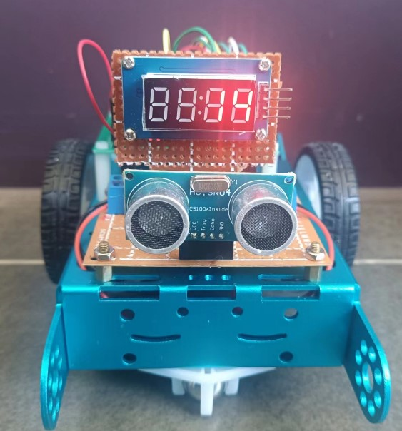
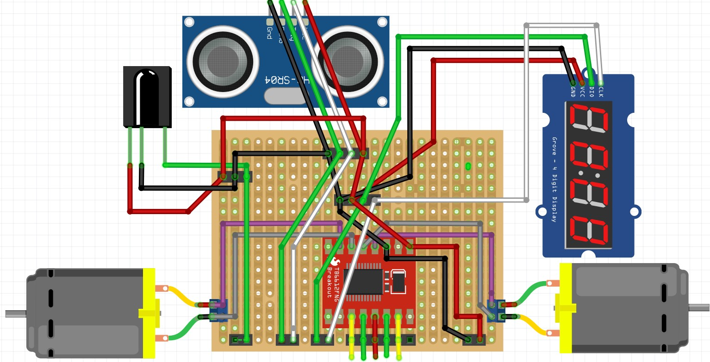

# 基于ESP32-C3的WIFI控制Mini Car

## 简介

小车使用ESP32-C3作为控制器，提供以下功能：

* 红外，WIFI控制小车前进，后退，左、右转动
* 超声避障
* 数码管显示前方物体距离

以有利于学习的原则进行小车硬件的设计。设计了：

* ESP32-C3开发扩展板。开发扩展板引出所有接口，提供锂电池电源的连接端子，方便开发
* 小车控制元件板。元件板上的所有模块都是通过排座插入，方便重复使用

小车控制系统通过杜邦线连接两板实现。



## WIFI遥控

1. 打开控制板上的电源，启动小车WIFI服务
2. 连接小车的WIFI热点：ESP32-C3,  密码：12345678
3. 浏览器访问小车Web服务：http://192.168.4.1


## 元件

* 开发版：ESP32-C3核心开发简约版 x1
* 电机驱动：DRV8833 x1
* 降压模块：迷你DC降压模块，固定输出5V x1
* 小车底盘：2WD铝合金智能小车底盘一套 x1
* 超声模块：HC-SR04 x1
* 数码管：TM1637 4位数码管
* 红外遥控：
  * 接收模块：VS1838B x1
  * 遥控器：[21 Keys](https://hobbycomponents.com/wired-wireless/464-low-profile-21-button-infrared-ir-remote)  x1
* 开关：SS-12D00,3脚2档,直插立式 拨动开关
* 洞洞板： 
    * 单面环氧板，绿油，5*7CM x1
    * 单面玻纤版，黄油，5*7CM x2
    * 单面电木板，5*7CM x1
* 电线:  
   * 30AWG，彩色电路板飞线
   * 22AWG, 1007电子线，红色，黑色
* PCB接线柱：KF301-2P,间距5.08mm,铜脚 x3
* 排针：16P  x2, 4P x1
* 排座：2P x6, 4P x1, 6P x2, 8P x2,  16P x2
* 电池:
   * 16850锂电池 21
   * 二节16850锂电池盒 x1
* 铜柱：M3*6+6，单通 x4
* 尼龙柱：M2.5*20+6，单通
* 螺母：
  * 不锈钢 M3  x4 
  *  尼龙 M2.5 x4
* 螺丝
  * 不锈钢 M2*8 x4
  * 不锈钢 M3*8 x2
  * 尼龙 M2.5*8 x2
* 杜邦线：
  * 公转公，10CM x2
  * 母转公，10CM x10

## 小车控制板

### ESP32-C3扩展板

ESP32-C3扩展板通过在一块5x7CM洞洞板上使用ESP32-C3核心开发简约版，集成DC-DC升压模块实现。板子通过排针输出所有ESP32-C3接口，通过排座输出5V电源接口，使用接线端子连接7.4V电池。

模块：
 * ESP32-C3核心开发简约版
 * 7.4V降压5V的降压模块

输出：
  * 2x16P排针引出所有ESP32-C3核心开发版精简版接口
  * 2x2P排座，提供2组5V电源接口 

输入：
  * 2P接线柱连接3.7V锂电池

    

### 元件板

小车控制元件安装在一块5x7CM洞洞板上，提供排座接入电源，引出元件接口；通过接线端子提供电机连接口

板载：
  * DRV8833
  * 红外接受器
  * 超声
  * TM1637 4位数码管

排针：
  * 2P排座用于连接5V电源
  * 1P排座，红外接受器
  * 2P排座，超声
  * 2P排座，TM1637 4位数码管
  * 5P排座，DRV8833

接线端子：
  * 2P接线端子，电机连接口

   

### 电路板连接

ESP32-C3扩展板和元件板的杜邦线连接


## 元件及连线

### ESP32-C3开发简约版


### DRV8833电机驱动


#### 电机驱动和ESP32-C3连线

| DRV8833      |  ESP32-C3       |  
|--------------|-----------------|
| VM           |  +5 Power  公用 |  
| GND          |  GND            | 
| STBY         |  +3.3  Pin18    |
| AIN1         |  GPIO 01 绿     | 
| AIN2         |  GPIO 00 黄     |
| BIN1         |  GPIO 03  绿    |
| BIN2         |  GPIO 10 黄     |

```c
// Motor A Right
int motor1Pin1 = 1;  //AIN1绿色
int motor1Pin2 = 0;  //AIN2黄色

// Motor B
int motor2Pin1 = 3;   //  BIN1 绿色
int motor2Pin2 = 10;  // BIN2 黄色
```

#### 电机驱动和电机连线

| DRV8833    |  Motor-C3       |  
|------------|-----------------|
| AO1        |  Left Motor 红  | 
| AO2        |  Left Motor 黑  |
| BO1        |  Right Motor 红 |
| Bo2        |  Right Motor 黑 |

### 超声

```c
int trigPin = 5;  // Trigger 白色
int echoPin = 4;  // Echo 绿色
```

### TM163 4位数码管

```c
#define CLK 2  //  白色
#define DIO 7  // 绿色
```

### 电源

二节16850电池，连接开发扩展板的电源接线柱


                        

