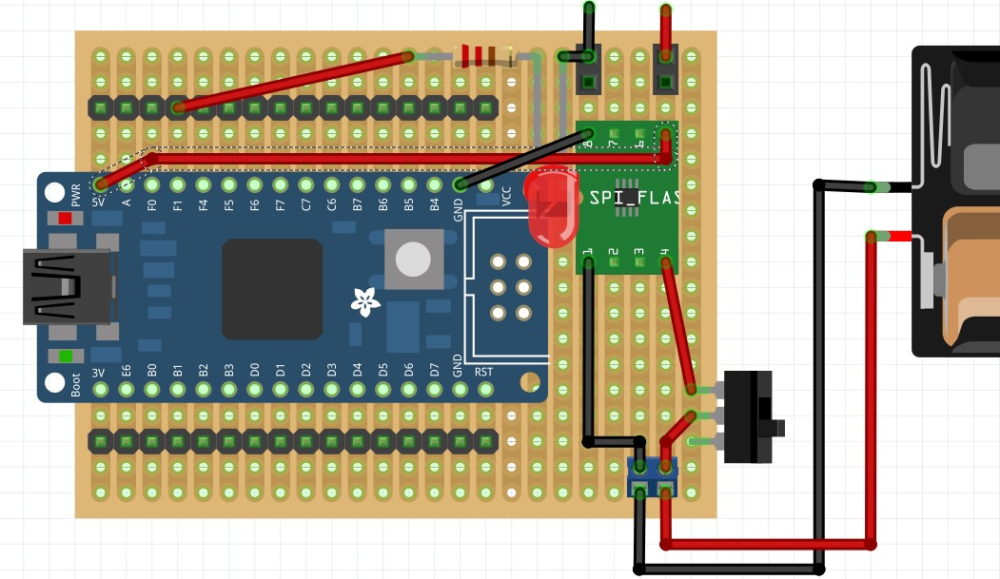

# 基于ESP32-C3的Mini-Car

## 功能

* 红外，WIFI控制小车前进，后退，左、右转动
* 超声避障

## 元件

* 开发版：ESP32-C3核心开发版(精简版) x1
* 电机驱动：DRV8833 x1
* 升压模块：Mini版DC-DC升压模块3.7V转5V输出 x1
* 小车底盘：2WD铝合金智能小车底盘一套 x1
* 超声模块：HC-SR04 x1
* 数码管：TM1637 4位数码管
* 红外遥控：
  * 接收器：VS1838B x1
  * 遥控器：[21 Keys](https://hobbycomponents.com/wired-wireless/464-low-profile-21-button-infrared-ir-remote)  x1
* 开关：SS-12D00,3脚2档,直插立式 拨动开关
* 洞洞板： 
    * 单面环氧板，绿油，5*7CM x1
    * 单面玻纤版，黄油，5*7CM x2
* 电线:  
   * 30AWG，彩色电路板飞线
   * 22AWG, 1007电子线，红色，黑色
* PCB接线柱：KF301-2P,间距5.08mm,铜脚 x3
* 排针：16P  x2, 4P x1
* 排座：2P x6, 4P x1, 6P x2, 8P x2,  16P x2
* 电池:
   * 16850锂电池 x1
   * 一节16850锂电池盒 x1
* 铜柱：M3*10+6，单通 x4
* 尼龙柱：M2.5*20+6，单通
* 螺母：
  * 不锈钢 M3  x4 
  *  尼龙  M2.5 x4
* 螺丝
  * 不锈钢 M3 x2
  * 尼龙 M2.5 x2
* 杜邦线：
  * 公转公，10CM x2
  * 母转公，10CM x10

## 小车电路板

小车电路板由ESP32-C3扩展板和元件板组成，两板通过杜邦线连接成小车控制系统。

### ESP32-C3扩展板

ESP32-C3扩展板通过在一块5x7CM洞洞板上使用ESP32-C3核心开发版精简版，集成DC-DC升压模块实现。板子通过排针输出所有ESP32-C3接口，通过排座输出5V电源接口
使用接线端子连接3.7V电池

模块：
 * ESP32-C3核心开发版精简版
 * 3.7到5V升压模块

输出：
  * 2x16P排针引出所有ESP32-C3核心开发版精简版接口
  * 2x2P排座，提供2组5V电源接口 

输入：
  * 2P接线柱连接3.7V锂电池

    

### 元件板

小车控制元件安装在一块5x7CM洞洞板上，提供排座接入电源，引出元件接口；通过接线端子提供电机连接口

板载：
  * DRV8833
  * 红外接受器
  * 超声
  * TM1637 4位数码管

排针：
  * 2P排座用于连接5V电源
  * 1P排座，红外接受器
  * 2P排座，超声
  * 2P排座，TM1637 4位数码管
  * 5P排座，DRV8833
接线端子：
  * 2P接线端子，电机连接口

   

### 电路板连接

ESP32-C3扩展板和元件板的杜邦线连接


## 元件针脚

### ESP32-C3核心开发版精简版


### DRV8833电机驱动


* ANI1：AO1的逻辑输入控制端口，电平0-5V 
* AIN2：AO2的逻辑输入控制端口，电平0-5V
* BNI1：BO1的逻辑输入控制端口，电平0-5V
* BIN2：BO2的逻辑输入控制端口，电平0-5V

* AO1、AO2为1路H桥输出端口，接一个直流电机的两个脚。
* BO1、BO2为2路H桥输出端口，接另一个外直接电机的两个脚。
* GND：接地。
* `VM`：芯片和电机供电脚，电压范围2.7 V – 10.8 V。
* `STBY`：接地或悬空芯片不工作，无输出，接5V工作；电平0-5V。
* NC：空脚

#### 电机驱动连线

| DRV8833      |  ESP32-C3       |  
|--------------|-----------------|
| VM           |  +5 Power  公用 |  
| GND          |  GND            | 
| STBY         |  +3.3  Pin18    |
| AIN1         |  GPIO 01 绿     | 
| AIN2         |  GPIO 00 黄     |
| BIN1         |  GPIO 03  绿    |
| BIN2         |  GPIO 10 黄     |

```c
// Motor A Right
int motor1Pin1 = 1;  //AIN1绿色
int motor1Pin2 = 0;  //AIN2黄色

// Motor B
int motor2Pin1 = 3;   //  BIN1 绿色
int motor2Pin2 = 10;  // BIN2 黄色
```

| DRV8833    |  Motor-C3       |  
|------------|-----------------|
| AO1        |  Left Motor 红  | 
| AO2        |  Left Motor 黑  |
| BO1        |  Right Motor 红 |
| Bo2        |  Right Motor 黑 |


### 电源

 一节16850电池，连接开发扩展板电源接线柱


                        

