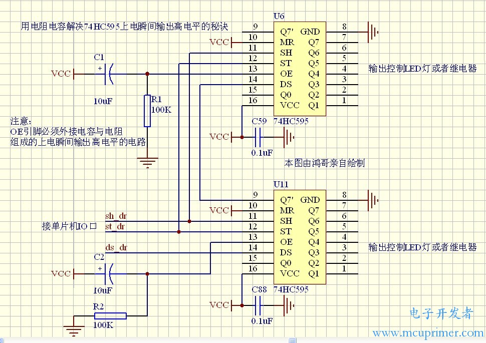

# 使用74HC595扩展端口的小车

74HCT595 is an 8-bit serial-in/serial or parallel-out shift register with a storage register and 3-state outputs.
## 74HC595上电瞬间高电平

在工控中用74HC595控制继电器，如果处理不恰当，在上电瞬间由于单片机正处于自身复位启动状态，留下了短暂的“权力真空”时间，使74HC595还未来得及被单片机初始化而输出短暂的高电平，令继电器误动作，这样的后果是很严重的。

两个秘诀可以有效解决这个问题。基本原理就是充分利用74HC595的第13引脚OE引脚特点，当OE引脚处于高电平状态时，所有的输出引脚都是高阻态的，所谓高阻态，就相当于输出引脚被断开悬空，既不属于高电平，也不属于低电平。


* 第一种秘诀：用IO口加上拉电阻，配合单片机快速初始化的方法。

在软件上，初始化代码必须先使控制`OE`引脚的IO口处于`高电平`，然后马上给`74HC595`发送所有引脚为`低电平`的代码指令，最后把`OE引脚`的IO口处于`低电平`

* 第二种秘诀：用电阻电容组成上电瞬间输出高电平电路，配合单片机快速初始化的方法

将595的OE脚扳起，OE脚通过10K电阻接到地。

将595的OE脚扳起，OE脚通过10K电阻接到地，OE脚再通过0.1uF电容到VCC。
  上电瞬间光耦导通的故障消除。

 

## 功能

* 红外遥控
* Web控制
* 超声避撞
* 车辆测速
* LED标志车辆行驶状态

## 背景

传感器和控制信号较多，超过Arduino UNO原始端口数量，使用74HC595扩展输出控制：
 
* 左右电机：IN1-IN4
* 2个LED

但是电机的PWM不能使用74HC595输出，因为74HC595的OE控制了其`所有`输出的PWM


## 代码

* 加入IR： Lab_2WD_10_2_74HC595_IR.ino
* 加入softserial： Lab_2WD_10_3_74HC595_IR_Web.ino
* 加入速度测量：Lab_2WD_10_4_74HC595_IR_Web_speed.ino
* 加入超声： Lab_2WD_10_5_74HC595_IR_Web_speed_ul.ino

* ESP8266: Lab_2WD_10_5_ESP8266_web_softserial`.ino


## 硬件安置

* 2个小面包板安装于第2层纸板

 * LED，IR，Ultrasonic,LED,74HC595N
 * Pro mini和ESP8266

* 2个测速传感器，安装于第一层底盘,电源连接到传感器的小面包板，信号连接到Arduino Pro Mini

* N298N安装于第2层纸板

* 电池安置于第一层底盘


## 端口安排

Arduino 的2-13号端口，全部使用。保留0，1串口

**74HC595**

* latchPin： RCLK (Register Clock / Latch) (12) -> Arduino D13(黄色)
* clockPin: SRCLK (Shift Register Clock) (11)    -> Arduino D4（白色）
* dataPin: SER (Serial Input)(14)  -> Arduino D12(绿色)
```c
#define LATCH_PIN 13 // Latch pin of 74HC595 is connected to Digital pin 13
#define CLOCK_PIN 4  // Clock pin of 74HC595 is connected to Digital pin 4
#define DATA_PIN 12  // Data pin of 74HC595 is connected to Digital pin 12
```
**LED**

```c
// 74hc595 黄色
#define LED_LEFT_PIN_SR 5
#define LED_RIGHT_PIN_SR 6
```

**IR**

* IR out ->Arduino D7（白色）
```c
#define IR_RECEIVE_PIN 7
```

**LN298N**

```c
// 74hc595 - motor
#define MOTOR_LEFT_FORWARD_PIN_SR 4
#define MOTOR_LEFT_BACK_PIN_SR 3
#define MOTOR_RIGHT_FORWARD_PIN_SR 1
#define MOTOR_RIGHT_BACK_PIN_SR 2
```
```c
// LN298N - Arduino
#define LEFT_PWM_PIN 6
#define RIGHT_PWM_PIN 5
```
**SofSerial**
Arduino

```c
// softserial - Arduino
#define SS_RX_PIN 10
#define SS_TX_PIN 11
```

**超声** 
Arduino
```c
#define TRIG_PIN 8    // Trigger 白色
#define ECHO_PIN  9    // Echo   绿色
```

**测速** 

速度测速需要使用中断，Arduino UNO/Pro Mini只能使用2，3

* right- 中断0 2 `灰色`
* left- 中断1 3  `绿色` 


## ESP8266连接

|ESP8266      | 连接到           |
|-------------|------------------|
| VCC3.3 红色  | 面包板 +3.3V        |
| RX 蓝色      | Pro Mini Pin 11   |
| TX 黄色      | Pro Mini Pin 10   |
| EN 橙色      | 面包板 +5V         |
| GND 黑色     | 面包板 GND        |


## 解决问题

### 红外不稳定

原因是ESP8266太近，板子电源红色光，信号干扰 

需要注意：红外接收器在板子上的位置，不适靠近LED光源，特别是红色

### 车不直线前进

* 根据测速，调整了2侧PWM使得测量速度基本一致，
* 用线固定了松动的左侧电机，

但是还是难以直线前进，经检测是：后面的万向轮跟转位置不正的原因，要直线前进，需要预先摆正万向轮

##  参考

* https://maker.pro/arduino/tutorial/how-to-extend-the-number-of-io-lines-on-an-arduino

Extending `inputs` requires a parallel to `serial` shift register.

* 74HCT165 8-bit `parallel-in/serial out` shift register

* https://www.woolseyworkshop.com/2021/02/04/adding-digital-io-to-your-arduino-part-1-the-74hc595/

* https://www.woolseyworkshop.com/2021/02/18/adding-digital-io-to-your-arduino-part-2-the-74hc165/

* https://www.woolseyworkshop.com/2021/03/18/adding-digital-io-to-your-arduino-part-3-the-mcp23017/