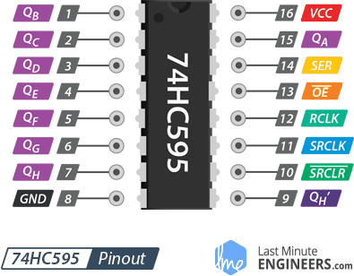
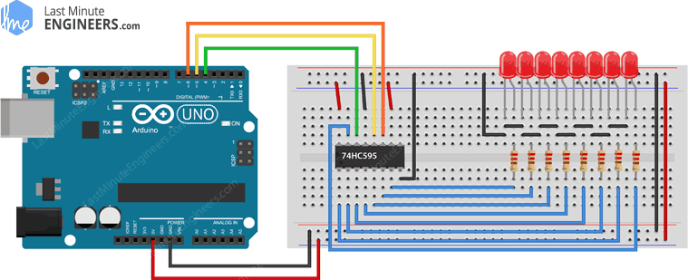
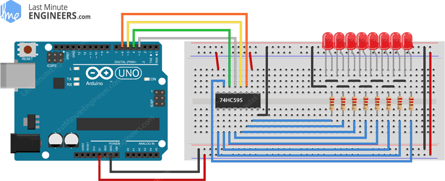

## 74hHC595扩展output

3个转8个，可以解决小车输出端口不足问题

*  https://lastminuteengineers.com/74hc595-shift-register-arduino-tutorial/

使用74HC595输出控制：左右电机（IN1-IN4),2个LED，可以多出3个Pin, 电机的PWM不适宜使用74HC595，因为74HC595的OE控制了`所有`输出的PWM




## 问题

芯片直接插在面包板上，不使用芯片座，芯片座在面包板，插不好接触不良。

### 4HC595 Shift Register Pinout

* SER (Serial Input) pin is used to `send data into the shift register` one bit at a time.

* SRCLK (Shift Register Clock) is the `clock for the shift-register` and is `positive`-edge triggered. This means that the bits are pushed in on the rising edge of the clock.

* RCLK (Register Clock / Latch - 锁存器) is a very important pin. When this pin is pulled `HIGH`, the contents of the Shift Register are copied into the Storage/Latch Register, which eventually appears at the output. So, the `latch` pin can be seen as the `last` step before we see our results at the output.

* OE (Output Enable) is also an active-low pin: when pulled HIGH, the output pins are disabled (set to high impedance state). When it is pulled `LOW`, the `output pins function` normally.

* SRCLR (Shift Register Clear) pin allows us to `reset` the entire Shift Register, setting all the bits to zero. Because this is an active-low pin, we must pull the SRCLR pin `LOW` to perform the `reset`.

## Arduino Example1  Code

Here is an example sketch that turns on each LED in turn until they are all on, then turns them all off and the cycle repeats.

### 连线

 The three control pins of the 74HC595, namely the `latch, clock, and data pin`, 

* latchPin： RCLK (Register Clock / Latch) (12) -> Arduino D5
* clockPin: SRCLK (Shift Register Clock) (11)    -> Arduino D6
* dataPin: SER (Serial Input)(14)  -> Arduino D4

* GND(8) -> Arduino GND
* VCC(16)  -> Arduino +5V
* OE(13)  -> Arduino GND
* SRCLR(10)  -> Arduino +5V



## Arduino Example 2: Controlling Brightness Using PWM

Here’s another project based on the same setup but with a slight variation:

we manipulate the `OE` pin on the IC to control the brightness of the output LEDs!

* When this pin is set to `HIGH,` the output pins are `disabled `(remember, it is active-low). 

* When OE is set to `LOW`, the output pins function `normally`.

### 连线

```c
int outputEnablePin = 3;    // OE pin of 74HC595 is connected to PWM pin 3
```

* OE(13)  -> Arduino D3




bitSet(x, n)

* Sets (writes a `1` to) a bit of a numeric variable.

Parameters
* x: the numeric variable whose bit to set.
* n: which bit to set, starting at 0 for the least-significant (`rightmost`) bit.
