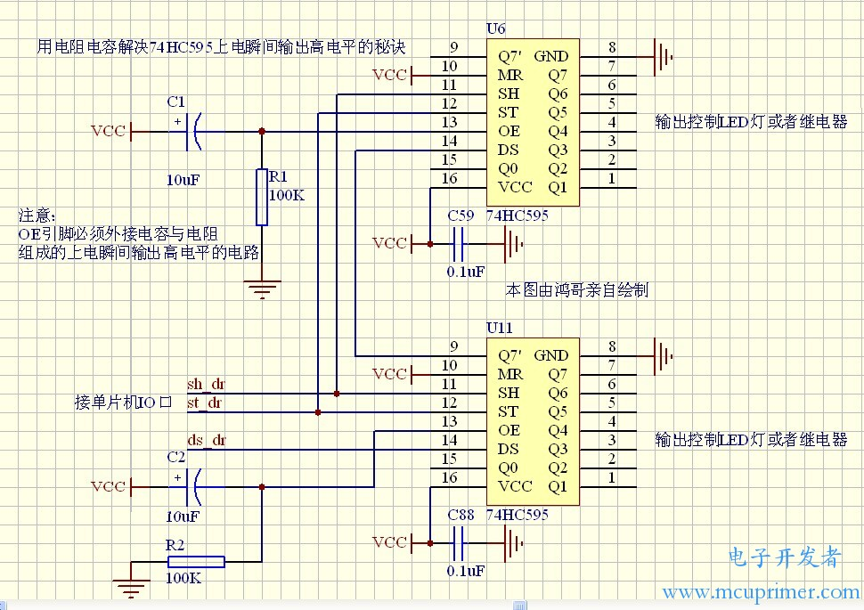

## 74HC595上电瞬间高电平

## 实验
 

电容10uF时，还是会有短时间的高电平输出

改为47uF后，正常


## 有关分析

Why use a capacitor on the 5v pin with a 74HC595
* Decoupling 
http://www.thebox.myzen.co.uk/Tutorial/De-coupling.html


在工控中用74HC595控制继电器，如果处理不恰当，在上电瞬间由于单片机正处于自身复位启动状态，留下了短暂的“权力真空”时间，使74HC595还未来得及被单片机初始化而输出短暂的高电平，令继电器误动作，这样的后果是很严重的。

两个秘诀可以有效解决这个问题。基本原理就是充分利用74HC595的第13引脚OE引脚特点，当OE引脚处于高电平状态时，所有的输出引脚都是高阻态的，所谓高阻态，就相当于输出引脚被断开悬空，既不属于高电平，也不属于低电平。


* 第一种秘诀：用IO口加上拉电阻，配合单片机快速初始化的方法。

在软件上，初始化代码必须先使控制`OE`引脚的IO口处于`高电平`，然后马上给`74HC595`发送所有引脚为`低电平`的代码指令，最后把`OE引脚`的IO口处于`低电平`

* 第二种秘诀：用电阻电容组成上电瞬间输出高电平电路，配合单片机快速初始化的方法

将595的OE脚扳起，OE脚通过10K电阻接到地。

将595的OE脚扳起，OE脚通过10K电阻接到地，OE脚再通过0.1uF电容到VCC。
  上电瞬间光耦导通的故障消除。

 


### How do you configure the 74HC595 to have low pin outputs at power on?

* https://electronics.stackexchange.com/questions/586736/how-do-you-configure-the-74hc595-to-have-low-pin-outputs-at-power-on

   * To make the outputs low at power-up you can have `OE` asserted `high` and put `pull-down` resistors on the outputs.

   * The obvious option for connecting the OE pin is to put a pull-up resistor on it and also connect it to a pin on your Microcontroller. 


下面方法无效

1. It seems if I put a 10K resistor from the clock pin to ground this prevents the all pins high on boot problem.

2. Pulling the latch pin to a stable level or the data pin to ground should have the same effect. Just pick one

The 74HC595 has an active LOW output enable. Connect one of the arduino pins to the OE\ pin and be sure to also put a pull up resistor on it. Then until you specifically enable it by driving the OE\ pin low they will stay off. Program the OE\ pin to high before defining it as an output.

74HC595 all outputs go high at startup
* https://forum.arduino.cc/t/74hc595-all-outputs-go-high-at-startup/703394

Why would a 74HC595 return all logic highs on all its outputs at start up

* https://electronics.stackexchange.com/questions/277314/why-would-a-74hc595-return-all-logic-highs-on-all-its-outputs-at-start-up

Serial to Parallel Shifting-Out with a 74HC595

https://docs.arduino.cc/tutorials/communication/guide-to-shift-out

## 参考

* https://www.amobbs.com/thread-5427190-1-1.html

使用的是74HC595，除了实现正常功能外我希望能做到2点：
* 1.上电时输出高阻。避免误动作（上电时595的寄存器的值是随机的）
* 2.单片机软件复位，输出保持前一个状态，也是避免误动作。

网上用的比较多的有2中方案：

1. 输出使能OE上拉，单片机控制。OE高电平时输出高阻。这个能解决`上电`的问题，但是单片机复位时管脚也是高阻，所以输出没法保持，单片机一复位又回到高阻。

2. 输出OE接RC。上电的时候OE先是高，再低。这样上电时是高阻输出，然后OE拉低后，输出是not change（高阻）。后面单片机输出想要的值，复位时由于OE是低，输出保持。

我采用的是方案二，但是上电时还是一定几率的出现输出随机的数。还有一种办法能解决，就是OE由高变低前，先将寄存器的值刷成想要的，单片机软复位的时候不刷。但是这样也太麻烦了吧。

```c
VCC
|
___
___  22uf
|
|------OE
_
|_|  47K
|
GND
```

我就是这样做的，2.2uF+160K，有时候CPU复位慢了，就不行了，电容换成4.7uF，就没有问题了。