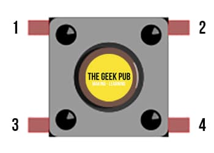
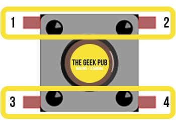
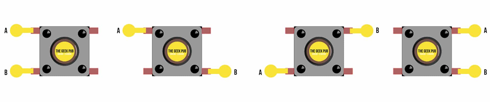
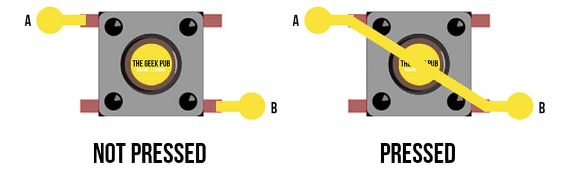
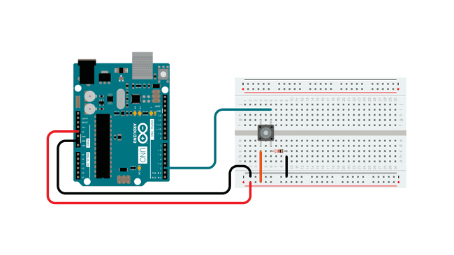

#  Button

## The Momentary Button

Before we dive into the Arduino button tutorial itself, it is super important that you understand the basics of buttons themselves. 

For this section, we’re going to focus primarily on the most common button used in Arduino projects: `the momentary push button`.

The momentary push button does exactly as it sounds. When you press it, it creates an electrical connection between a set of contacts. When you release it, it disconnects. In other words, the button only passes current when the button is held pressed.

### Understanding Button Pinouts

Let’s take a look at a standard button you’ll see in most Arduino kits.



These standard buttons have four pins. `1, 2, 3, and 4`. But they might not work the way you would first imagine that they do. Some of the pins are always electrically connected!



In a standard momentary button, pins `1 & 2`, and pins `3 & 4` are electrically connected at all times! So you can only switch between pins `1 & 3` and pins `2 & 4`! This confuses so many beginners.

So why in the world does the button have more pins than it does switches? Well it turns out the answer is very simple. These buttons are designed to be placed on and soldered to circuit boards. Having four solder points will make sure the switch stays in place without warping when pressed.

However, this also gives us some flexibility when connecting our switches to a project. There are four possible ways to connect wiring to this switch. Use whichever one is easiest in your circuit board or breadboard layouts!




### Understanding How the Buttons Work

Buttons work by making an electrical connection Internally. When the button is not pressed, no connection is made. When the button is pressed, a connection is created,




## layout

Connect three wires to the board. The first goes from one leg of the pushbutton through a pull-down resistor (here 10k ohm) to ground. The second goes from the corresponding leg of the pushbutton to the 5 volt supply. The third connects to a digital I/O pin (here pin 2) which reads the button's state.

When the pushbutton is open (unpressed) there is no connection between the two legs of the pushbutton, so the pin is connected to ground (through the pull-down resistor) and we read a LOW. When the button is closed (pressed), it makes a connection between its two legs, connecting the pin to voltage, so that we read a HIGH. (The pin is still connected to ground, but the resistor resists the flow of current, so the path of least resistance is to +5V.)

If you disconnect the digital I/O pin from everything, the LED may blink erratically. This is because the input is "floating" - that is, not connected to either voltage or ground. It will more or less randomly return either HIGH or LOW. That's why you need a pull-down resistor in the circuit.



## code

### button_led

```c
/*

  Button

  Turns on and off a light emitting diode(LED) connected to digital pin 13,
  when pressing a pushbutton attached to pin 2.

  The circuit:
  - LED attached from pin 13 to ground through 220 ohm resistor
  - pushbutton attached to pin 2 from +5V
  - 10K resistor attached to pin 2 from ground

  - Note: on most Arduinos there is already an LED on the board
    attached to pin 13.

  created 2005
  by DojoDave <http://www.0j0.org>
  modified 30 Aug 2011
  by Tom Igoe

  This example code is in the public domain.

  https://www.arduino.cc/en/Tutorial/BuiltInExamples/Button
*/

// constants won't change. They're used here to set pin numbers:
const int buttonPin = 2;  // the number of the pushbutton pin 7
const int ledPin = 13;    // the number of the LED pin

// variables will change:
int buttonState = 0;  // variable for reading the pushbutton status

void setup() {
  // initialize the LED pin as an output:
  pinMode(ledPin, OUTPUT);
  // initialize the pushbutton pin as an input:
  pinMode(buttonPin, INPUT);
}

void loop() {
  // read the state of the pushbutton value:
  buttonState = digitalRead(buttonPin);

  // check if the pushbutton is pressed. If it is, the buttonState is HIGH:
  if (buttonState == HIGH) {
    // turn LED on:
    digitalWrite(ledPin, HIGH);
  } else {
    // turn LED off:
    digitalWrite(ledPin, LOW);
  }
}
```


### button_led state

```c
/*
  State change detection (edge detection)

  Often, you don't need to know the state of a digital input all the time, but
  you just need to know when the input changes from one state to another.
  For example, you want to know when a button goes from OFF to ON. This is called
  state change detection, or edge detection.

  This example shows how to detect when a button or button changes from off to on
  and on to off.

  The circuit:
  - pushbutton attached to pin 2 from +5V
  - 10 kilohm resistor attached to pin 2 from ground
  - LED attached from pin 13 to ground through 220 ohm resistor (or use the
    built-in LED on most Arduino boards)

  created  27 Sep 2005
  modified 30 Aug 2011
  by Tom Igoe

  This example code is in the public domain.

  https://www.arduino.cc/en/Tutorial/BuiltInExamples/StateChangeDetection
*/

// this constant won't change:
const int buttonPin = 2;  // the pin that the pushbutton is attached to
const int ledPin = 13;    // the pin that the LED is attached to

// Variables will change:
int buttonPushCounter = 0;  // counter for the number of button presses
int buttonState = 0;        // current state of the button
int lastButtonState = 0;    // previous state of the button

void setup() {
  // initialize the button pin as a input:
  pinMode(buttonPin, INPUT);
  // initialize the LED as an output:
  pinMode(ledPin, OUTPUT);
  // initialize serial communication:
  Serial.begin(9600);
}


void loop() {
  // read the pushbutton input pin:
  buttonState = digitalRead(buttonPin);

  // compare the buttonState to its previous state
  if (buttonState != lastButtonState) {
    // if the state has changed, increment the counter
    if (buttonState == HIGH) {
      // if the current state is HIGH then the button went from off to on:
      buttonPushCounter++;
      Serial.println("on");
      Serial.print("number of button pushes: ");
      Serial.println(buttonPushCounter);
    } else {
      // if the current state is LOW then the button went from on to off:
      Serial.println("off");
    }
    // Delay a little bit to avoid bouncing
    delay(50);
  }
  // save the current state as the last state, for next time through the loop
  lastButtonState = buttonState;


  // turns on the LED every four button pushes by checking the modulo of the
  // button push counter. the modulo function gives you the remainder of the
  // division of two numbers:
  if (buttonPushCounter % 4 == 0) {
    digitalWrite(ledPin, HIGH);
  } else {
    digitalWrite(ledPin, LOW);
  }
}

```

## Reference

* https://www.thegeekpub.com/275328/arduino-button-tutorial/

* https://www.thegeekpub.com/275412/use-a-button-to-toggle-an-led-arduino-tutorial/

* https://arduinogetstarted.com/tutorials/arduino-button