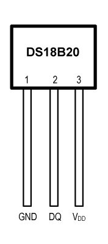
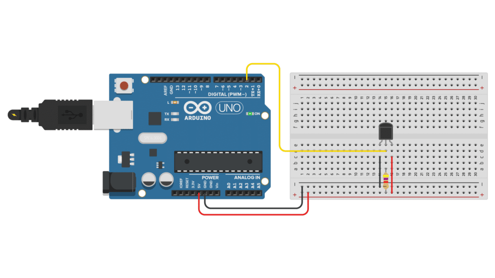

# DS18B20

* https://www.makerguides.com/ds18b20-arduino-tutorial/

## DallasTemperature库

DallasTemperature library by Miles Burton.

## DS18B20传感器和连接

Note that pin 1 (GND) is the `leftmost` pin when the `flat` side of the sensor (with the text printed on it) is facing towards you.

Next, connect `the middle pin (DQ)` to any of the digital pins of the Arduino. In this Arduino Pro Mini case, I used digital pin 12. 

You also have to add a `4.7 `kΩ pull-up resistor between `the DQ pin and 5 V`. 

This will keep the idle state for the 1-Wire bus high.

DS18B20 digital temperature sensor connections

|DS18B20     |Arduino |
|------------|--------|
|Pin 1 (GND) |	GND   |
|Pin 2 (DQ)	 |Pin 2 Arduino and via 4.7 kΩ resistor to 5V|
|PIN 3 (VDD) |	5V    |

 