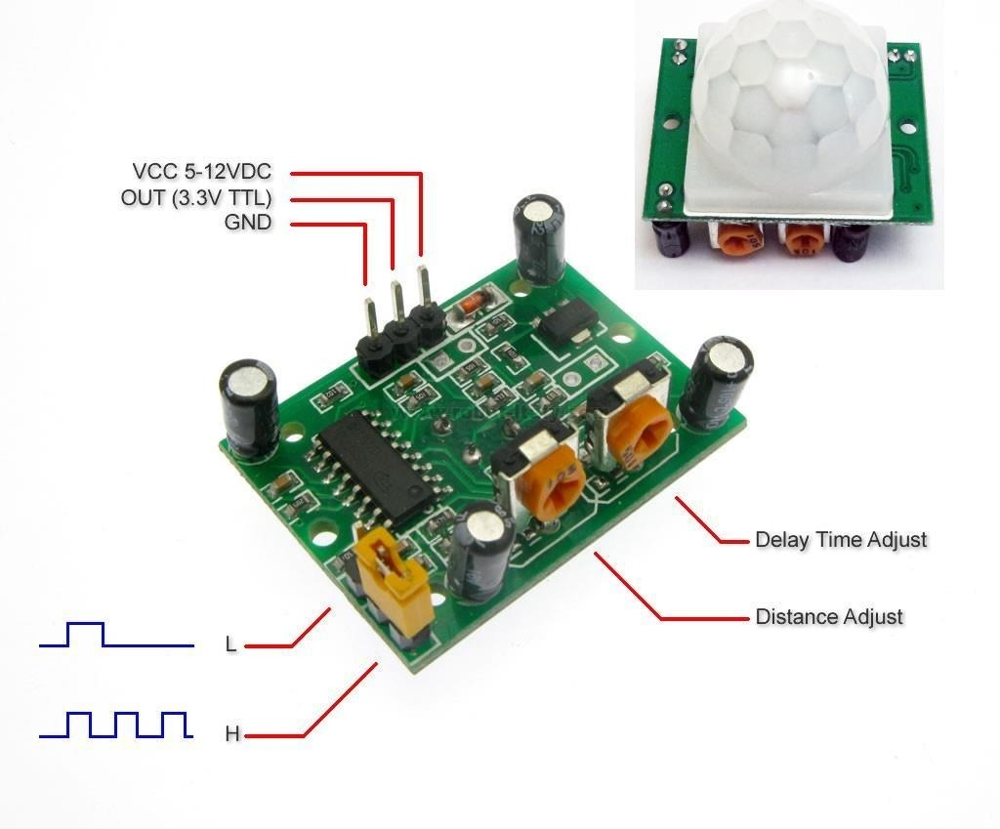
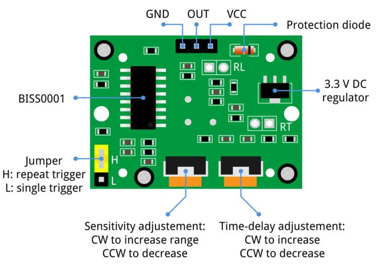
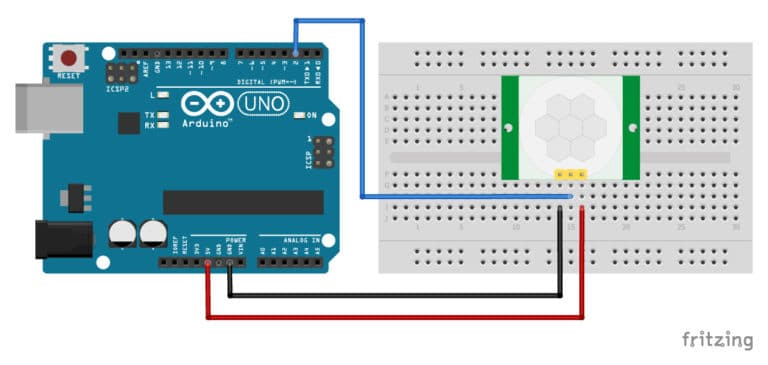

# 人体感应


## HC-SR501

HC-SR501 是一款基于热释电效应的人体热释运动传感器，能检测到人体或者动物上发出的红外线。

这个传感器模块可以通过两个旋钮调节检测 3 ~ 7 米的范围，5秒至5分钟的延迟时间，还可以通过跳线来选择单次触发以及重复触发模式。





## 连线




## code

```c

/* Example code for HC-SR501 PIR motion sensor with Arduino. More info: www.www.makerguides.com */

// Define connection pins:
#define pirPin 2
#define ledPin 13

// Create variables:
int val = 0;
bool motionState = false; // We start with no motion detected.

void setup() {
  // Configure the pins as input or output:
  pinMode(ledPin, OUTPUT);
  pinMode(pirPin, INPUT);

  // Begin serial communication at a baud rate of 9600:
  Serial.begin(9600);
}

void loop() {
  // Read out the pirPin and store as val:
  val = digitalRead(pirPin);

  // If motion is detected (pirPin = HIGH), do the following:
  if (val == HIGH) {
    digitalWrite(ledPin, HIGH); // Turn on the on-board LED.

    // Change the motion state to true (motion detected):
    if (motionState == false) {
      Serial.println("Motion detected!");
      motionState = true;
    }
  }

  // If no motion is detected (pirPin = LOW), do the following:
  else {
    digitalWrite(ledPin, LOW); // Turn off the on-board LED.

    // Change the motion state to false (no motion):
    if (motionState == true) {
      Serial.println("Motion ended!");
      motionState = false;
    }
  }
}
```


## 参考


* https://www.makerguides.com/hc-sr501-arduino-tutorial/