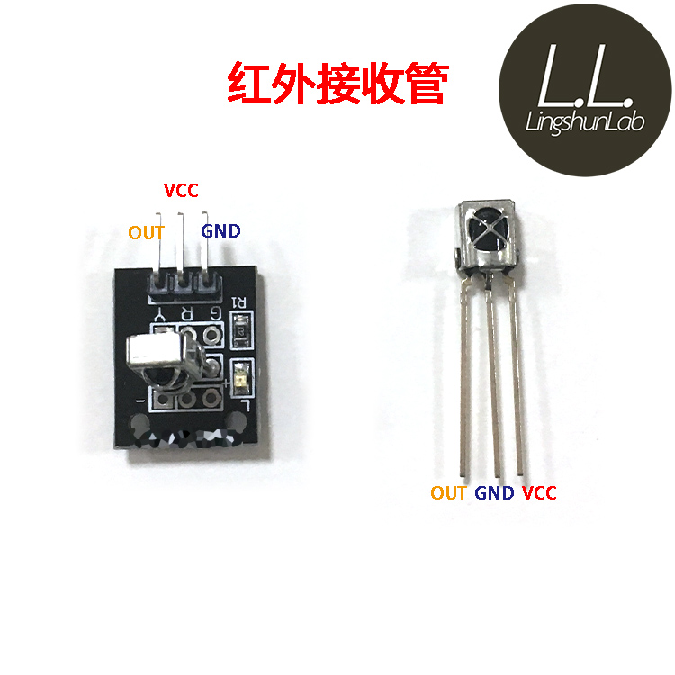

# 红外

## 连线




## decode遥控器

使用库： IRremote https://github.com/Arduino-IRremote/Arduino-IRremote

运行代码通过串口观察，每个按键的命令16进制的数值，编制按键对应的相应。示例中是控制左右3个LED灯的亮和灭

* IRremote GND ->Arduino GND
* IRremote VCC ->Arduino +5
* IRremote out ->Arduino Pin11 //不用<IRremote.hpp>定义的pin2


白遥控器：
* 2 - 0x18 
* 4-  0x8
* 6 - 0x5A 
* 8 - 0x52 
* 5 - 0x1C stop
* + - 0X15
* - - 0x7

黑遥控器：
* 2 - 0x11
* 4 - 0x14 
* 6 - 0x16
* 8 - 0x19
* 5 - 0x15 stop
* vol+ 0X1
* vol- 0x9


华为盒子 

* ^ -0xCA
* <- 0x99 
* -> 0xC1
* back 0xD2
* stop(ok) 0xCE
* +  0x80
* - 0x81


```c
#define DECODE_NEC          // Includes Apple and Onkyo
#include <Arduino.h>

#include "PinDefinitionsAndMore.h" // Define macros for input and output pin etc.
#include <IRremote.hpp>

#define IR_RECEIVE_PIN 11  // 不用<IRremote.hpp>定义的pin2

void setup() {
    Serial.begin(115200);
    // Just to know which program is running on my Arduino
    Serial.println(F("START " __FILE__ " from " __DATE__ "\r\nUsing library version " VERSION_IRREMOTE));

    // Start the receiver and if not 3. parameter specified, take LED_BUILTIN pin from the internal boards definition as default feedback LED
    IrReceiver.begin(IR_RECEIVE_PIN, ENABLE_LED_FEEDBACK);

    Serial.print(F("Ready to receive IR signals of protocols: "));
    printActiveIRProtocols(&Serial);
    Serial.println(F("at pin " STR(IR_RECEIVE_PIN)));
}

void loop() {
    if (IrReceiver.decode()) {

        /*
         * Print a short summary of received data
         */
        IrReceiver.printIRResultShort(&Serial);
        IrReceiver.printIRSendUsage(&Serial);
        if (IrReceiver.decodedIRData.protocol == UNKNOWN) {
            Serial.println(F("Received noise or an unknown (or not yet enabled) protocol"));
            // We have an unknown protocol here, print more info
            IrReceiver.printIRResultRawFormatted(&Serial, true);
        }
        Serial.println();
        IrReceiver.resume(); // Enable receiving of the next value
    }
}
```

## 遥控LED


* Led left -> Arduino pin8
* Led Right -> Arduino pin9
* Led back -> Arduino pin10

```c


/*
 * Specify which protocol(s) should be used for decoding.
 * If no protocol is defined, all protocols (except Bang&Olufsen) are active.
 * This must be done before the #include <IRremote.hpp>
 */

#define DECODE_NEC          // Includes Apple and Onkyo

#define LED_Left 8
#define LED_Right 9
#define LED_Back 10

#include <Arduino.h>

#include "PinDefinitionsAndMore.h" // Define macros for input and output pin etc.
#include <IRremote.hpp>

#define  IR_RECEIVE_PIN 11

void setup() {
    pinMode(LED_Left, OUTPUT);
    pinMode(LED_Right, OUTPUT);
    pinMode(LED_Back, OUTPUT);
    Serial.begin(115200);
    // Just to know which program is running on my Arduino
    Serial.println(F("START " __FILE__ " from " __DATE__ "\r\nUsing library version " VERSION_IRREMOTE));

    // Start the receiver and if not 3. parameter specified, take LED_BUILTIN pin from the internal boards definition as default feedback LED
    IrReceiver.begin(IR_RECEIVE_PIN, ENABLE_LED_FEEDBACK);

    Serial.print(F("Ready to receive IR signals of protocols: "));
    printActiveIRProtocols(&Serial);
    Serial.println(F("at pin " STR(IR_RECEIVE_PIN)));
}

void loop() {
    /*
     * Check if received data is available and if yes, try to decode it.
     * Decoded result is in the IrReceiver.decodedIRData structure.
     *
     * E.g. command is in IrReceiver.decodedIRData.command
     * address is in command is in IrReceiver.decodedIRData.address
     * and up to 32 bit raw data in IrReceiver.decodedIRData.decodedRawData
     */
    if (IrReceiver.decode()) {

        /*
         * Print a short summary of received data
         */
        IrReceiver.printIRResultShort(&Serial);
        IrReceiver.printIRSendUsage(&Serial);
        if (IrReceiver.decodedIRData.protocol == UNKNOWN) {
            Serial.println(F("Received noise or an unknown (or not yet enabled) protocol"));
            // We have an unknown protocol here, print more info
            IrReceiver.printIRResultRawFormatted(&Serial, true);
        }
        Serial.println();

        /*
         * !!!Important!!! Enable receiving of the next value,
         * since receiving has stopped after the end of the current received data packet.
         */
        IrReceiver.resume(); // Enable receiving of the next value

        /*
         * Finally, check the received data and perform actions according to the received command
         */
        if (IrReceiver.decodedIRData.command == 0x11) {
            // forward - 2
             digitalWrite(LED_Left, HIGH);  
             digitalWrite(LED_Right, HIGH);  
            digitalWrite(LED_Back, LOW);  
            
        } else if (IrReceiver.decodedIRData.command == 0x14) {
            // Left - 4 
            digitalWrite(LED_Left, HIGH);  
            digitalWrite(LED_Right, LOW);  
            digitalWrite(LED_Back, LOW);  
       
        } else if (IrReceiver.decodedIRData.command == 0x16) {
            // right - 6 
            digitalWrite(LED_Left, LOW);  
            digitalWrite(LED_Right, HIGH); 
            digitalWrite(LED_Back, LOW);   
        } else if (IrReceiver.decodedIRData.command == 0x19) {
            // back  
             digitalWrite(LED_Left, LOW);  
             digitalWrite(LED_Right, LOW);  
             digitalWrite(LED_Back, HIGH);  
        } else if (IrReceiver.decodedIRData.command == 0x0) {
            // stop  
            digitalWrite(LED_Left, LOW);  
            digitalWrite(LED_Right, LOW);  
            digitalWrite(LED_Back, LOW);  
        }
    }
}

```

## 参考

* https://github.com/Arduino-IRremote/Arduino-IRremote