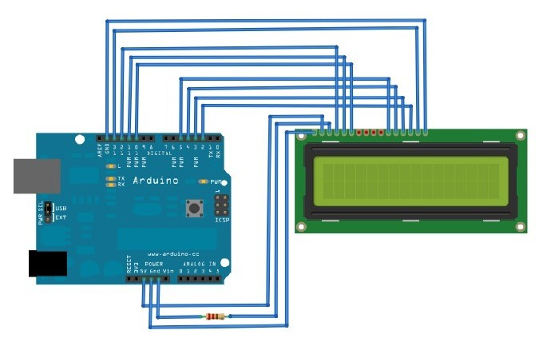

# LCD1602A

* https://docs.arduino.cc/learn/electronics/lcd-displays/

LCD模块种类超多，大小通常以“行数x字符”数来表示，比如2x16，2x8,4x20等等。

大部分LCD模块都是由背光+液晶模块组成，利用Arduino驱动也很方便。

接口方式有很多种：4位或者8位并行，3-wire，串口，I2C和SPI，LCD模块的价格也跟接口的难易程度成反比，也就是说采用4位或者8位并行的是最便宜的

市面上比较便宜的基本采用Hitachi HD44780芯片(或者兼容)方案，从外观上看，板上有16个针脚的就是这类LCD，16个pin有些是一排的，有些是双排的。
国产HJ1602A是一种工业字符型液晶蓝色2x16的点阵LCD，采用4位并行接口，能够同时显示16x2即32个字符。（ 16列2行）：
* 显示内容为2行，每行显示16个字符，每个字符大小为5×8点阵。

下面是16个针脚对应的Arduino的针脚以及它们的作用：

LCD	Arduino	作用

1 (GND)	GND	供电(-)
2 (VDD)	5v	供电(+)
3 (VO/Contrast)	GND	显示对比度控制，接地表示最大对比
4 (RS)	12	寄存器选择
5 (RW)	11	读写模式选择
6 (E/enable)	10	允许寄存器写入
11 (DB4)	5	读写数据
12 (DB5)	4	读写数据
13 (DB6)	3	读写数据
14 (DB7)	2	读写数据
15 (BL1/Backlight1)	13	背光供电(+)
16 (BL2/Backlight2)	GND	背光供电(-)

## 实例1

Arduino连接2x16 LCD显示Hello world!

### 组件

Arduino 1块
HJ1602A 1块
4.7k电阻 1个
面包板 1块
接线 若干

### 连线



### code

```c
/*
  LiquidCrystal Library - F*ck GFW!
 
 Demonstrates the use a 16x2 LCD display.  The LiquidCrystal
 library works with all LCD displays that are compatible with the 
 Hitachi HD44780 driver. There are many of them out there, and you
 can usually tell them by the 16-pin interface.
*/

// include the library code:
#include <LiquidCrystal.h>

// The circuit:
// rs (LCD pin 4) to Arduino pin 12
// rw (LCD pin 5) to Arduino pin 11
// enable (LCD pin 6) to Arduino pin 10
// LCD pin 15 to Arduino pin 13
// LCD pins d4, d5, d6, d7 to Arduino pins 5, 4, 3, 2
LiquidCrystal lcd(12, 11, 10, 5, 4, 3, 2);

int backLight = 13;    // pin 13 will control the backlight

void setup()
{
  pinMode(backLight, OUTPUT);
  digitalWrite(backLight, HIGH); // turn backlight on. Replace 'HIGH' with 'LOW' to turn it off.
  lcd.begin(16,2);              // columns, rows.  use 16,2 for a 16x2 LCD, etc.
  lcd.clear();                  // start with a blank screen
  lcd.setCursor(0,0);           // set cursor to column 0, row 0 (the first row)
  lcd.print("F*ck GFW!");    // change this text to whatever you like. keep it clean.
  lcd.setCursor(0,1);           // set cursor to column 0, row 1
  lcd.print("naozhendang.com");
}

void loop()
{
}
```
这里我们要到的是一个叫LiquidCrystal的库，这也是4位/8位并行接
口LCD常用到的库，封装了很多常用的LCD功能使用背光LCD使用了PWM10，使得AVR内部定时器Timer1和Timer2 都无法使用


## Arduino实现温湿度显示在LCD显示屏上

## 首先准备工作：

1、  Arduino主板一个
2、  面包板一块
3、  连接线若干
4、  DHT11温湿度传感器1枚
5、  1602A LCD显示屏一块(带背光)
6、  可变电阻一个（或1K电阻一枚，但试验之后发现电阻效果不好，最好是可变电阻）

准备好这些器件后，就开始进行连线编码了。这里有很多需要注意的问题，我所使用的LCD显示屏排针是没有焊接到屏幕上的，所以参考例程连线以及编码后发现屏幕根本就不是预期中显示我想让他显示的字符，只是显示一排共16个小方块，可变电阻怎么调节都没有效果。上网查了很多资料也没有搞定，连线检查了多遍可以保证绝对没有错误。于是在淘宝店家那里咨询了一下，店长说需要把排针焊接到屏幕上才行，不然可能接触不良。开始半信半疑，想办法搞到锡焊焊接上之后果然OK了。如果有人遇到这种问题，可以焊接上再试试。

### LCD1602引脚详细说明：

引脚编号	名称	说明

1	Vss	接地 (0V)
2	Vdd	电源 (+5V)
3	Vo	接可变电阻中间引脚
4	RS	Register Select:      1: D0 – D7 当做资料解释     0: D0 – D7 当做指令解释
5	RW	Read/Write mode:   1:从 LCD 读取资料   0: 写资料到 LCD 
6	E	Enable
7	D0	Bit 0 LSB
8	D1	Bit 1
9	D2	Bit 2
10	D3	Bit 3
11	D4	Bit 4
12	D5	Bit 5
13	D6	Bit 6
14	D7	Bit 7 MSB
15	A	背光(电源正极)
16	K	背光(GND)


