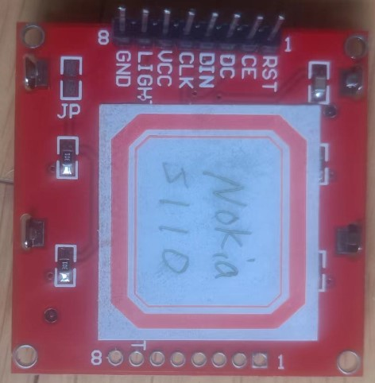

# Monochrome Nokia 5110 LCD Displays

Interfacing Arduino with Nokia 5110 LCD and DHT11 sensor

* https://simple-circuit.com/arduino-nokia-5110-lcd-dht11-sensor/

* https://randomnerdtutorials.com/complete-guide-for-nokia-5110-lcd-with-arduino/

* https://fritzing.org/projects/nokia5110-lcd-with-dht11-temperature-and-humidity

## Nokia 5110 LCD Displays



1) RST – Reset                  Pin3
2) CE – Chip Enable             Pin4 
3) D/C – Data/Command Selection Pin5
4) DIN – Serial Input           Pin6    
5) CLK – Clock Input            Pin7
6) VCC – 3.3V                 -3.3V 
7) LIGHT – Backlight Control - +5V
8) GND – Ground               GND 

## layout

```c
// Software SPI (slower updates, more flexible pin options):
// pin 7 - Serial clock out (SCLK)
// pin 6 - Serial data out (DIN)
// pin 5 - Data/Command select (D/C)
// pin 4 - LCD chip select (CS)
// pin 3 - LCD reset (RST)
```
## 使用Adafruit库测试

在线安装时，部分从githua 下载会失败，可以下载器zip文件，然后，通过include库的方式加入库

```c
// Software SPI (slower updates, more flexible pin options):
// pin 7 - Serial clock out (SCLK)
// pin 6 - Serial data out (DIN)
// pin 5 - Data/Command select (D/C)
// pin 4 - LCD chip select (CS)
// pin 3 - LCD reset (RST)
Adafruit_PCD8544 display = Adafruit_PCD8544(7, 6, 5, 4, 3);
```