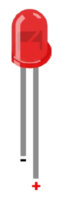
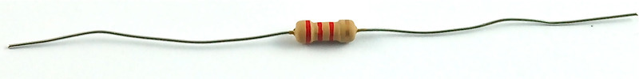
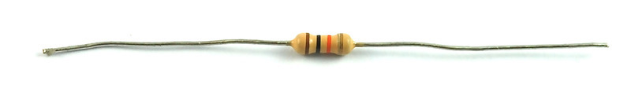
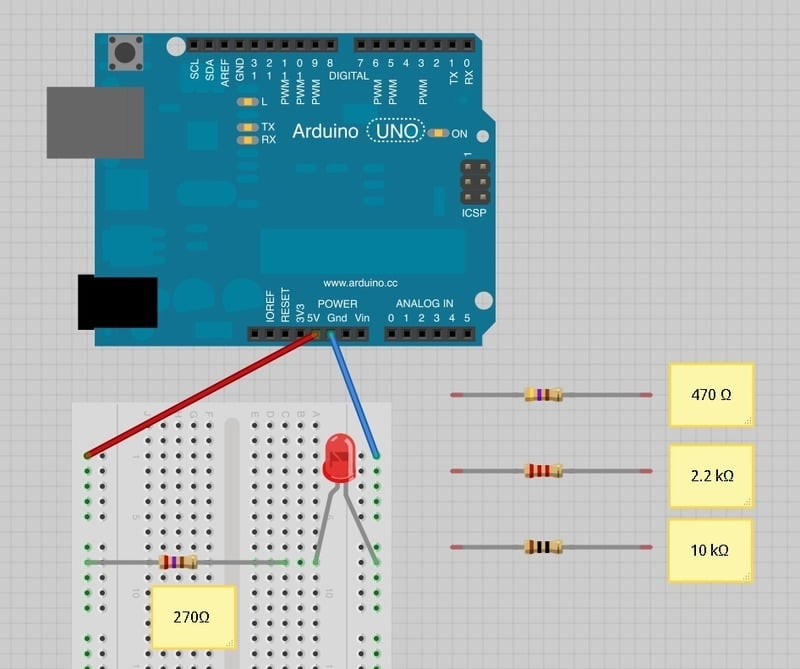
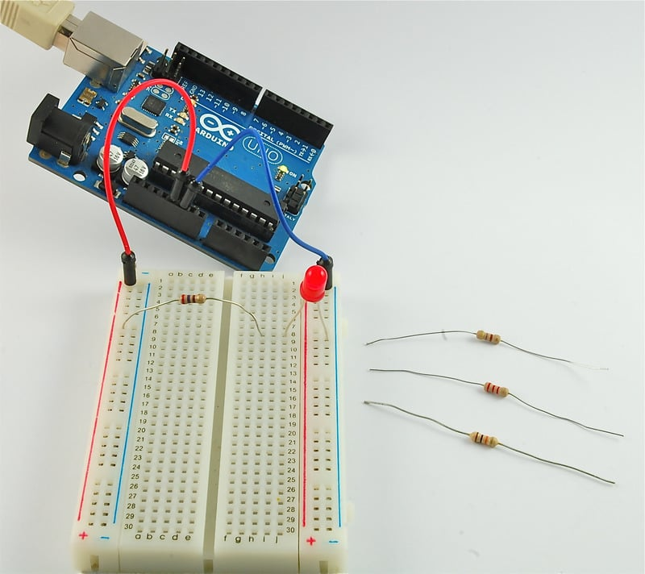

# LED

## LED-Blink

## 元件

* 220Ω电阻 1个
* LED 1个

### LED

发光二极管(LED)正负极

LED长脚（支架小）为正，短脚（支架大）为负



### 电阻

Each color has a number, as follows:
* Black 0
* Brown 1
* Red 2
* Orange 3
* Yellow 4
* Green 5
* Blue 6
* Purple 7
* Gray 8
* sWhite 9

* `220Ω电阻的五色环` 红 红  黑 黑  金 

 |  红  |红    | 黑   |  黑   |  金 |
 |:----:|:----:|:----:|:-----:|:---:|
 |  2   | 2     |  0   |  0    |  5% |

 s

* 270 Ω Resistor (red, purple, brown stripes) 


* 470 Ω Resistor (yellow, purple, brown stripes) 


* 2.2 kΩ Resistor (red, red, red stripes) 



* 10 kΩ Resistor (brown, black, orange stripes) 



## LED 实例

### 使用Arduino供电直接点亮LED电路图

* Power Pin 5v -> red line
* Pin gnd -> black line





### 使用PWM Pin使LED-Blink

* PWM Pin 9 ->red line
* Pin GND -> black line

```c
/*
  Blink
*/

int led = 9;         // the PWM pin the LED is attached to
// the setup function runs once when you press reset or power the board
void setup() {
  // initialize digital pin LED_BUILTIN as an output.
  pinMode(led, OUTPUT);
}

// the loop function runs over and over again forever
void loop() {
  digitalWrite(led, HIGH);  // turn the LED on (HIGH is the voltage level)
  delay(1000);                      // wait for a second
  digitalWrite(led, LOW);   // turn the LED off by making the voltage LOW
  delay(1000);                      // wait for a second
}
```

## LED Blink without delay

* https://arduinogetstarted.com/tutorials/arduino-led-blink-without-delay

### code

```c
/*
 * Created by ArduinoGetStarted.com
 *
 * This example code is in the public domain
 *
 * Tutorial page: https://arduinogetstarted.com/tutorials/arduino-led-blink-without-delay
 */

// constants won't change:
const int LED_PIN_1 = 3;            // the number of the LED 1 pin
const int LED_PIN_2 = LED_BUILTIN;  // the number of the LED 2 pin
const int BUTTON_PIN = 7;           // the number of the button pin

const long BLINK_INTERVAL_1 = 1000;  // interval at which to blink LED 1 (milliseconds)
const long BLINK_INTERVAL_2 = 500;   // interval at which to blink LED 2 (milliseconds)

// Variables will change:
int ledState_1 = LOW;   // ledState used to set the LED 1
int ledState_2 = LOW;   // ledState used to set the LED 2

int previousButtonState = LOW; // will store last time button was updated

unsigned long previousMillis_1 = 0;   // will store last time LED 1 was updated
unsigned long previousMillis_2 = 0;   // will store last time LED 2 was updated

void setup() {
  Serial.begin(9600);

  // set the digital pin as output:
  pinMode(LED_PIN_1, OUTPUT);
  pinMode(LED_PIN_2, OUTPUT);
  
  // set the digital pin as an input:
  pinMode(BUTTON_PIN, INPUT);
}

void loop() {
  unsigned long currentMillis = millis();

  // check to see if it's time to blink the LED 1
  if (currentMillis - previousMillis_1 >= BLINK_INTERVAL_1) {
    // if the LED is off turn it on and vice-versa:
    ledState_1 = (ledState_1 == LOW) ? HIGH : LOW;

    // set the LED with the ledState of the variable:
    digitalWrite(LED_PIN_1, ledState_1);

    // save the last time you blinked the LED
    previousMillis_1 = currentMillis;
  }

  // check to see if it's time to blink the LED 2
  if (currentMillis - previousMillis_2 >= BLINK_INTERVAL_2) {
    // if the LED is off turn it on and vice-versa:
    ledState_2 = (ledState_2 == LOW) ? HIGH : LOW;

    // set the LED with the ledState of the variable:
    digitalWrite(LED_PIN_2, ledState_2);

    // save the last time you blinked the LED
    previousMillis_2 = currentMillis;
  }

  // check button state's change
  int currentButtonState = digitalRead(BUTTON_PIN);

  if(currentButtonState != previousButtonState) {
    // print out the state of the button:
    Serial.println(currentButtonState);

    // save the last state of button
    previousButtonState = currentButtonState;
  }

  // DO OTHER WORKS HERE
}
```

## 实现了多个LED的分组，显示

`待补充：运行情况`