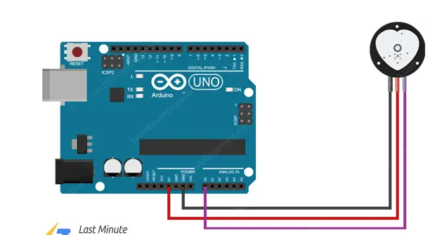

# 心率传感器Pulse Sensor示例

## 心率传感器

* https://pulsesensor.com/

心率传感器，根据人体中的血氧饱和度变化来反应心脏跳动变化，可以实时打印心率值。
本模块可在数字和模拟两种输出模式之间切换，当配有显示器时，更可以直观的显示实时血氧波形和心率值。

本产品尺寸小巧，接线简单，接在Arduino`模拟口`上使用，


## 电路




 

 使用传感器库测试

## 库

安装pulsesersor的官方库

* https://pulsesensor.com/pages/installing-our-playground-for-pulsesensor-arduino

* https://github.com/WorldFamousElectronics/PulseSensorPlayground

```c
 #include <PulseSensorPlayground.h>  
```

## 参考

* https://lastminuteengineers.com/pulse-sensor-arduino-tutorial/

* https://www.instructables.com/Pulse-Sensor-With-Arduino-Tutorial/


