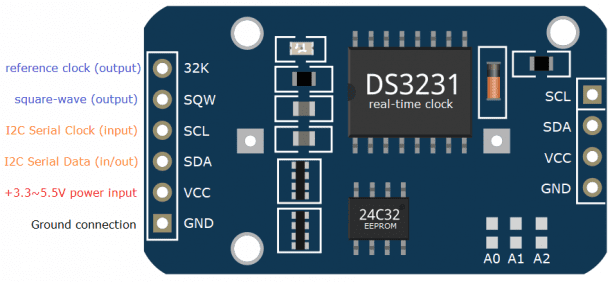
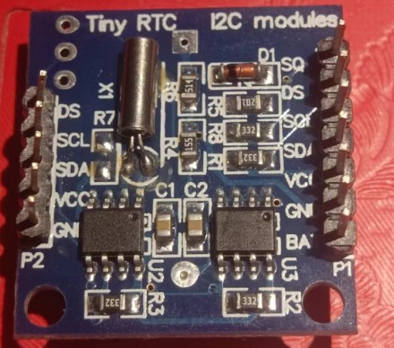
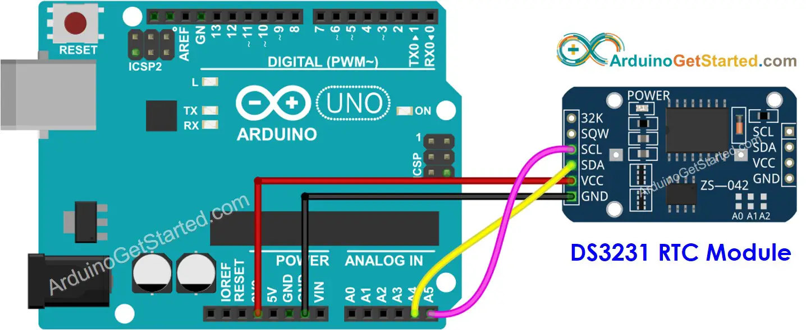

# HOW TO USE A REAL-TIME CLOCK MODULE WITH THE ARDUINO

* https://arduinogetstarted.com/tutorials/arduino-rtc

* https://www.circuitbasics.com/how-to-use-a-real-time-clock-module-with-the-arduino/

## WHY KEEP TRACK OF THE DATE AND TIME?

Keeping track of the current date/time for an Arduino has many purposes. One use for it is for recording/log purposes. For example, an Arduino Weather Station needs timestamps in recording weather data. Another example is for an Arduino digital clock or calendar. Arduino-based clocks use the current time as a timer for reminders or to execute a scheduled command via the Arduino’s I/O pins. Depending on the project, having a way to get the current date and time is very useful.

## RTC Module

Real-Time Clock (RTC) – A Real-Time Clock, or RTC for short, is an integrated circuit that keeps track of time. It uses a back-up battery to `maintain the time` in the event that the main power source is removed.

### DS3231 Module

* 32K – outputs from the DS3231 chip a very accurate 32KHz oscillator
* SQW – outputs a square-wave signal from the DS3231 chip. The frequency of the square-wave can be changed between 1Hz, 4kHz, 8kHz, or 32kHz programmatically. this pin can also be used programmed as an interrupt output.
* SCL – input pin for I2C Serial Clock
* SDA – input/output pin for I2C Serial Data
* VCC – power source input pin for the module; can be any voltage from +3.3V to +5.5V DC
* GND – Ground pin connection

The `SCL, SDA, VCC, and GND` pins at the right side of the module are connected internally at the left side pins with the same label.

### 实用模块

模块两边的 `SCL, SDA, VCC, and GND` 都可以用，作用一样

模块是自己焊接排针，排针焊接的有点歪，以后，焊接排针时需要在板子上确认`排针放正`

### layout

  RTC ->  Arduino
* SCL -> A5
* SCA -> A4
* VCC -> 3.3v
* GND -> GND

##  软件测试

使用库：https://github.com/cvmanjoo/RTC
 
使用该库的examples测试！ OK！

