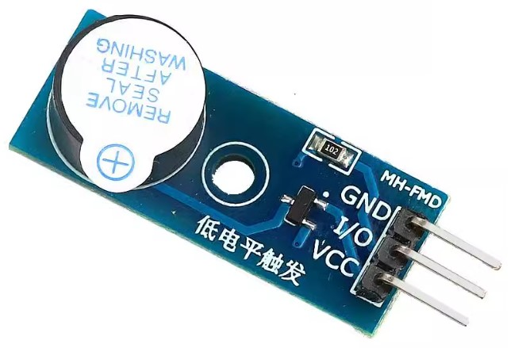

# 蜂鸣器

##  测试例程

* https://github.com/robsoncouto/arduino-songs     

蜂鸣器和蜂鸣器模块测试的song效果都较差，没有使用价值

## 测试设备

### 蜂鸣器
有源无源的区别在于：

* 有源蜂鸣器有长短脚，也就是所谓正负极，长脚为正极，短脚为负极

* 而无源蜂鸣器则没有正负极，两个引脚长度相同

有源蜂鸣器长脚为正（+），短脚为（-）

* 短脚接到 GND
* 长脚接到数字口

###  蜂鸣器模块

