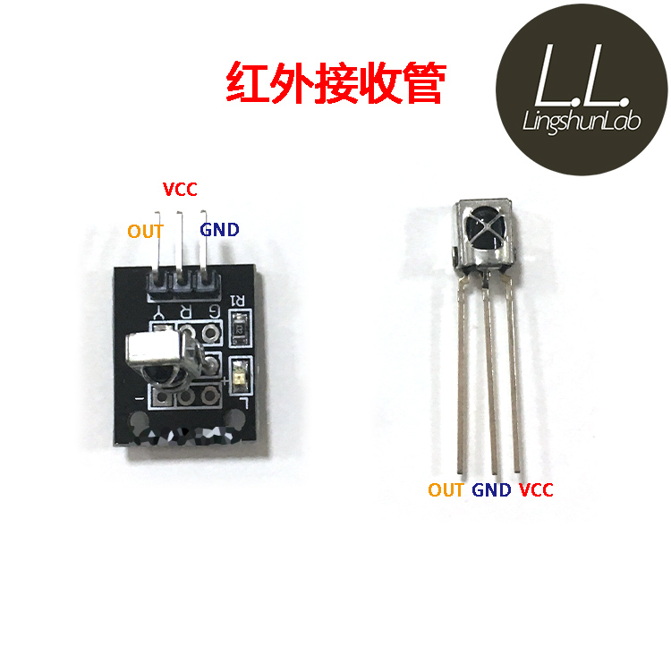
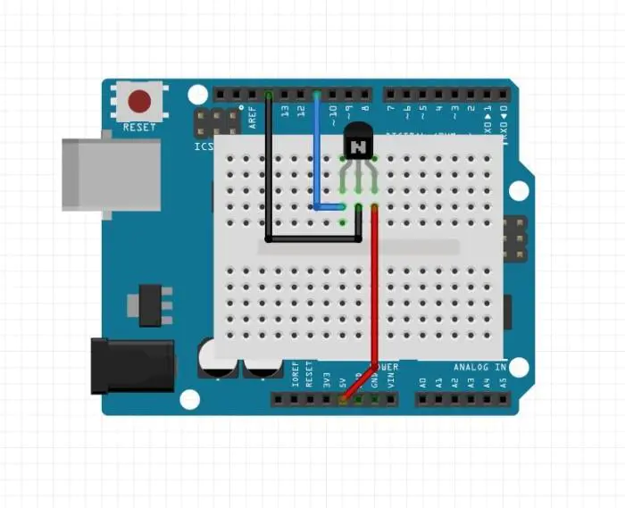
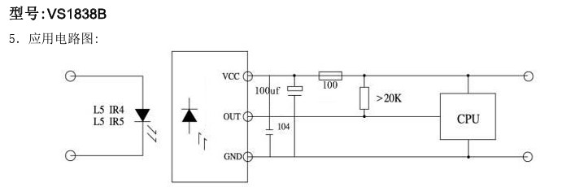

# 红外遥控

## 红外接受器

* VS1838B



* 简单连线



VS1838B的建议电路图

建议的电路图，有解偶的电容和电阻，可以有效降低噪音信号，所以，买按照电路图制作好的模块，更好。


## 红外接受器接受乱码

独立使用IR receiver没有问题，但是小车接受遥控器的信号为噪声

### 测试分析

小车全功能代码中，代码中执行向软串口发送数据，红外就乱码，注释掉就正常。 `原因？`

```c
serializeJson(sensor_json, espSerial);
```

目前看不是电路复杂问题，是Arduino向通过软串口向ESP8266发送数据的问题，原因不明！

###  网上问答

https://forum.arduino.cc/t/tsop4838-ir-decoder-random-noise/129185

* Sounds like a decoupling problem. You IR datasheet will suggest a cap and resistor on the IR receiver's lines to reduce noise.

* https://electronics.stackexchange.com/questions/460042/why-does-my-ir-receiver-spit-out-random-codes-when-my-motor-is-on

`Motors` are `noisy`, and they dump noise onto their power supply rails. You've done nothing to isolate the IR receiver from that noise.

You should have `a capacitor from +5V to ground`. You probably want a "bulk" cap of 100uF or so, in parallel with a 100nF cap (and there's more than one way to do this "right", so don't be surprised at comments.


You should isolate the IR receiver from that noise. If you're truly running the motor from a separate +5V supply, and intend to continue to do so, then power the IR receiver from the Arduino's +5V supply. Better, if the receiver is rated for 3.3V operation, power it from the Arduino's 3.3V supply for better isolation. Either way, put a 100nF cap in parallel with the receiver's power supply pins, right at the receiver package.

----

* How solid is your power supply? Those IR receivers are VERY FUSSY about power.
  If your +5 is soft or a little low the Arduino won't care but the IR RXVR will!


## decode遥控器

**使用库**： IRremote https://github.com/Arduino-IRremote/Arduino-IRremote

运行代码通过串口观察，每个按键的命令16进制的数值，编制按键对应的相应。示例中是控制左右3个LED灯的亮和灭

* IRremote GND ->Arduino GND
* IRremote VCC ->Arduino +5
* IRremote out ->Arduino Pin11 // <IRremote.hpp>示例默认是pin2

21 Keys白遥控器：
* 2 - 0x18 
* 4-  0x8
* 6 - 0x5A 
* 8 - 0x52 
* 5 - 0x1C stop
* + - 0X15
* - - 0x7

黑遥控器：
* 2 - 0x11
* 4 - 0x14 
* 6 - 0x16
* 8 - 0x19
* 5 - 0x15 stop
* vol+ 0X1
* vol- 0x9

华为盒子 

* ^ -0xCA
* <- 0x99 
* -> 0xC1
* back 0xD2
* stop(ok) 0xCE
* +  0x80
* - 0x81


中兴电视机顶盒 
* ACTION_GO 0x47  // IR_Remoter: ZTE
* ACTION_LEFT 0x48
* ACTION_STOP 0x49
* ACTION_RIGHT 0x4A
* ACTION_BACK 0x4B
* sound + 0xC
* sound - 0x18

```c
#define DECODE_NEC          // Includes Apple and Onkyo
#include <Arduino.h>

#include "PinDefinitionsAndMore.h" // Define macros for input and output pin etc.
#include <IRremote.hpp>

#define IR_RECEIVE_PIN 11  // 不用<IRremote.hpp>定义的pin2

void setup() {
    Serial.begin(115200);
    // Just to know which program is running on my Arduino
    Serial.println(F("START " __FILE__ " from " __DATE__ "\r\nUsing library version " VERSION_IRREMOTE));

    // Start the receiver and if not 3. parameter specified, take LED_BUILTIN pin from the internal boards definition as default feedback LED
    IrReceiver.begin(IR_RECEIVE_PIN, ENABLE_LED_FEEDBACK);

    Serial.print(F("Ready to receive IR signals of protocols: "));
    printActiveIRProtocols(&Serial);
    Serial.println(F("at pin " STR(IR_RECEIVE_PIN)));
}

void loop() {
    if (IrReceiver.decode()) {

        /*
         * Print a short summary of received data
         */
        IrReceiver.printIRResultShort(&Serial);
        IrReceiver.printIRSendUsage(&Serial);
        if (IrReceiver.decodedIRData.protocol == UNKNOWN) {
            Serial.println(F("Received noise or an unknown (or not yet enabled) protocol"));
            // We have an unknown protocol here, print more info
            IrReceiver.printIRResultRawFormatted(&Serial, true);
        }
        Serial.println();
        IrReceiver.resume(); // Enable receiving of the next value
    }
}
```

## 遥控LED


* Led left -> Arduino pin8
* Led Right -> Arduino pin9
* Led back -> Arduino pin10

```c


/*
 * Specify which protocol(s) should be used for decoding.
 * If no protocol is defined, all protocols (except Bang&Olufsen) are active.
 * This must be done before the #include <IRremote.hpp>
 */

#define DECODE_NEC          // Includes Apple and Onkyo

#define LED_Left 8
#define LED_Right 9
#define LED_Back 10

#include <Arduino.h>

#include "PinDefinitionsAndMore.h" // Define macros for input and output pin etc.
#include <IRremote.hpp>

#define  IR_RECEIVE_PIN 11

void setup() {
    pinMode(LED_Left, OUTPUT);
    pinMode(LED_Right, OUTPUT);
    pinMode(LED_Back, OUTPUT);
    Serial.begin(115200);
    // Just to know which program is running on my Arduino
    Serial.println(F("START " __FILE__ " from " __DATE__ "\r\nUsing library version " VERSION_IRREMOTE));

    // Start the receiver and if not 3. parameter specified, take LED_BUILTIN pin from the internal boards definition as default feedback LED
    IrReceiver.begin(IR_RECEIVE_PIN, ENABLE_LED_FEEDBACK);

    Serial.print(F("Ready to receive IR signals of protocols: "));
    printActiveIRProtocols(&Serial);
    Serial.println(F("at pin " STR(IR_RECEIVE_PIN)));
}

void loop() {
    /*
     * Check if received data is available and if yes, try to decode it.
     * Decoded result is in the IrReceiver.decodedIRData structure.
     *
     * E.g. command is in IrReceiver.decodedIRData.command
     * address is in command is in IrReceiver.decodedIRData.address
     * and up to 32 bit raw data in IrReceiver.decodedIRData.decodedRawData
     */
    if (IrReceiver.decode()) {

        /*
         * Print a short summary of received data
         */
        IrReceiver.printIRResultShort(&Serial);
        IrReceiver.printIRSendUsage(&Serial);
        if (IrReceiver.decodedIRData.protocol == UNKNOWN) {
            Serial.println(F("Received noise or an unknown (or not yet enabled) protocol"));
            // We have an unknown protocol here, print more info
            IrReceiver.printIRResultRawFormatted(&Serial, true);
        }
        Serial.println();

        /*
         * !!!Important!!! Enable receiving of the next value,
         * since receiving has stopped after the end of the current received data packet.
         */
        IrReceiver.resume(); // Enable receiving of the next value

        /*
         * Finally, check the received data and perform actions according to the received command
         */
        if (IrReceiver.decodedIRData.command == 0x11) {
            // forward - 2
             digitalWrite(LED_Left, HIGH);  
             digitalWrite(LED_Right, HIGH);  
            digitalWrite(LED_Back, LOW);  
            
        } else if (IrReceiver.decodedIRData.command == 0x14) {
            // Left - 4 
            digitalWrite(LED_Left, HIGH);  
            digitalWrite(LED_Right, LOW);  
            digitalWrite(LED_Back, LOW);  
       
        } else if (IrReceiver.decodedIRData.command == 0x16) {
            // right - 6 
            digitalWrite(LED_Left, LOW);  
            digitalWrite(LED_Right, HIGH); 
            digitalWrite(LED_Back, LOW);   
        } else if (IrReceiver.decodedIRData.command == 0x19) {
            // back  
             digitalWrite(LED_Left, LOW);  
             digitalWrite(LED_Right, LOW);  
             digitalWrite(LED_Back, HIGH);  
        } else if (IrReceiver.decodedIRData.command == 0x0) {
            // stop  
            digitalWrite(LED_Left, LOW);  
            digitalWrite(LED_Right, LOW);  
            digitalWrite(LED_Back, LOW);  
        }
    }
}

```

## 参考

* https://github.com/Arduino-IRremote/Arduino-IRremote