# 智能小车1- 使用Arduino加L298N控制智能小车直流电机

用的XD-YK04无线模块

## A 准备电机和车架

1. 准备线

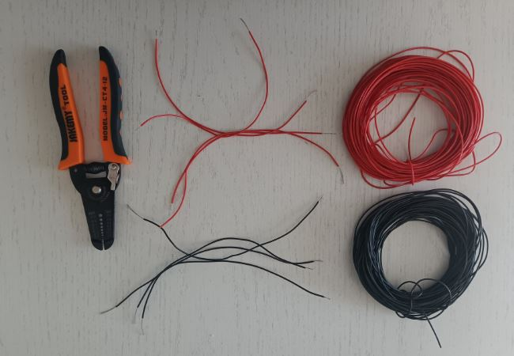

2. 给电机焊接电源线

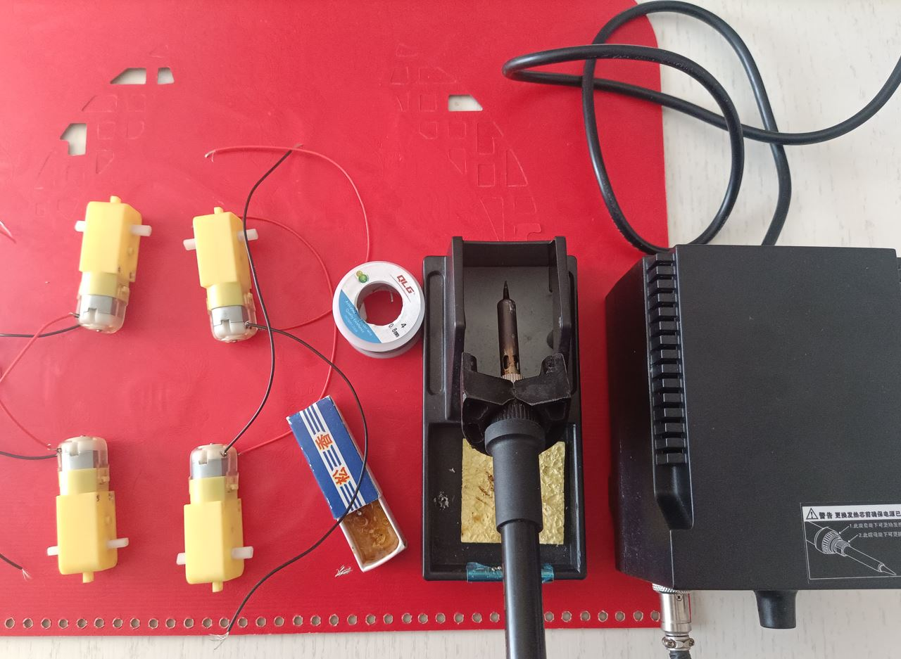

3. 安装电机到车架

**注意** ：两侧的电机时`机头对机头`安装的，所以，它们的驱动正反转命令是反的，但是，将电机连接到驱动模块时，2电机的正和负是连在一起的（一致），所以，安装的2电机的正和负是反的

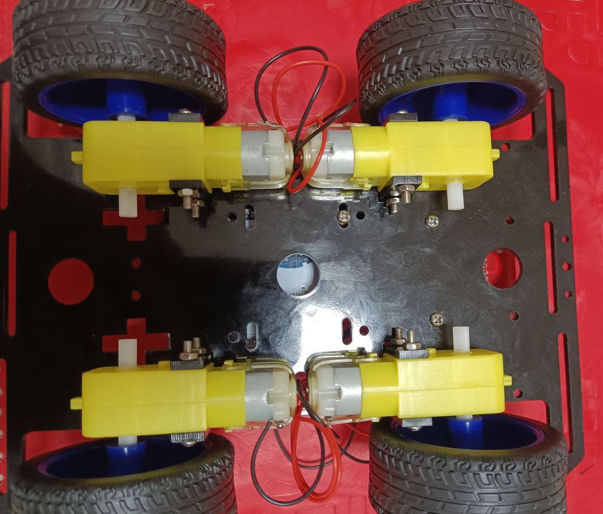


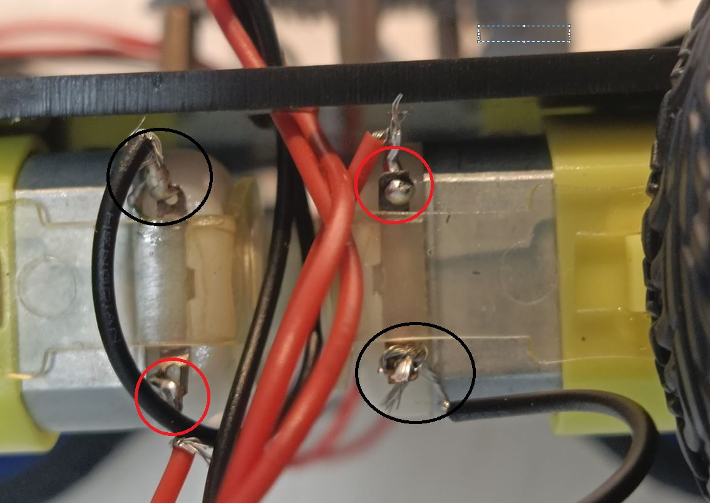

## B LS298N控制智能小车直流电机

### LS298N

L298N是一种双H桥电机驱动芯片，其中每个H桥可以提供2A的电流，功率部分的供电电压范围是2.5-48v，逻辑部分5v供电，接受5vTTL电平。

L298N模块多数都是下边这个样子，这里要注意，L298N模块12v是给模块供电，5v是输出，意思就是L298N的模块接入12V电源，同时输出5V电源可以给其他模块供电

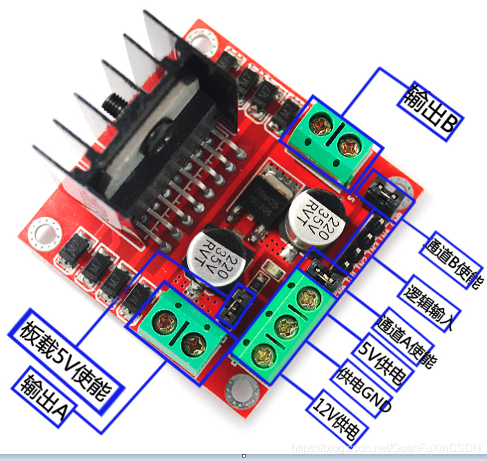

**接口说明**

* 12V供电： 这个是外部电源为驱动板供电的接口，一般驱动电压实际可以接受的输入范围是7~12V，此时可以使能板载的5V逻辑供电。当使用大于12V的驱动电压时，为了避免稳压芯片损坏，首先要拔掉板载5V输出使能的跳线帽，然后在5V输出端口外部接入5V电压对L298N内部逻辑供电。

* 5V供电 ：（引出5V电压接到Arduino板，给Arduino板供电（驱动电压7~12V）连接到UNO板的5V）同时Arduino板也要引出一条GND线，连接到L298N的GND与外部电源共地。

* ENA ENB通道A使能，通道B使能：当你不用PWM时不需要拔掉跳线帽，当你需要PWM时，将需要拔掉跳线帽，接到Arduino上的模拟输入输出接口，我的只需要外侧接上,下面回介绍。 （就是用来调速的）

* IN1 IN2 IN3 IN4逻辑输出口：其中IN1 IN2 控制一个电机的转动，IN3 IN4 控制另一个电机的转动，只要一个置高 一个置低，就可以让电机转动起来。（控制转向），

* 板载5V：：用于板载5V供电，如果把掉跳线帽，需要在5V输出接口上，通过外部电源输入5V电压为L298N驱动版供电。

通常是为了避免稳压芯片损坏，当输入驱动电压大于12V时，拔掉跳线帽，需要使用其它电源输入5V电压为驱动板供电


### L298N模块连接Arduino

#### 安装L298N到车架

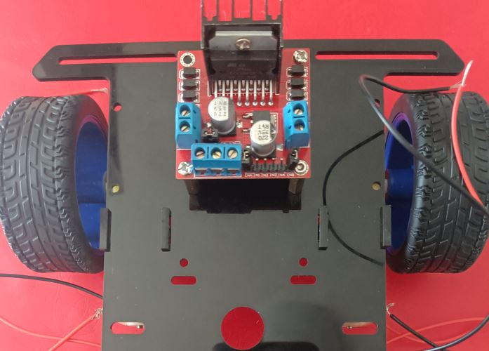

#### 连接电机到LS298N驱动模块

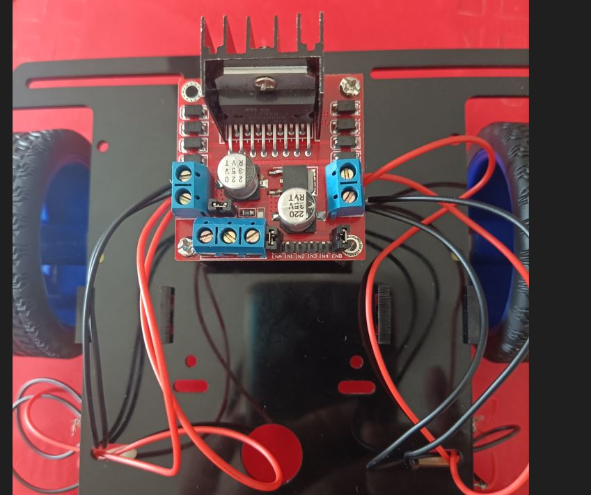

* IN1 - 左侧电机负极
* IN2 - 左侧电机正极

* IN3 - 右侧电机负极
* IN4 - 右侧电机正极

#### 连接电源到L298N模块 

* 12V 接到 L298N模块 电机驱动模块的 +12V 和 GND，

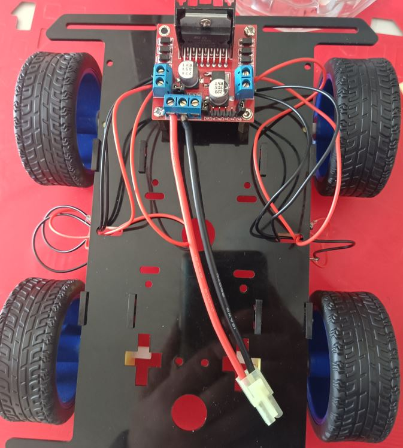

#### 连接LS298N驱动模块和Arduino

##### 对Arduino供电

* LS298N  GND -> Arduino GND
* LS298N  +5V -> Arduino Vin

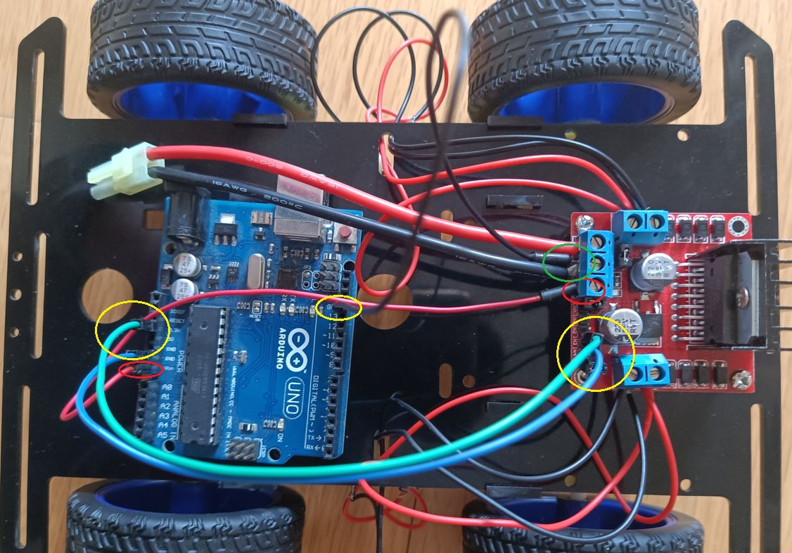

##### L298N模块的IN控制引脚和Arduino板子的连接


* 左侧电机负极 IN1 ->  引脚6
* 左侧电机正极 IN2 ->  引脚7
 
* 右侧电机负极 IN3   ->  引脚4
* 右侧电机正极 IN4 ->    引脚5
 
L298N模块的ENA和ENB都接+5V，一般模块都是用跳线帽短接就可以了

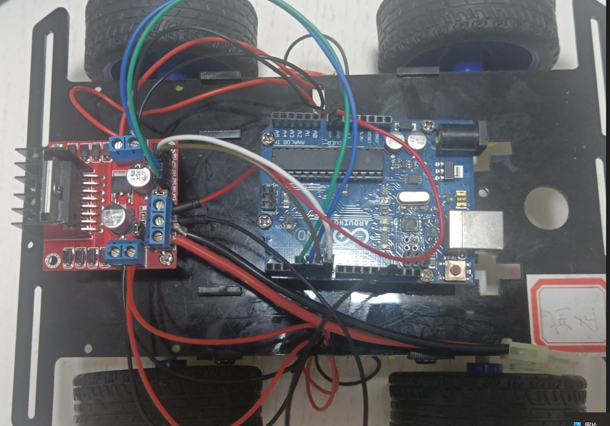

### L298N模块测试验证

#### 硬件和连线测试

要先保证电机和电路没有问题，才能继续写代码，因为如果不确定硬件正常，后边如果出了问题无法区分出来是电路还是软件问题 

测试电机的具体方法：

**左侧电机**

IN1   -> Arduino +5V
IN2   -> Arduino GND

观察电机是否旋转，同时也要观察电机的转向，另外把IN1连接到GND，IN2连接到+5V看看电机是否反转，一般电机都会旋转，如果不旋转那就要仔细检查电路连接。

**右侧电机**

* LS298N  IN3 -> Arduino +5V
* LS298N  IN4 -> Arduino GND


#### 代码和调试

先分别测试左、右轮的前进和后退。然后，测试整车的前进、后退、左、右转

测试时，将车辆悬空，便于测试。

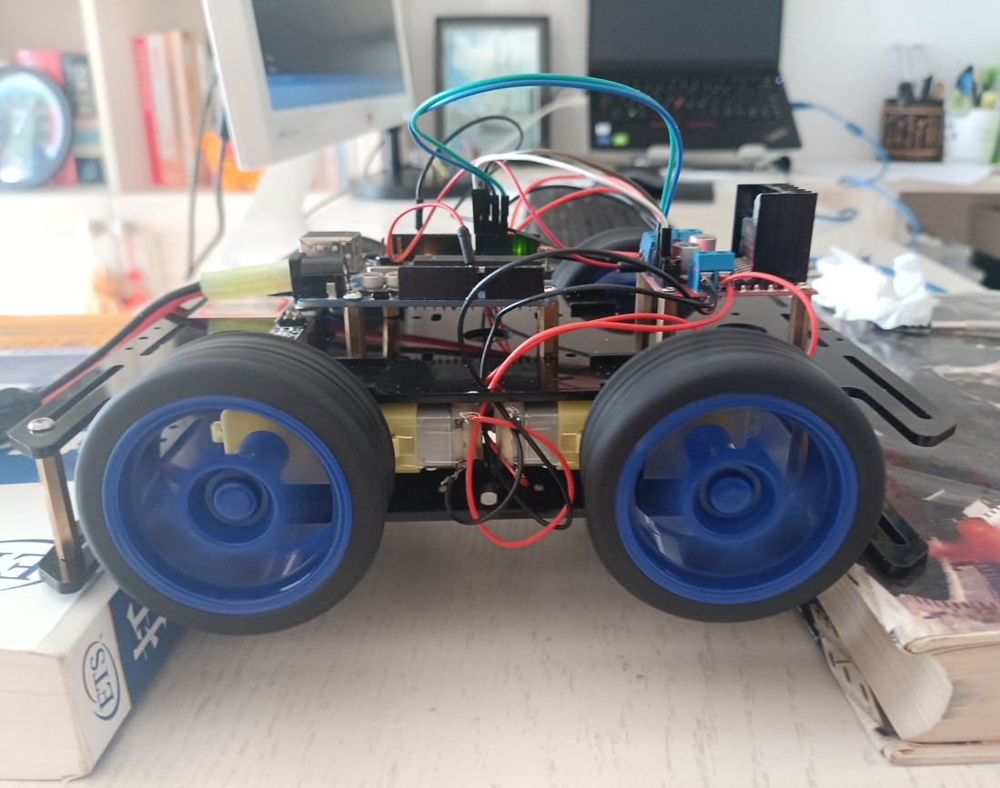

整车测试代码：

```c
/*
 Motor Black -  High -> Forward
 Motor Red +  High -> Back 
*/

#define LeftForward 4   // Motor Black -    LS298N IN1 -> Arduino Pin4 
#define LeftBack 5      // Motor Red     +  LS298N IN2 -> Arduino Pin5 
#define RightForward 6  // Motor Black -    LS298N IN3 -> Arduino Pin6 
#define RightBack 7    // Motor Red     +   LS298N IN4 -> Arduino Pin7 

void setup() {
    pinMode(LeftForward,OUTPUT);
    pinMode(LeftBack,OUTPUT);
    pinMode(RightForward,OUTPUT);
    pinMode(RightBack,OUTPUT);
    initCar();
    delay(1000);  
    go(); 
    delay(1000); 
    stopCar();
    delay(1000);     
    back();
    delay(1000);  
    turnLeft();
    delay(1000);      
    turnRight();
    delay(1000); 
    stopCar();
 }

void loop() {
 
}

void initCar(){
	//默认全是低电平 停止状态
  digitalWrite(LeftForward,LOW); 
	digitalWrite(LeftBack,LOW);
	digitalWrite(RightForward,LOW); 
	digitalWrite(RightBack,LOW);
}

void go(){
  // 左轮前进
  digitalWrite(LeftForward,HIGH); 
	digitalWrite(LeftBack,LOW); 
  // 右轮前进
	digitalWrite(RightForward,HIGH); 
	digitalWrite(RightBack,LOW); 
}

void back(){
  //左轮后退
  digitalWrite(LeftForward,LOW); 
	digitalWrite(LeftBack,HIGH); 
  //右轮后退
	digitalWrite(RightForward,LOW); 
	digitalWrite(RightBack,HIGH); 
}

/* 左转 */
void turnLeft(){
  //左轮不动
  digitalWrite(LeftForward,LOW); 
	digitalWrite(LeftBack,LOW);
  // 右轮前进
	digitalWrite(RightForward,HIGH); 
	digitalWrite(RightBack,LOW); 
}

/* 右转 */
void turnRight(){
  // 左轮前进
  digitalWrite(LeftForward,HIGH); 
	digitalWrite(LeftBack,LOW); 
  // 右轮不动
  digitalWrite(RightForward,LOW); 
	digitalWrite(RightBack,LOW);
}

void stopCar(){
	initCar();
}
```
