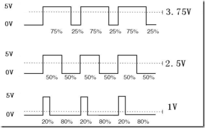
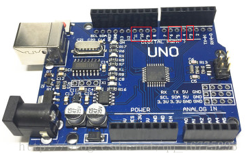

# 智能小车 5 - L298N控制智能小车PWM调速

https://cloud.tencent.com/developer/article/2158369

* https://thecustomizewindows.com/2018/08/how-to-connect-multiple-leds-with-one-arduino-pin-series-connection/

* https://techzeero.com/arduino-tutorials/controlling-multiple-leds-with-arduino/

* https://www.makerguides.com/arduino-multiple-leds-with-different-delays/

## pins问题

如果加入调速需要使用2个Pin, 红外遥控 + led表示 + 超声 + 测速后，Arduino不够

* LS298N ENA -> Arduino UNO 9，“
* LS298N ENB -> Arduino UNO 10

和led的pin冲突，需要减少led的pins
 
**`暂时保留led,不烧录调速代码，以后，可以删除led, 同时加入，红外遥控车速命令`**

##  PWM调速

 将对小车的行进速度进行调整，将驱动模块的作用发挥出来。首先要了解PWM这个概念。
PWM。

  脉宽调制(PWM)基本原理：控制方式就是对逆变电路开关器件的通断进行控制，使输出端得到一系列幅值相等的脉冲，用这些脉冲来代替正弦波或所需要的波形。也就是在输出波形的半个周期中产生多个脉冲，使各脉冲的等值电压为正弦波形，所获得的输出平滑且低次谐波少。按一定的规则对各脉冲的宽度进行调制，即可改变逆变电路输出电压的大小，也可改变输出频率。




通俗一点讲那，就是当如果我们想输出5V电压时，只需一直输出高电平即可；当我们想输出3.75V电压时，那我们就需要在一个周期内（一个高电平和一个低电平为一个周期）3.75÷5=75%时间输出高电平，25%时间输出低电平；同理，如果想输出2.5V电压时，我们需要在一个周期内50%时间输出高电平，50%时间输出低电平


Arduino UNO开发板上只有带有“~”表示的引脚才具有PWM功能，因此我们在控制驱动时可以使用这几个引脚。 

* 3,5,6,9,10,11

用analogWrite(pin, val) 

val是0~255的整数值，对应电压从0到+5V。这种方式产生的方波周期大概是20ms左右（50Hz），不需要占用额外的cpu命令时间。



如果想控制驱动的输出时，需要对驱动的“ENA”“ENB”进行控制，因此我们需要将图中被选中部分的两个跳线帽拔掉。并将“ENA”连接Arduino UNO开发板的“9”引脚，“ENB”连接“10”引脚。


要点
```c
// 调整速度
bool speedLevel = 0;
int leftPWM = 9;  //和现在的电机pin冲突，需要调整电机驱动的pins
int rightPWM = 10;

void setup() {
  // 调整速度
  pinMode(leftPWM, OUTPUT);
  pinMode(rightPWM, OUTPUT);
}


void loop() {
 // 调整速度
  if (speedLevel)  //根据不通的档位输出不同速度
  {

    analogWrite(leftPWM, 120);
    analogWrite(rightPWM, 120);
  } else {

    analogWrite(leftPWM, 250);
    analogWrite(rightPWM, 250);
  }

```

### 合成代码
基于`lab_ls298n_speed_mersure_simple`,增加速度控制

`lab_ls298n_speed_mersure_control_simple`的代码
中，ENA”连接Arduino UNO开发板的“5”引脚，“ENB”连接“6”引脚和现在的电机pin冲突，需要调整电机驱动的pins


```c
/*
  测速+调速
 Motor Black -  High -> Forward
 Motor Red +  High -> Back 

*/

#define LeftForward 4   // Motor Black -     LS298N IN1 -> Arduino Pin4
#define LeftBack 5      // Motor Red     +     LS298N IN2 -> Arduino Pin5
#define RightForward 6  // Motor Black -     LS298N IN3 -> Arduino Pin6
#define RightBack 7     // Motor Red     +     LS298N IN4 -> Arduino Pin7

// 测速 left int1 pin3,
//      right: int0 pin2
int leftCounter = 0, rightCounter = 0;
unsigned long time = 0, old_time = 0;  // 时间标记
unsigned long time1 = 0;               // 时间标记
float lv, rv;                          //左、右轮速度
// 调整速度
bool speedLevel = 0;
int leftPWM = 9;  //和led的pin冲突，需要减少led的pins
int rightPWM = 10;

void setup() {
  // 测速
  Serial.begin(9600);
  attachInterrupt(0, RightCount_CallBack, FALLING);
  attachInterrupt(1, LeftCount_CallBack, FALLING);
  // 调整速度
  pinMode(leftPWM, OUTPUT);
  pinMode(rightPWM, OUTPUT);

  pinMode(LeftForward, OUTPUT);
  pinMode(LeftBack, OUTPUT);
  pinMode(RightForward, OUTPUT);
  pinMode(RightBack, OUTPUT);
  initCar();
  delay(2000);
}

void loop() {
  // 测速
  SpeedDetection();
  go();
  delay(2000);
  // back();
  // delay(2000);
  stopCar();
  delay(2000);
  turnLeft();
  delay(2000);
  stopCar();
  // turnRight();
  delay(2000);
  if (Serial.available() > 0) {
    char cmd = Serial.read();
    Serial.print(cmd);
    if (cmd == 0)
      stopCar();
  }
  // 调整速度
  if (speedLevel)  //根据不通的档位输出不同速度
  {

    analogWrite(leftPWM, 120);
    analogWrite(rightPWM, 120);
  } else {

    analogWrite(leftPWM, 250);
    analogWrite(rightPWM, 250);
  }
}


/*
 * *速度计算
 */
bool SpeedDetection() {
  time = millis();                   //以毫秒为单位，计算当前时间
  if (abs(time - old_time) >= 1000)  // 如果计时时间已达1秒
  {
    detachInterrupt(0);  // 关闭外部中断0
    detachInterrupt(1);  // 关闭外部中断1
    //把每一秒钟编码器码盘计得的脉冲数，换算为当前转速值
    //转速单位是每分钟多少转，即r/min。这个编码器码盘为20个空洞。
    lv = (float)leftCounter * 60 / 20;   //小车车轮电机转速
    rv = (float)rightCounter * 60 / 20;  //小车车轮电机转速
    Serial.print("left:");
    Serial.print(lv);  //向上位计算机上传左车轮电机当前转速的高、低字节
    Serial.print("     right:");
    Serial.println(rv);  //向上位计算机上传左车轮电机当前转速的高、低字节
    //恢复到编码器测速的初始状态
    leftCounter = 0;  //把脉冲计数值清零，以便计算下一秒的脉冲计数
    rightCounter = 0;
    old_time = millis();  // 记录每秒测速时的时间节点
    // 测速 left int1 pin3,
    //  right: int0 pin2
    attachInterrupt(0, RightCount_CallBack, FALLING);  // 重新开放外部中断0
    attachInterrupt(1, LeftCount_CallBack, FALLING);   // 重新开放外部中断0
    return 1;
  } else
    return 0;
}

/*
 * *左轮编码器中断服务函数
 */
void LeftCount_CallBack() {
  leftCounter++;
}

/*
 * *右轮编码器中断服务函数
 */
void RightCount_CallBack() {
  rightCounter++;
}

void initCar() {
  //默认全是低电平 停止状态
  digitalWrite(LeftForward, LOW);
  digitalWrite(LeftBack, LOW);
  digitalWrite(RightForward, LOW);
  digitalWrite(RightBack, LOW);
}

void go() {
  // 左轮前进
  digitalWrite(LeftForward, HIGH);
  digitalWrite(LeftBack, LOW);
  // 右轮前进
  digitalWrite(RightForward, HIGH);
  digitalWrite(RightBack, LOW);
}

void back() {
  //左轮后退
  digitalWrite(LeftForward, LOW);
  digitalWrite(LeftBack, HIGH);
  //右轮后退
  digitalWrite(RightForward, LOW);
  digitalWrite(RightBack, HIGH);
}

/* 左转 */
void turnLeft() {
  //左轮不动
  digitalWrite(LeftForward, LOW);
  digitalWrite(LeftBack, LOW);
  // 右轮前进
  digitalWrite(RightForward, HIGH);
  digitalWrite(RightBack, LOW);
}

/* 右转 */
void turnRight() {
  // 左轮前进
  digitalWrite(LeftForward, HIGH);
  digitalWrite(LeftBack, LOW);
  // 右轮不动
  digitalWrite(RightForward, LOW);
  digitalWrite(RightBack, LOW);
}

void stopCar() {
  initCar();
}

```