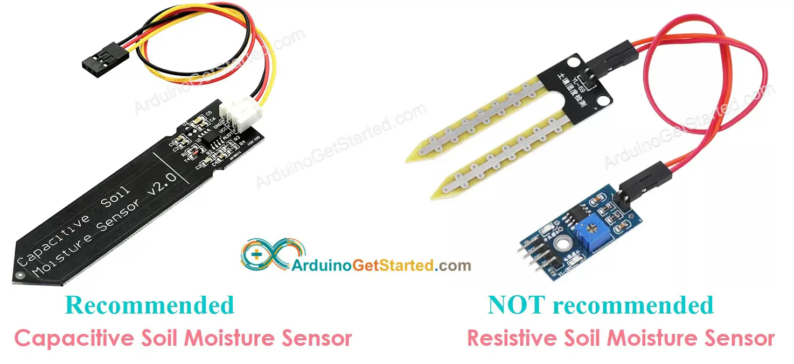
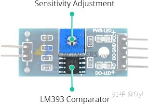
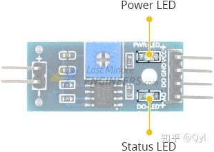
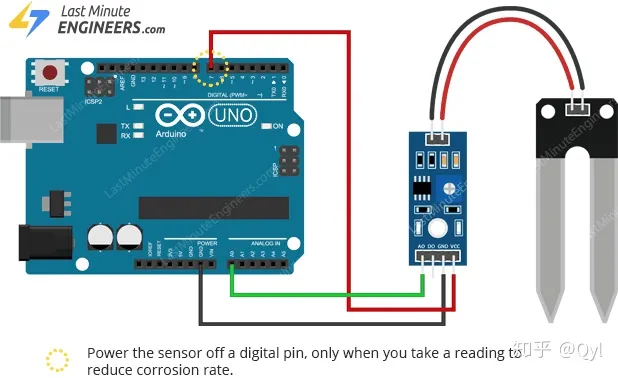
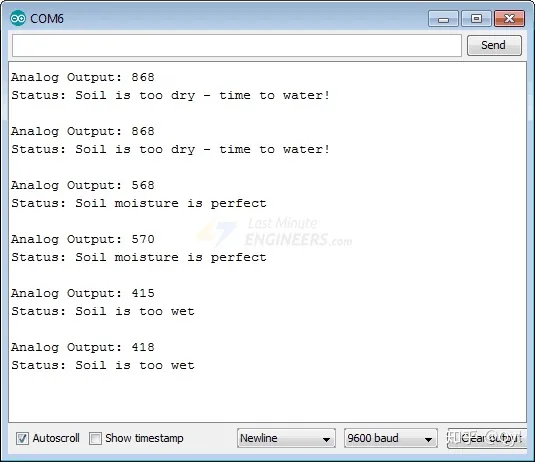
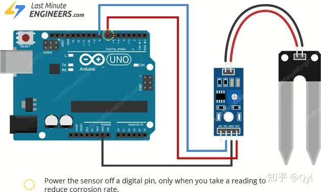

#  土壤湿度

soil moisture measures

## 土壤湿度传感器

土壤湿度传感器有2种：电容、电阻



推荐采用`电容式`

### 电阻式土壤湿度传感器

土壤湿度传感器的工作非常简单。

带有两个裸露导体的叉形探针用作可变电阻器（就像电位计一样），其电阻根据土壤中的水分含量而变化。


## 硬件总览

典型的电阻土壤湿度传感器具有两个组件。

**探针**

该传感器包含一个叉形探针，该探针带有两个裸露的导体，可进入土壤或要测量水含量的其他任何地方。

如前所述，它充当可变电阻器，其电阻会根据土壤湿度而变化。


**模块**
传感器还包含一个电子模块，用于将探针连接到Arduino。

该模块根据探头的电阻产生输出电压，并可以在模拟输出（AO）引脚上使用。

相同的信号被馈送到LM393高精度比较器以对其进行数字化，并在数字输出（DO）引脚处可用

该模块具有内置电位计，用于调节数字输出（DO）的灵敏度。

您可以使用电位计来设置阈值。因此，当水分含量超过阈值时，模块将输出低电平，否则输出高电平。

当您要在达到特定阈值时触发操作时，此设置非常有用。例如，当土壤中的水分水平超过阈值时，您可以激活继电器以开始抽水。你有主意！
提示：顺时针旋转旋钮可提高灵敏度，逆时针旋转可降低灵敏度


除此之外，该模块还具有两个LED。模块通电后，电源LED指示灯将点亮。当数字输出变为低电平时，状态LED将点亮。




## 使用模拟输出感测土壤湿度

如您所知，该模块提供模拟和数字输出，因此对于我们的第一个实验，我们将通过读取模拟输出来测量土壤湿度。

### 接线


让我们将土壤湿度传感器连接到Arduino。

首先，您需要为传感器供电。为此，您可以将模块上的VCC引脚连接到Arduino上的5V。

然而，这些传感器的一个普遍已知的问题是它们在潮湿环境中的寿命短。探针通电后，腐蚀速度将提高。

为克服此问题，我们建议您不要持续为传感器供电，而应仅在获取**读数时才为其供电**

一种简单的方法是将VCC引脚连接到Arduino的数字引脚，然后根据需要将其设置为HIGH或LOW。

同样，模块消耗的总功率（两个LED都点亮）约为8 mA，因此可以通过Arduino上的数字引脚为模块供电。

因此，让我们将模块上的VCC引脚连接至Arduino的数字引脚＃7，并将GND引脚接地。

最后，将模块上的AO引脚连接到Arduino上的A0 ADC引脚。

* VCC  -> Pin 7 
* GND -> GND
* AO ->  A0s

下图显示了接线。



### 校准
为了从土壤湿度传感器获得准确的读数，建议您首先针对计划监测的特定类型的土壤进行校准。

不同类型的土壤会影响传感器，因此您的传感器可能会或多或少地敏感，这取决于您使用的土壤类型。

在开始存储数据或触发事件之前，您应该查看从传感器实际获得的读数。

使用以下草图来记录当土壤尽可能干燥时-vs-完全被水分饱和时传感器输出的值。

### code

```c
 // Sensor pins
 #define sensorPower 7
 #define sensorPin A0
 ​
 void setup() {
     pinMode(sensorPower, OUTPUT);
     
     // Initially keep the sensor OFF
     digitalWrite(sensorPower, LOW);
     
     Serial.begin(9600);
 }
 ​
 void loop() {
     //get the reading from the function below and print it
     Serial.print("Analog output: ");
     Serial.println(readSensor());
     
     delay(1000);
 }
 ​
 //  This function returns the analog soil moisture measurement
 int readSensor() {
     digitalWrite(sensorPower, HIGH);    // Turn the sensor ON
     delay(10);                          // Allow power to settle
     int val = analogRead(sensorPin);    // Read the analog value form sensor
     digitalWrite(sensorPower, LOW);     // Turn the sensor OFF
     return val;                         // Return analog moisture value
 }
```

运行code时，您将在串行监视器中看到接近以下读数的位置：

当土壤干燥时（〜850）
当土壤完全湿润时（〜400）


运行code时，您将在串行监视器中看到接近以下读数的位置：

当土壤干燥时（〜850）
当土壤完全湿润时（〜400）

### 最终版本

根据校准值，以下程序定义了以下范围来确定土壤的状态：

* <500太湿
* 目标范围是500-750
* > 750足够干可以浇水
```c
/* Change these values based on your calibration values */
 #define soilWet 500   // Define max value we consider soil 'wet'
 #define soilDry 750   // Define min value we consider soil 'dry'
 ​
 // Sensor pins
 #define sensorPower 7
 #define sensorPin A0
 ​
 void setup() {
     pinMode(sensorPower, OUTPUT);
     
     // Initially keep the sensor OFF
     digitalWrite(sensorPower, LOW);
     
     Serial.begin(9600);
 }
 ​
 void loop() {
     //get the reading from the function below and print it
     int moisture = readSensor();
     Serial.print("Analog Output: ");
     Serial.println(moisture);
 ​
     // Determine status of our soil
     if (moisture < soilWet) {
         Serial.println("Status: Soil is too wet");
     } else if (moisture >= soilWet && moisture < soilDry) {
         Serial.println("Status: Soil moisture is perfect");
     } else {
         Serial.println("Status: Soil is too dry - time to water!");
     }
     
     delay(1000);    // Take a reading every second for testing
                     // Normally you should take reading perhaps once or twice a day
     Serial.println();
 }
 ​
 //  This function returns the analog soil moisture measurement
 int readSensor() {
     digitalWrite(sensorPower, HIGH);    // Turn the sensor ON
     delay(10);                          // Allow power to settle
     int val = analogRead(sensorPin);    // Read the analog value form sensor
     digitalWrite(sensorPower, LOW);     // Turn the sensor OFF
     return val;                         // Return analog moisture value
 }
 ```

 如果一切正常，您应该在串行监视器上看到以下输出。

 

 ### 使用数字输出感测土壤湿度

对于第二个实验，我们将使用数字输出确定土壤的状态。

#### 接线
我们将使用上一个示例中的电路。这次，我们只需要删除与ADC引脚的连接，并将模块上的DO引脚连接到Arduino上的数字引脚＃8。




## 参考

* https://arduinogetstarted.com/tutorials/arduino-soil-moisture-sensor


