# 自做2自由度平台

* `TODO`:暂时没有不集成为2自由度系统，以后在实现

## 自做2自由度平台的第二自由度

* 瓶盖和一自由度电机轴连接，成为2自由度平台
* 步进电机安装在瓶盖上
* ：
   * 一侧使用花卉的支撑铁条，焊接到步进电机轴上
   * 另一侧插入是带孔支架的孔中

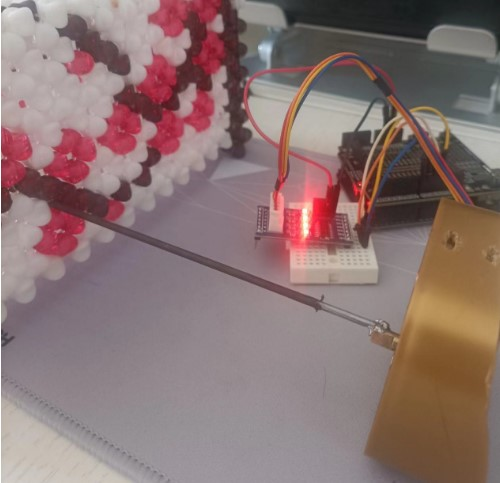

* `TODO`:
    * 为焊接牢固，铁条焊接到步进电机轴上边上，转动轨迹是小圆圈，不是同心点
    * 焊在中间也很难把轴焊正中
    * 可以买步进电机的连轴器和轴，避免了焊接， 转动轨迹也会更好

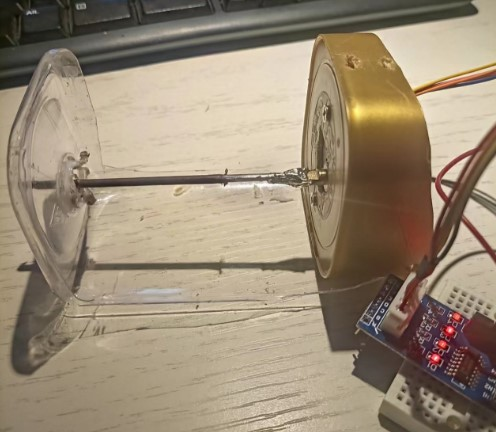

    28BYJ-48 的轴径是5mm
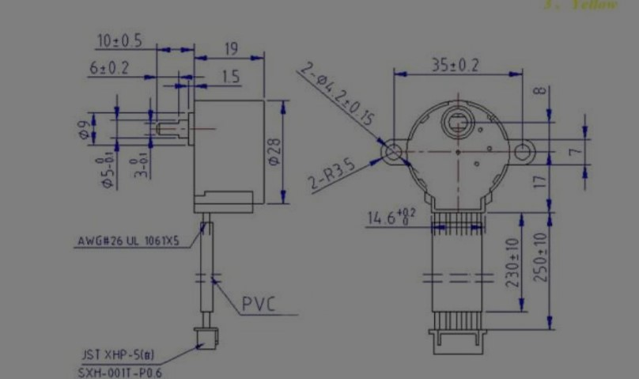

## 参考实现平台

### DIY Solar Tracking System Inspired by NASA (Parker Solar Probe)

这个2轴最好，和实际更相近。其他都是常规多自由度机械臂的做法，但是，现在需要转动的是一个大的板子，多自由度机械臂的方案不算好。

* 光伏板使用一个单臂支架支撑

电机通过皮带带动圆盘转动

* https://www.youtube.com/watch?v=wL9PcGu_xrA

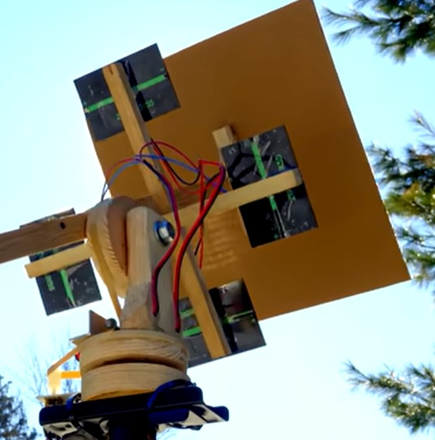

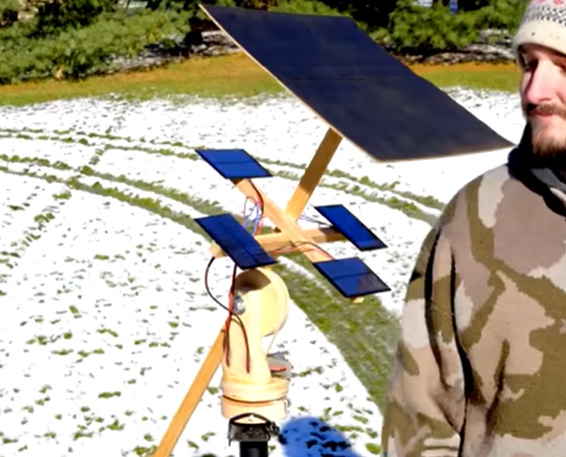

电机通过皮带带动圆盘转动
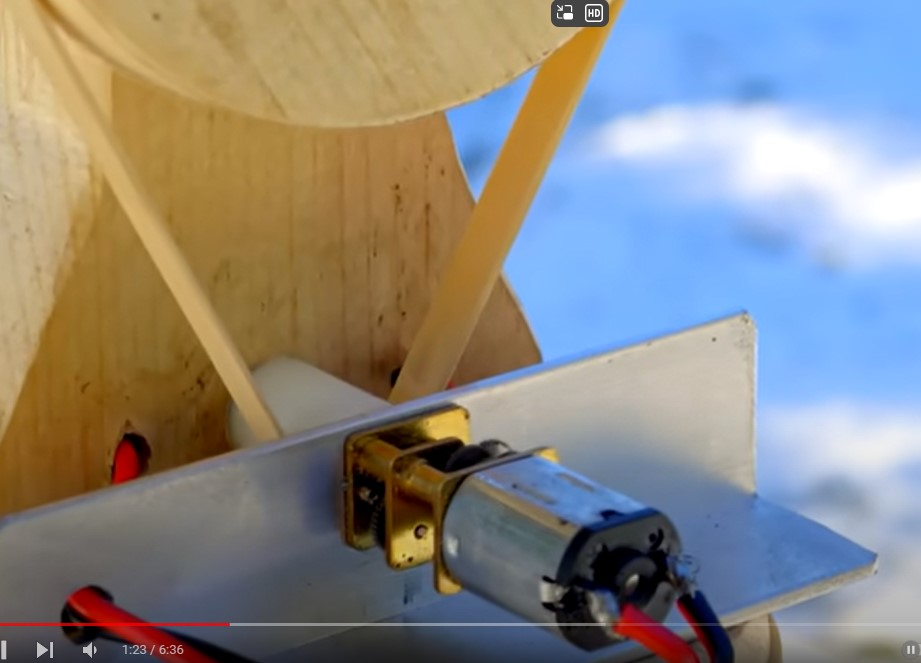

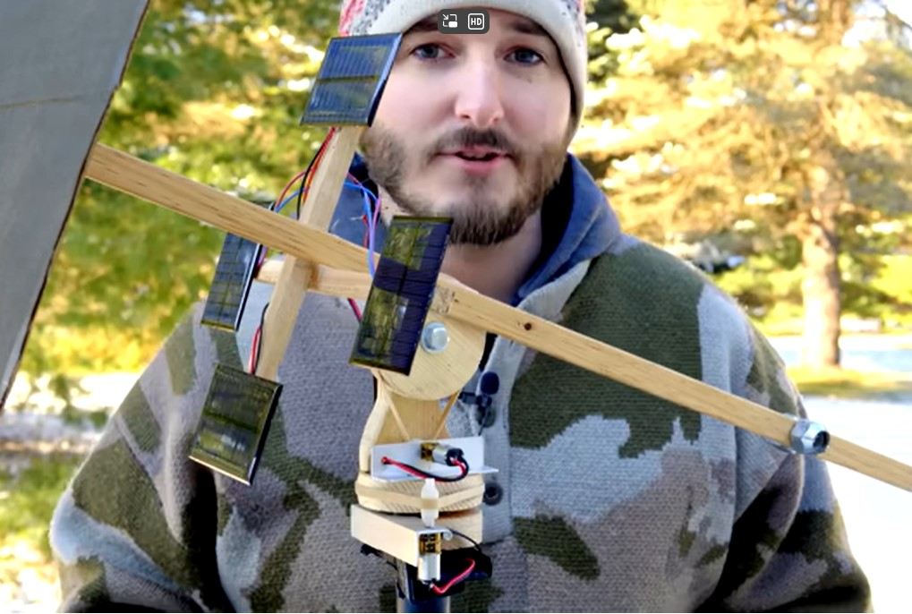

### DIY Solar Tracking System Arduino Get More FREE ENERGY
* https://www.youtube.com/watch?v=wIzwv6LcriA

* 第一自由度电机平台

*  第二自由度平台

* 电池板平台

#### 平台连接

### How to Make Solar Tracker with Arduino Uno R3

* https://www.youtube.com/watch?v=dP6gO19t2pk

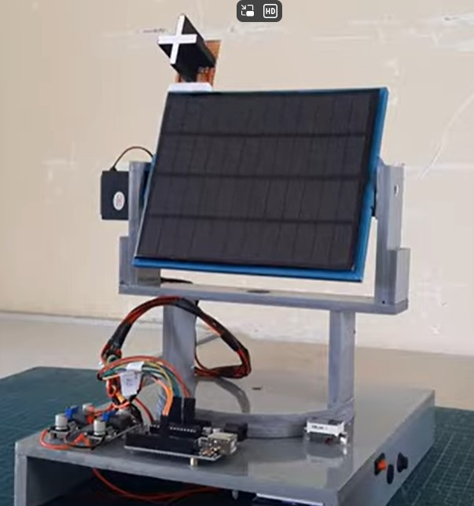

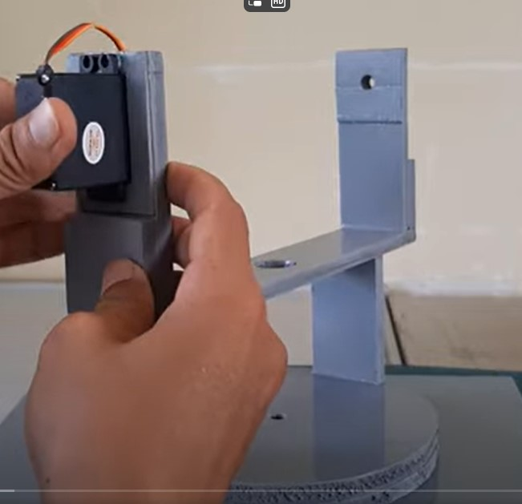

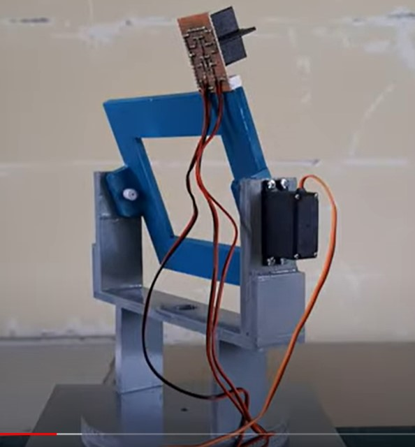
### How to Make Dual Axis Solar Tracker

*  Dual Axis Sun Tracker Solar Panel without Arduino Part:1

  *  https://www.youtube.com/watch?v=Okvyq91Q-0k&list=PLB4JWIkdh7W_NSY-WDA3zAWO8FAZC_3hc&index=2

### Dual Axis Sun Tracker Solar Panel without Arduino Part:2

* https://www.youtube.com/watch?v=bG2sAwm-4gY&list=PLB4JWIkdh7W_NSY-WDA3zAWO8FAZC_3hc&index=3

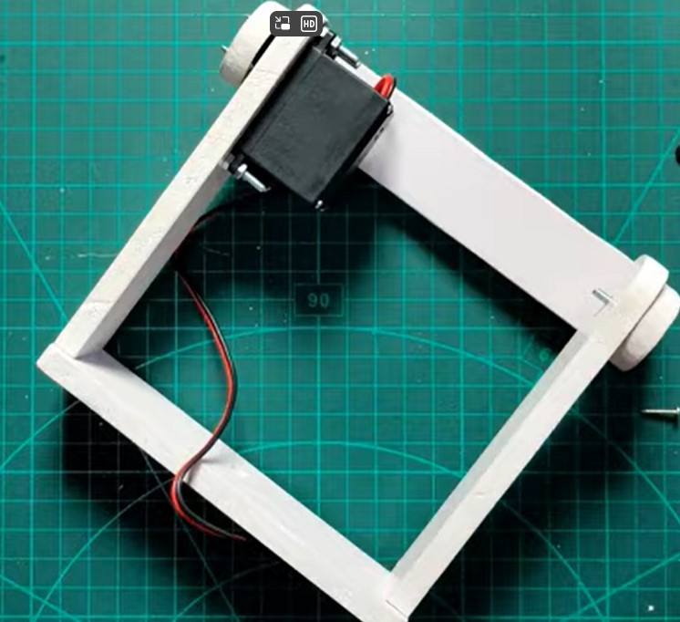

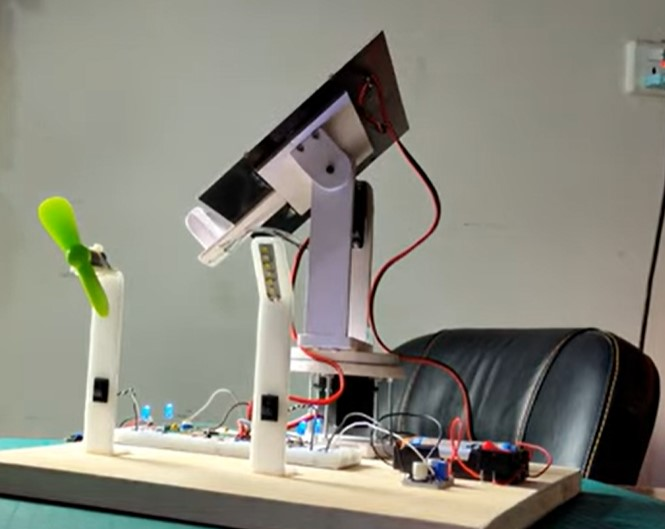
