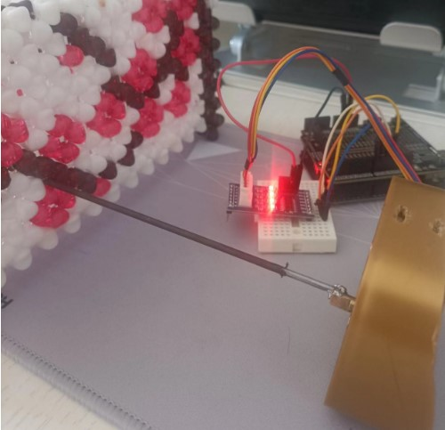
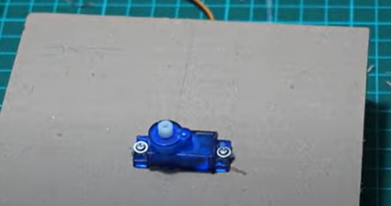
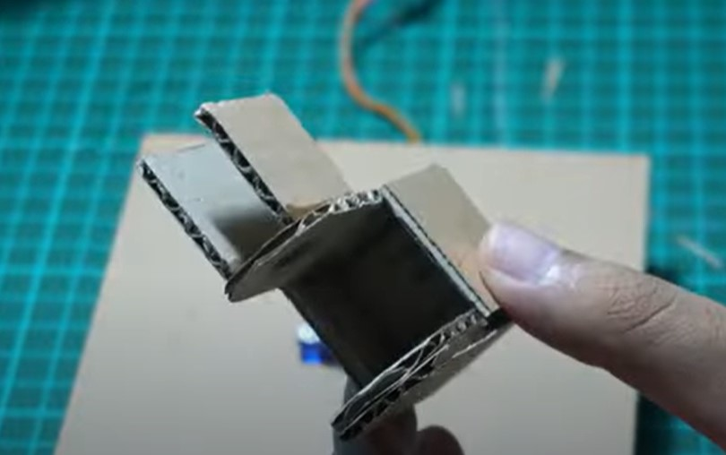
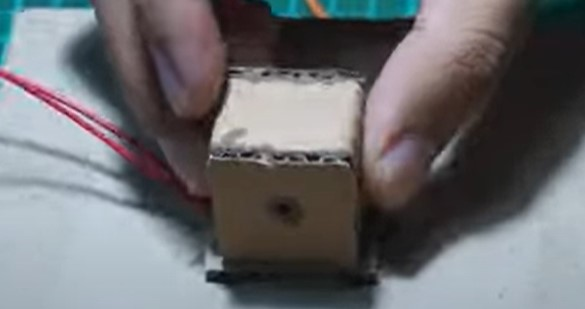
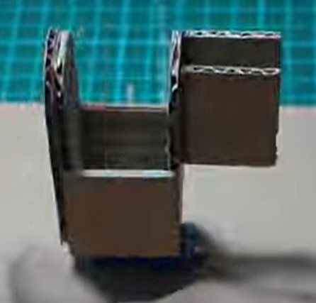
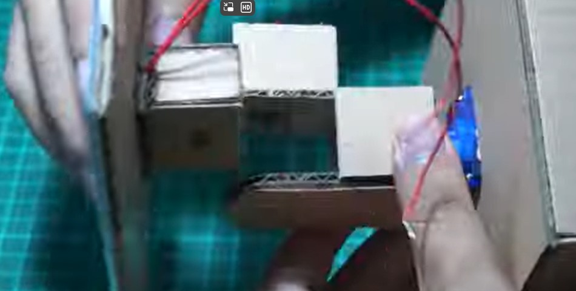
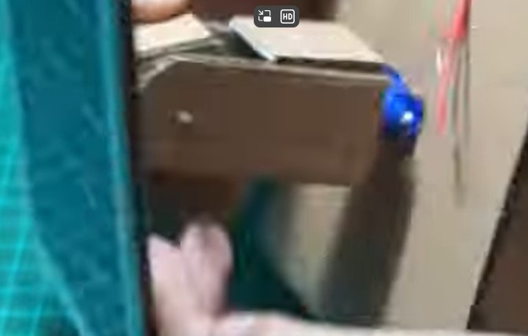
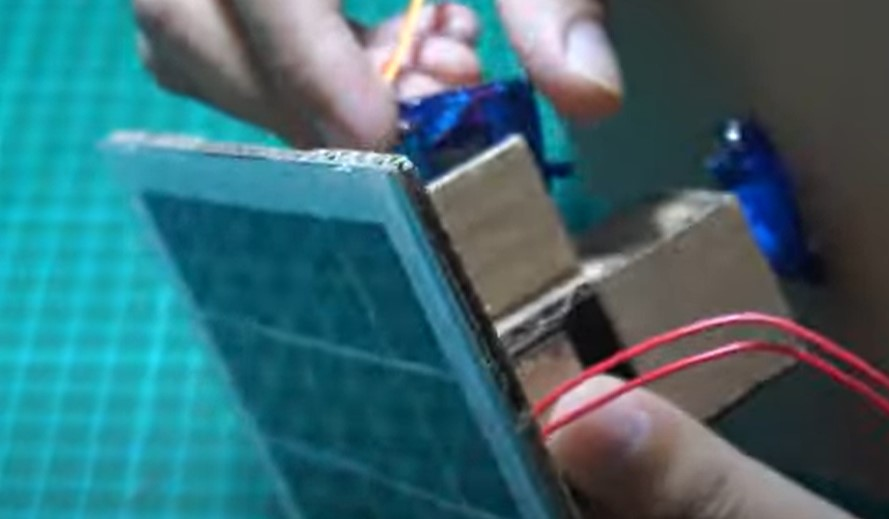

# 自做2自由度平台

* `TODO`:暂时没有不集成为2自由度系统，以后在实现

## 自做2自由度平台的第二自由度

* 瓶盖和一自由度电机轴连接，成为2自由度平台
* 步进电机安装在瓶盖上
* ：
   * 一侧使用花卉的支撑铁条，焊接到步进电机轴上
   * 另一侧插入是带孔支架的孔中

* `TODO`:
    * 为焊接牢固，铁条焊接到步进电机轴上边上，转动轨迹是小圆圈，不是同心点
    * 可以买步进电机的连轴器和轴，避免了焊接， 转动轨迹也会更好

## 参考实现平台

DIY Solar Tracking System Arduino Get More FREE ENERGY
* https://www.youtube.com/watch?v=wIzwv6LcriA

* 第一自由度电机平台

*  第二自由度平台

* 电池板平台

## 平台连接

