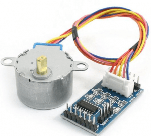
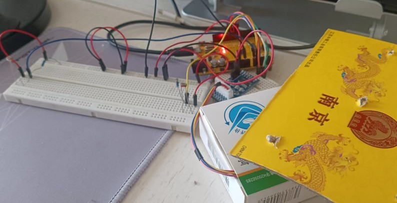
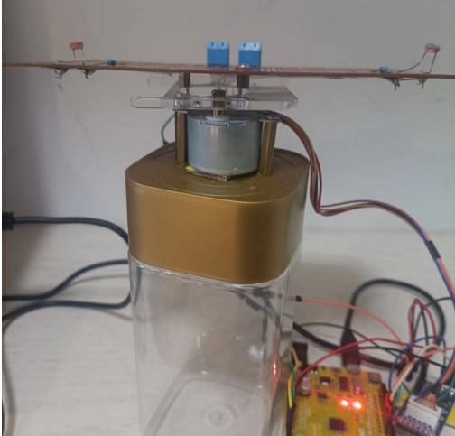
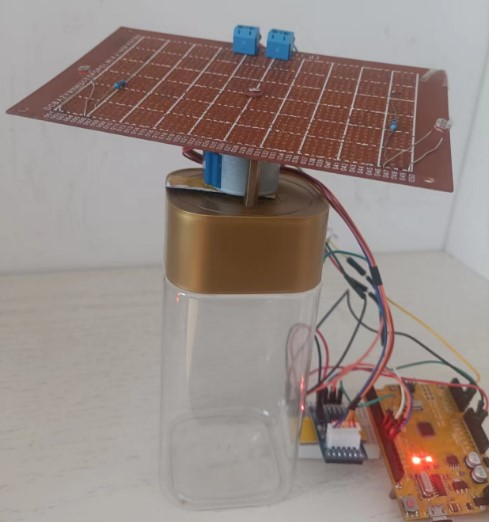
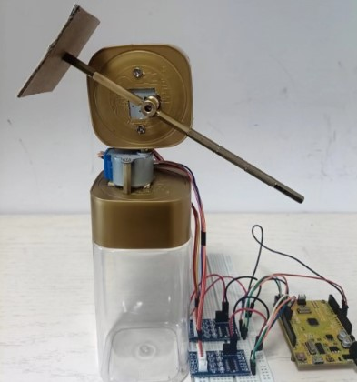

# 单轴步进电机光强(太阳)跟踪

* 光敏电阻检测光强，跟踪-使用AccelStepper步机电机库

* 步进电机是`开环控制`，舵机是闭环，所以，`单纯步进电机不能控制其初始位置`，因为没有位置信息反馈，需要配上霍尔编码器构成简单闭环
  所有，如果单纯用步进电机做光跟踪器，需要`人工`调整电机到初始位置,后面的转动相对于这个位置进行

* 步进电机是`开环控制`，所以，宜采用有光差是只向光强方向`转一个固定较角度`就停止，以简单的方式实现稳定转动

* `TODO：`
  * RTC时间跟踪
  * 自做双自由度平台，参考文档： `Lab_Stepper_Motor_Solar_tracker_2axis_base.md`
  * Lab_Dual_Axies_Stepper_Motor_Solar_Tracker_AccelStepper.ino OK！

##  元件

* 步进电机: 五线四相28BYJ-48 x1
* 步进电机驱动：ULN2003 
* 光敏电阻photoresistor 5516 x2
* 10K电阻 x2
* 洞洞板 x1
* 小面包板 x1
* Arduino UNO x1

## 光敏电阻连线


## 电机和驱动

* 五线四相步进电机：The 28BYJ-48 Stepper Motor can draw up to 240 mA, 

* ULN2003 五线四相步进电机蓝色版



### 电机连线

使用Arduino IDE中的示例

* 驱动板上IN1、IN2、IN3、IN4分别连接UNO开发板的数字引脚8，9，10，11；
* 驱动板电源输入+、-引脚分别连接UNO开发板的5V、GND。

##  测试方案

### 面包板

简单的面包板测试



面包板上光敏电阻，发送的信号，那边光强，电机就带动其上连接的纸板向那个方向转

### 洞洞板

洞洞板测试的原件布置：
* 光敏电阻焊接在洞洞板上。
 *  洞洞板上布置2个接线柱
     * 一个用于接电源
     * 一个用于输出2个光敏电阻的信号
* 步进电机驱动安装在小面包板上
  * 小面包板从Arduino引入电源，给电机和洞洞板供电
* 步进电机安装在食品塑料瓶上
* 步进电机轴连接亚克力板
* 洞洞板安装在亚克力板上

步进电机转动带动洞洞板向光强的一侧转动到2侧光强小于设定数值。

洞洞板不大，2侧光敏电阻在均匀光线情况下，数值差别不大，可以通过用手遮挡一个光敏电阻，使的2边差别变大，电机会转动板子移被遮挡的位置。





## 软件

### 不使用库

* `Lab_Stepper_Motor_Solar_Tracker_simple.ino` 
* `Lab_Stepper_Motor_Solar_Tracker.ino` 有较多判断，但是，还是没有处理好：越转2边光线强度差别越大问题

### 使用第三方库

* AccelStepper库

* `Lab_Stepper_Motor_Solar_Tracker_AccelStepper.ino` -  刷机用代码

### 解决问题

使用AccelStepper库不能改变方向，都向一个方向转! 
* https://www.airspayce.com/mikem/arduino/AccelStepper/

原因是`28byj-48`电机的motors连线特别

* **byj - `pins 2 and 3` swapped !!!**

所以，使用时需要

* Pins entered in sequence IN1-**`IN3`**-IN2-IN4 for proper step sequence
* use HALF4WIRE for half stepping

如Arduino pin: ULN2003A IN pin out pin color code on the byj stepper

* 8 in1 
* 9 in2 
* 10 in3
* 11 in4

那么代码如下：
```c
// byj - pins 2 and 3 swapped !!!
AccelStepper byj(AccelStepper::HALF4WIRE, 8, 10, 9, 11); 
```

## Dual-Axis Gimbal 双轴云台

**自做双轴云台结构**

* 垂直步进电机安装在瓶盖上 - 1 轴自由度
* 水平电机通过瓶盖连接垂直步进电机轴上- 2 轴自由度
   * 水平电机安装连轴器，多个M3铜柱通过连轴器的M3紧固空连接构成平板支

**测试代码：**  * 

* Lab_Simple_Dual_Axie.ino OK！

* Lab_Dual_Axies_Stepper_Motor_Solar_Tracker_AccelStepper.ino OK！



##  参考

* https://www.circuitbasics.com/how-to-control-stepper-motors-with-uln2003-and-arduino-uno/

* https://www.instructables.com/Building-an-Automatic-Solar-Tracker-With-Arduino-U/