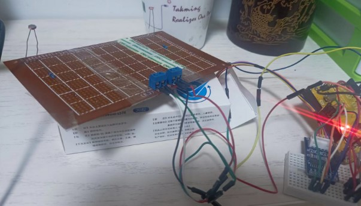

# 步进电机太阳跟踪

* 光敏电阻检测光强，跟踪
* `TODO：`, RTC时间跟踪

##  光敏电阻检测光强跟踪元件

* 五线四相步进电机 *1
* 光敏电阻photoresistor *2
* 10K电阻 *2

## 光敏电阻连线

## 电机和驱动

* 五线四相步进电机：The 28BYJ-48 Stepper Motor can draw up to 240 mA, 

* ULN2003 五线四相步进电机蓝色版

### 电机连线

使用Arduino IDE中的示例

* 驱动板上IN1、IN2、IN3、IN4分别连接UNO开发板的数字引脚8，9，10，11；
* 驱动板电源输入+、-引脚分别连接UNO开发板的5V、GND。

## 光敏电阻检测光强跟踪测试

### 面包板测试

面包板上光敏电阻，发送的信号，那边光强，电机就带动其上连接的纸板向那个方向转

### 洞洞板测试

光敏电阻焊接在洞洞板上。

洞洞板上布置2个接线柱

* 一个用于接电源
* 一个用于输出2个光敏电阻的信号

洞洞板和步进电机的轴连接后，洞洞板可以向光强的一侧转动到2侧光强小于设定数值。

**存在问题**： 目前洞洞板和步进电机的轴连接，是通过下面一个纸板间接连接，连接方式不稳定，只能简单测试，

需要一种既灵活，有稳定的轴连接方式

焊接可以较稳定连接，但不灵活。不方便拆卸。

##  参考

* https://www.circuitbasics.com/how-to-control-stepper-motors-with-uln2003-and-arduino-uno/

* https://www.instructables.com/Building-an-Automatic-Solar-Tracker-With-Arduino-U/