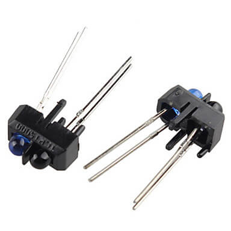
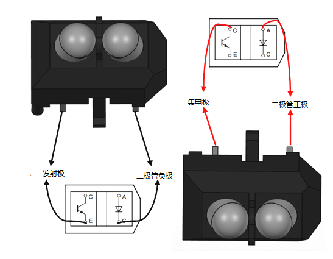
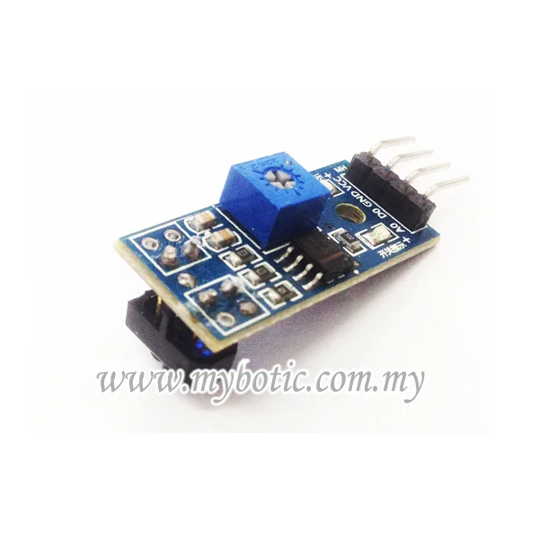
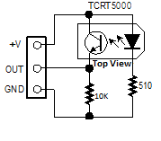

# Use TCRT5000 IR Tracking Sensor Module With Arduino UNO

TCRT5000 IR Sensor红外传感器具有干扰小、便于装配、使用方便等特点，可以广泛应用于机器人避障、避障小车、流水线计数及黑白线寻迹等众多场合。

## TCRT5000 IR 

传感器




TCRT5000是一种基于红外光学反射原理的传感器，它包含一个红外发光二极管和一个光敏三极管，光敏三极管内部覆盖了用于阻挡可见光的材质（据查为铅）。下图为TCRT5000的引脚图




模块



模块电路



如上图所示，调试时可通过调整红外发光管负极和GND之间的电阻值（范围为100~550欧姆）以及光敏三极管发射极与GND之间的电阻值（范围为5~20K），使测试性能达到预期。对于我手上的TCRT5000来说，设置200欧姆和10 K的效果较好。如何判断调整效果呢？我们需要将上图电路与Arduino连接，通过IDE的串口监视器实时判断调试结果是否符合预期。将上图的OUT连接至Arduino UNO 的A0针脚，连接好+5V和GND，上传以下代码。

##  循迹

TCRT5000红外反射光电开关寻迹传感器模块
 浅色 - 0 输出低电平 
 黑色 -1  输出高电平

模块接线方式

* 1、VCC:接电源正极（3-5V）

* 2、GND:接电源负极

* 3、OUT:TTL开关信号输出

```c
/*
TCRT5000红外反射光电开关寻迹传感器模块
 浅色 - 0 输出低电平 
 黑色 -1  输出高电平
*/

int ledPin = 13;  //定义数字接口13为LED输出接口
int pin = 10;  //   定义数字检测接口pin0(out)
int val;  //定义变量

void setup(){
  pinMode(ledPin, OUTPUT);  //设定数字接口13为输出接口
  Serial.begin(9600);  //设置串口波特率为9600kbps
}

void loop(){

  val = digitalRead(pin);  //读取模拟接口的值
  Serial.println(val);  //输出模拟接口的值
  if (val == 1)  //如果Pin10检测的值为高电平，点亮LED
  {
    digitalWrite(ledPin, HIGH);
  }  else  //如果为低电平熄灭LED
  {
    digitalWrite(ledPin, LOW);
  }
}
```

##  测距

测距范围较小，可以通过模块的电位器做测量距离调整

TCRT5000红外反射光电开关测距
 out ->AO  
 
```c
/*
TCRT5000红外反射光电开关寻迹传感器模块
程序二，接到A0模拟口，串口波形，可以测量距离
*/

int tcrt;

void setup() {
  pinMode(13, OUTPUT);
  Serial.begin(9600);
}

void loop(){
  tcrt = analogRead(A0);
  analogWrite(13, tcrt / 4);
  Serial.println(tcrt);
  delay(500);
}


```

## 参考

* https://www.basemu.com/tcrt5000-ir-sensor_how_to.htmls