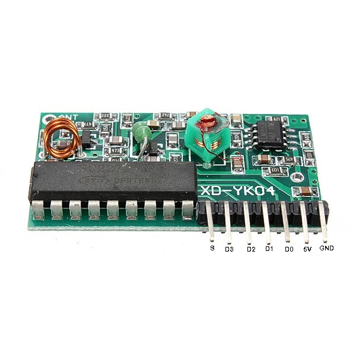
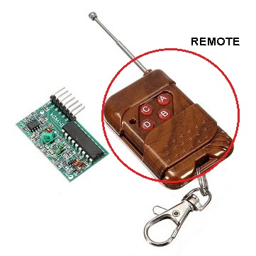
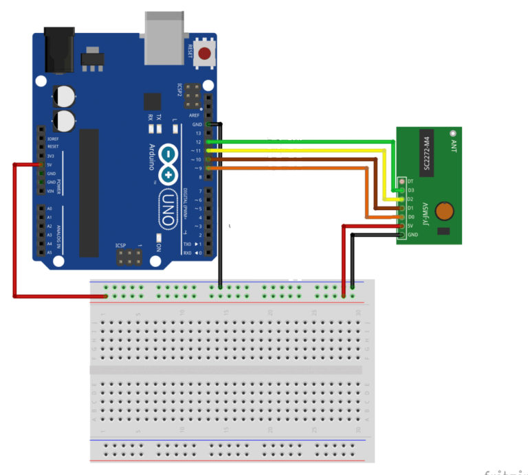

# RF remote controller with XD-YK04 Module

https://www.faranux.com/product/4-channels-rf-remote-control-module-yk04/

##  YK04 RF module

### Description

This is RF Remote Control Module suitable for controlling robotic car.It has 4 buttons: for start, stop, accelerate and decelerate.

* 4 channels wireless module receiver (SC2272-M4) and transmitter (PT2262) at 315mHz (view datasheet).

### Features:

#### Remote control unit(Transmitter):

* Operating voltage: DC 12V(23A / 12V battery x 1)
* Operating current: 10mA at 12V
* Radiated power: 10mW at 12V
* Transmission distance: 50m – 100m
* Transmitting frequency: 315MHZ
* Modulation mode: ASK (Amplitude Modulation)
* Encoder types: fixed code

#### Decoding receiver board:

* Operating voltage: DC 5V
* Receiver sensitivity is -98dB
* Leg 7 bits: VT, D3, D2, D1, D0, +5V and GND
* VT is a valid signal high output pin upon receiving a valid signal, the pin output high, may also drive the relay

### Note:

There are four buttons on the remote control, and respectively correspond to the four data bits to the receiving board output pin D0, D1, D2, and D3.
Press the buttons transmit signals, the corresponding data bit is output high.

### Applications:

* Automotive alarm systems
* Automotive RKE systems
* Automotive immobilizers
* Gate and garage door openers
* Identity tokens
* Burglar alarm systems

## How to get started with RF remote control module

Radio-frequency (RF) remote controls are very common. Garage-door openers, car-alarm fobs and radio-controlled toys have always used radio remotes, and the technology is starting to show up in other applications, too.
 
### RF receiver




They’re still pretty rare in home-theater devices,but you will find RF remotes controlling certain satellite-TV receivers and high-end stereo systems. Instead of sending out light signals, an RF remote transmits radio waves that correspond to the binary command for the button you’re pushing. A radio receiver on the micro -controller (in our case Arduino) receives the signal and decodes it. The greatest advantage to radio-frequency remotes is their range: They can transmit up to 30 meters from the receiver, and Infra-red signals can go through walls. This is why you’ll now find IR/RF remotes for home-theater components. These remotes use RF-to-IR converters to extend the range of an infrared remote



The remote has 4 buttons which corresponds to 4 pins on the receiver.  The RF module uses the `SC2272-M4`, which is the `momentary` version, so the pin will stay `HIGH` as long as we `hold down` the button.

工作模式三种

* 点动: 芯片`SC2272-M4`： the `momentary` version - 瞬时版本
* 自锁：芯片`SC2272-L4`
* 互锁：芯片`SC2272-T4`

To use this device we don’t need any special library. You will need the following:

* Arduino Uno
* RF receiver
* RF remote
* Jumper wire

We will just connect the pins of the receiver as indicated below,

* pin 9 -> D0
* pin 10 ->D1
* pin 11 -> D2
* pin 12 ->D3





Something to note is that the `S (VT)` is not connected because it goes high whenever you push a button on the remote.

### Code

```c
/*

pin 9 ->  D0 - A
pin 10 -> D1 - B
pin 11 -> D2 - C
pin 12 -> D3 - D 
*/

void setup() {
  Serial.begin(9600);                           // setting the  baud rate
  Serial.println("RF receiver button decode");  // printing
}

void loop() {
  /*here in this code I used if statement to setup my loops codes, yo can  also use while loop statements to control the output in the serial monitor*/
  if (digitalRead(9) == HIGH) {  // Button a pressed
    Serial.println("you are pushing on the A");
    // if the Key is pushed this above text will be displayed
  }
  if (digitalRead(10) == HIGH) {  // Button B pressed
    Serial.println("you are pushing on B");
  }
  if (digitalRead(11) == HIGH) {  // Button C pressed
    Serial.println("you are pushing on C");
  }
  if (digitalRead(12) == HIGH) {  // Button D pressed
    Serial.println("you are pushing on D");
  }
}

```

## 参考


* https://www.faranux.com/product/4-channels-rf-remote-control-module-yk04/

* https://www.instructables.com/Haunted-TV-Powered-by-Raspberry-Pi-OpenCV/

* https://github.com/YuriiSalimov/YK04_Module

* https://www.hackster.io/ronfrtek/visuino-smart-robot-car-315mhz-remote-control-module-xd-yk04-5ac1d1

* https://maker.pro/arduino/projects/how-to-build-a-remote-control-home-automation-system-with-yk04
