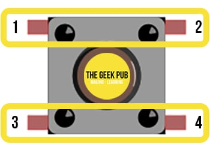
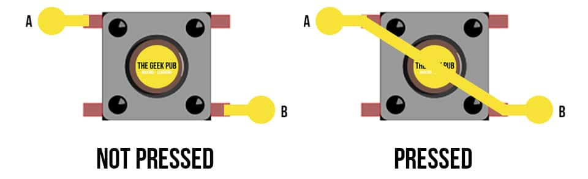

# freeRTOS实验：DS18B20和RGBLED

## 功能

* 温度测量和显示
* RGBLED变色，可用按钮开启和关闭

##  元件

*  开发板：Arduino Pro Mini
   *  USB-TTL模块FTD1232-1
*  DS18B20传感器
*  共阴四脚5MM全彩LED发光二极管
  * 电阻： 330欧 3个
*  4位数码管TM1637
*  Button
   * 电阻： 10K 1个
*  2P接线柱，开关
*  面包板，2个 
*  16850锂电池一节

## DS18B20传感器和连接

* 库：DallasTemperature library by Miles Burton

```c
#define ONE_WIRE_BUS 12
```
|DS18B20     |Arduino |
|------------|--------|
|Pin 1 (GND) |	GND   |
|Pin 2 (DQ)	 |Pin 12 Arduino and via 4.7 kΩ resistor to 5V|
|PIN 3 (VDD) |	5V    |

##  RGBLED连线

* https://github.com/sb1978/rgbled


* red cathode green blue

```c
my_rgbled(9,8,7, 'c');
```
|RGB    |Arduino |
|-------|--------|
|red    |  9     |
|cathode| GND	 |
|green  | 8      |
|blue   | 7      |

## TM1637连线

* 库：https://github.com/avishorp/TM1637


```c
#define CLK 2
#define DIO 3
```
## 按钮






##  freeRTOS

**调试记录：**

`xTaskCreate`中的Stack size示例中是128，调试时，读温度的任务循环执行几次后，就停止运行，
  将Stack size改为256，读温度的任务循环运行正常。

```c
 xTaskCreate(
    TaskTempRead, "TempRead",
    256,  // Stack size
    NULL, 1 , // Priority
    NULL);
```


 