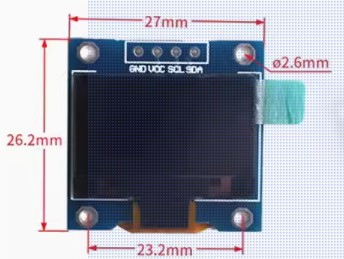

# OLED 

* Arrduino UNO
* OLED SSD1315 0.96

## OLED SSD1315 0.96



## Arduino UNO连线

oled   UNO 
 GND -> GND
 VCC -> 5V
 SCL -> A5
 SDA -> A4

##  u8g2库

OLED库示例，适用于多种OLED,使用某型号OLED时

* 需要删除示例中该型号对应代码前的注释，使得代码适用于该型号

SS1306芯片的OLED对应的型号是：`U8X8_SSD1306_128X64_ALT0_HW_I2C`

其代码如下：

```c
U8X8_SSD1306_128X64_ALT0_HW_I2C u8x8(/* reset=*/ U8X8_PIN_NONE); 	  
```

* 示例1： u8g2->u8x8->hello world
* 示例1：u8g2->u8x8->graphtest


## 1306专用库Adafruit_SSD1306

```c
Adafruit_SSD1306 display(SCREEN_WIDTH, SCREEN_HEIGHT, &Wire, OLED_RESET);
```

