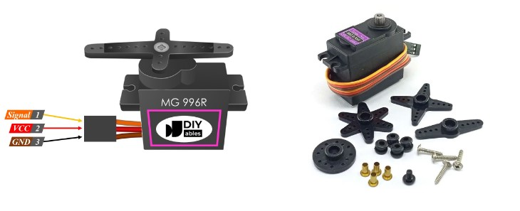
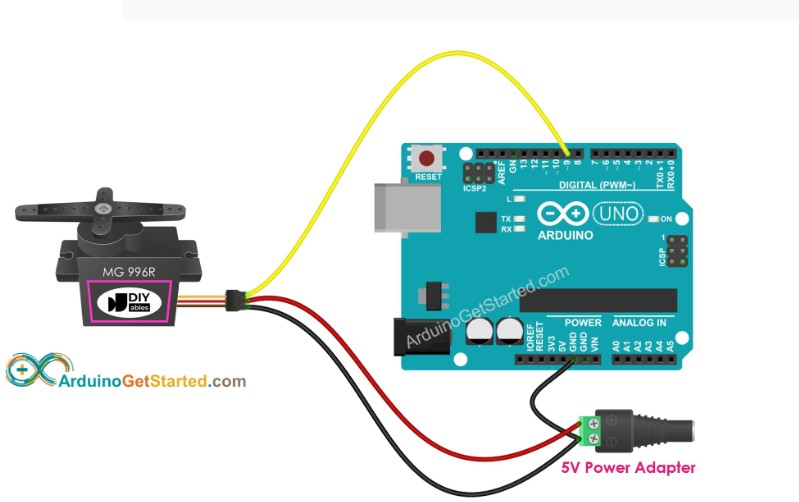

# MG995 舵机


## 技术参数



将了解MG995舵机。MG995舵机电机是一种舵机电机，可以连续移动，没有任何旋转程度的限制。“360”版本是连续旋转的伺服器，无法控制位置。它只是做你描述的事情。它根本不是真正的“伺服器”。它是一个带有自己控制器的减速电机。

MG996R是MG995伺服的升级版。新的PCB和IC控制系统使其更加精确。
其内部齿轮和电机也进行了升级，以改善死带宽和定心。MG996R伺服具有高定位速度，可精确控制和调节您的项目。工作电压范围为 4.8 V – 7.2 V。

如果您曾经使用过塔式Pro SG90和MG996R等舵机电机，该舵机电机是标准舵机类型，可以使用指定的度角进行控制。可以使用命令myservo.write(degrees);轻松移动舵机电机，然后舵机将移动到该j角度。MG995 舵机在操作方式上有所不同。我尝试多次对Arduino进行编程，以使用Arduino IDE上提供的默认程序控制舵机电机，但它不起作用。

重量：55g
尺寸：40.7×19.7×42.9毫米
失速扭矩：9.4公斤/厘米（4.8伏）;11公斤/厘米（6.0伏）
运行速度：0.19秒/60度（4.8v）;0.15秒/60度（6.0V）
工作电压：4.8~ 6.6V
齿轮类型：金属齿轮
温度范围：0-55？
伺服插头：JR（适合JR和双叶）
死带宽度：1us

## 测试 

这个舵机电机的方法。

正常的闭环定位舵机通过编程来响应脉冲宽度以确定角度：1.0ms 脉冲为位置 0°，1.5ms 脉冲为位置 90°，2.0ms 脉冲为位置 180°。

由于MG995 360是连续旋转的舵机类型，因此必须指定3个条件，即停止位置，左转和右转。在这三个位置中，基本命令是使用“写入微秒”命令。

根据我所做的几个实验，这些条件时的微秒值为：

停止位置 90度  – 写入微秒(1500)
左转到0度 – 写入微秒(544)
右转到180度 – 写入微秒(2544)

脉冲在0.544和1.5ms或1.5ms和2544之间，将产生成比例的速度。

### 布线

为了能够练习上述值，请将舵机连接到您的 Arduino。在其中一个PWM引脚上使用它。PWM 引脚分别为 3、5、6、9、10 和 11。可以在此处查看电路。对于供电，应给MG996R



## 代码

```c
#include <Servo.h>

Servo vertical_servo;
Servo horizontal_servo;

void setup() {
  vertical_servo.attach(3);
  horizontal_servo.attach(6);
  delay(1000);
}

void demo_servo(Servo cur_servo) {
  // rotate counter-clockwise full-speed 0度
  cur_servo.writeMicroseconds(544);
  delay(2000);

  // rotation stopped 90度
  cur_servo.writeMicroseconds(1500);
  delay(1000);

  // rotate clockwise full-speed 180度
  cur_servo.writeMicroseconds(2544);
  delay(2000);

  // rotation stopped 90度
  cur_servo.writeMicroseconds(1500);
  delay(2000);
}

void loop() {
  demo_servo(vertical_servo);
  demo_servo(horizontal_servo);
}
