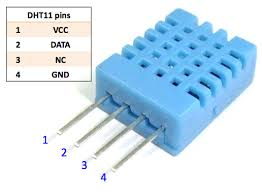
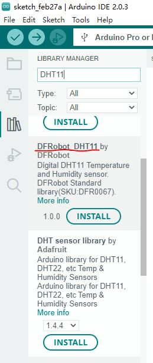
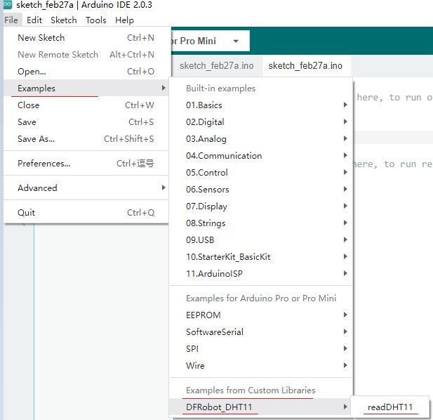

# DHT11

本实验示例使用DHT11温湿度传感器来感知环境温湿度

* Mini不能使用DHT11，因为DHT11 isn't able to work with 3.3V(Mini的工作电压是5V)

## 1 DHT11

DHT11数字温湿度传感器是一款能够检测温湿度的复合传感器，其内置一个测温元件、一个电阻式感湿元件和一个单片机。以奥松公司生产的DHT11温湿度传感器为例，其有效测量范围见表。

* 测量项	有效测量范围
* 温度	0~50℃
* 湿度	20~95%

### 1.1 DHT11传感器

传感器实物如图所示

DHT11传感器带有4个引脚，其相关说明见下表

PIN（引脚）	名称	说明
* 1	VCC	供电引脚，3~5.5VDC
* 2	DATA	温湿度数据输出
* 3	NC	空置引脚
* 4	GND	地线引脚，接电源负极

根据说明，可以从DATA引脚来获取温湿度数据，

### 1.2 DHT11传感器模块

传感器模块把DHT11的VCC、GND和DATA引脚引出(3 pins break out shield version)， 

其对应关系为：

* 模块的 + 引脚  -> 对应DHT11的VCC引脚
* 模块的 - 引脚  -> 对应DHT11的GND引脚
* 模块的 out 引脚 ->对应DHT11的DATA引脚

### DHT11模块和Arduino的连接

* +(VCC) ——>  接Arduino +5V （DHT11工作电压是5V)

* Out(Data） ——> 接Arduino数字针（DFRobot接Pin10, Adafruit接Pin2，Rob Tillaart接Pin5

* - (GND) ——>  接Arduino GND

## 2  安装DHT11库

使用Arduino IDE在线安装DHT库：DFRobot或者Arafruit等

1. DFRobot示例简单
2. Adafruit示例更全面
3. Rob Tillaart示例类型都，可以自动检测传感器类型

## 3 运行

## 4 Mini不能使用DHT11

Mini不能使用DHT11，因为DHT11 isn't able to work with 3.3V(Mini的工作电压是+5V)

* https://github.com/adafruit/DHT-sensor-library/issues/98

**现象**： Mini串口返回乱码

## 参考

* https://www.geeetech.com/wiki/index.php/Electric_thermometer_by_using_DHT11_sensor_module

* https://github.com/RobTillaart/Arduino/tree/master/libraries/DHTlib

* https://github.com/RobTillaart/DHTNew
