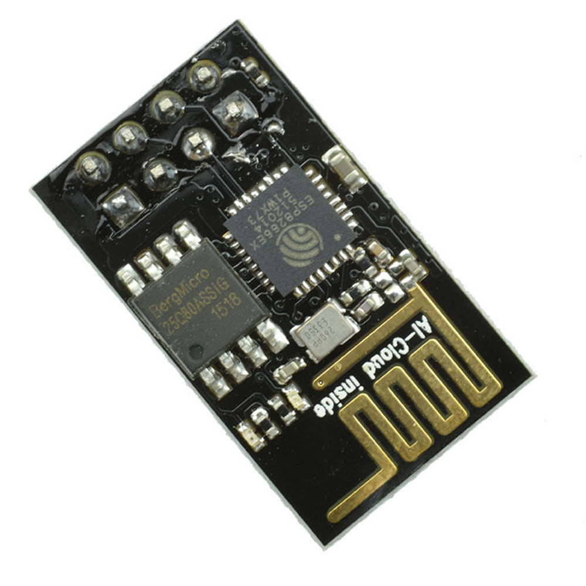
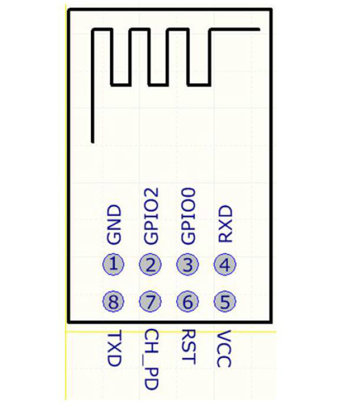
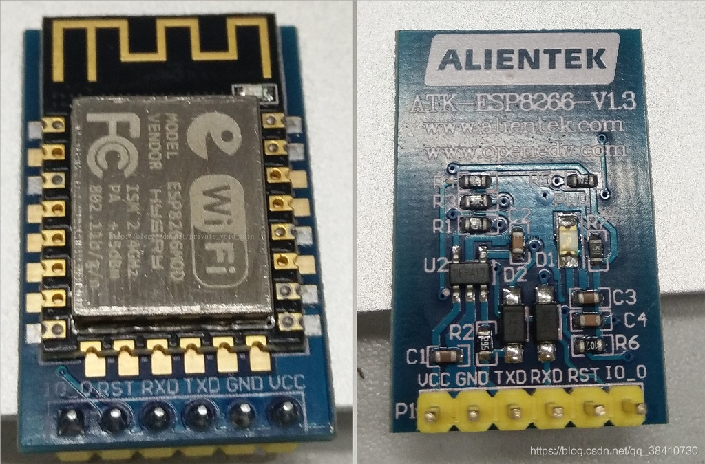
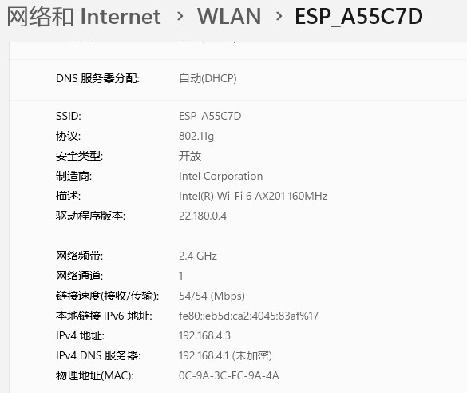

# Arduino和ESP8266 01S开发软件环境

* https://blog.csdn.net/qq_30019617/article/details/109778468

* https://github.com/tzapu/WiFiManager

## ESP8266

## 软件开发环境

* Arduino IDE
* Arduino IDE下的ESP8266`开发板`的相关开发包

**软件开发环境搭建步骤**

1. 下载Arduino IDE。附上官网下载地址
2. 安装Arduino IDE完毕后安装Esp8266开发板的开发包: 添加开发包的地址

http://arduino.esp8266.com/stable/package_esp8266com_index.json

拷贝粘贴进去就好。顺便改一个IDE的参数，烧录时能看到烧录信息

3. 重启arduino IDE,找到esp8266，安装板子开发包

4. 安装完成后，选择开发板

开发用的软件环境搭建完毕

## ESP8266板子和Arduino板子协调工作

ESP8266驱动是板子驱动，不是传感器，其本身是一个单片机系统

ESP8266板子如何和Arduino板子协同工作

* ESP8266和Arduino板子之间串口通信

需要向ESP8266和Arduino板分别烧录代码，向ESP8266烧录代码需要USB-TTL模块（下载器）

注意:如果线路正常,则下图的ESP8266会先是蓝灯闪烁,然后红灯**闪亮**,表示进入wifi搜索模式

如果通电后,灯不亮,或者蓝灯以及红灯**一直亮等**,同时AT指令不生效,那么就要再次排查电路是否正确

##  ESP的WIFI热点

只要连接好VCC,GND和EN+10k上拉电阻,芯片就能产生芯片ID名的WIFI热点：ESP-A55C7D，可以链接和pingt通

![](img/wifispot.jpg）

