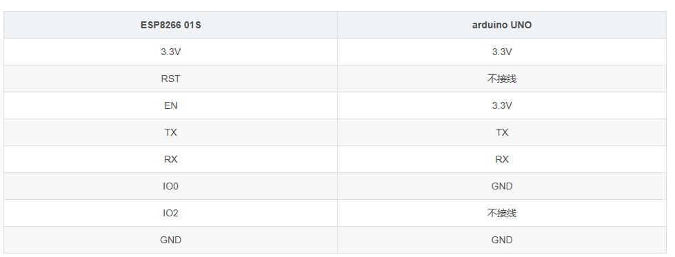

# 利用arduino给ESP8266 01S烧录程序

## 环境搭建：

将Arduino作为 USB-TTL下载器向ESP8266烧录代码

**所需硬件**

* Arduino UNO	1个
* ESP8266-01S	1个
* 面包板	1个
* 杜邦线	若干

要面包板的主要原因是因为Arduino上的3.3V和GND接口不够用，所以,要通过面包板并联一下。

**硬件连线**

 


`说明`: 上述搭建的环境是用来编译和烧录ESP8266-01S程序的。写好的程序只会借道Arduino的串口线写进ESP8266中去运行，并不会写进Arduino。这也就是为什么Arduino和ESP8266之间的串口是直接TX接TX，RX接RX的原因。

**实际连线**

按照表格提供的接线方式接通Arduino与ESP8266-01S之间的线路。

| ESP8266           |   面包板        | Arduino       |
| ----------------- | ---------------|----------------| 
| 3.3V（红色线）     | 电源 +（红色）  |               |
|                   | 电源 +（红色）  |  3.3V （红色线）  |
| EN（橙色）         | 电源 +（红色）  |                 |  
| TX（黄色）         |                |    TX            |  
| RX（蓝色）         |                |    RX            |
| IO0（白色）        | 电源 -（蓝色）  |                 |
| GND（黑色）        | 电源 -（蓝色）  |                 |
|                   | 电源 -（蓝色）  |   GND （黑色）    |


连线方案中，

* 3.3V和GND的接线用面包板并联转接一下

* 续烧录过程中需要`拔插线`操作
  *  3.3V（红色线） 
  *  IO0（白色） -  下拉: USRT Download工作模式，悬空：Flash Boot工作模式

  安排在2侧，方便后续烧录过程中的`拔插线`操作。


## 烧录步骤：

* **1.** 用Arduino IDE编译写好的程序。可以是毫无意义的空程序。只要能编译通过就可以，能烧录成功即可。

* **2.**  `拔出`ESP8266-01S的`3.3V`和`IO0`在面包板上的接线。

* **3.** 点Arduino IDE的上传按钮开始烧录。等待IDE提示连接开发板。

* **4.** 出现`Connecting…`这样的提示时，
  
  * 先把`IO0`**插回**原位`GND`，（下拉: USRT Download工作模式）
  
  * 再把`3.3V`插回原位`3.3V` 

步骤`4`是关键

* **5.** 等待烧录完成，IDE会有烧录进度提示。烧录成功后提示： hardsetting via rst pin

* **6.**  烧录完成后再拔出`IO0`和`3.3V`，悬空：Flash Boot工作模式

* **7.** 再将`3.3V`插回原位（3.3V）。切记**不要再插回**`IO0`了。

### 验证烧录

使用Arduino的ESP8266开发包的例程 `Lab_ESP8266_1_led.ino` 到ESP8266控制板上蓝色灯

```c
#define LED_BUILTIN 1 // The blue LED on the ESP-01 module is connected to GPIO1

void setup() {
  pinMode(LED_BUILTIN, OUTPUT);  // Initialize the LED_BUILTIN pin as an output
}

// the loop function runs over and over again forever
void loop() {
  digitalWrite(LED_BUILTIN, LOW);  // Turn the LED on (Note that LOW is the voltage level
  // but actually the LED is on; this is because
  // it is active low on the ESP-01)
  delay(1000);                      // Wait for a second
  digitalWrite(LED_BUILTIN, HIGH);  // Turn the LED off by making the voltage HIGH
  delay(2000);                      // Wait for two seconds (to demonstrate the active low LED)
}
```

## 烧录原理

大致原因：

* IO0接地时启动ESP8266-01S，8266会进入`下载模式`，即可以接受烧录。
* IO0不接地时ESP82660-01S会进入`工作模式`，工作模式就不接受烧录。

而拔插3.3V相当于重启ESP8266-01S。所以,每次刷机都需要先拔出`IO0`和`3.3V`，然后先把IO0接地，再接通`3.3V`的供电。刷机完成后`IO0`空置，重启ESP8266-01S。

**过程中可能遇到的问题**

* 如果Arduino中本来就有串口读写的代码，有可能会导致烧录失败，所以`烧录前先给Arduino里写入一个没有串口读写的程序`。
* 这种刷机方式的成功率不算高，要多尝试几次。
