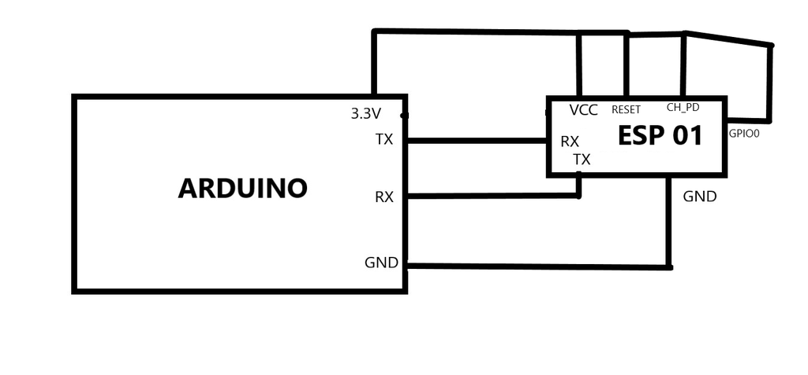

# Serial Communication Between Arduino and ESP-01

Arduino端有多个串口时，需要使用`软串口`和ESP8266通信

**注意**：有些库使用板载的pin13作为反馈信号灯，所以，`软串口`不使用pin13 

**TODO**

1. 现在的是同步web,改为异步web更好：

 ESP8266 Asynchronous Web Server

* 参考 https://randomnerdtutorials.com/esp8266-dht11dht22-temperature-and-humidity-web-server-with-arduino-ide/

2. 现在是ESP8266连接到无线路由，也可以将ESP作为WIFI热点:we will use the ESP8266 as Access Point

* https://www.survivingwithandroid.com/esp8266-web-server/

* https://randomnerdtutorials.com/esp8266-nodemcu-access-point-ap-web-server/

## 功能

* ESP8266连接到本地无线路由，提供Web服务，将web指令通过串口发给Arduino UNO

* Arduino UNO从串口接收来自 ESP8266命令执行有关操作

可以集成为`WIFI`控制小车了

## 代码烧录步骤

1. 烧录空代码到Arduino UNO
2. 烧录ESP8266程序: Lab_ESP8266_3_1_Web_Serial

   

4. 烧录Arduino UNO程序: Lab_ESP8266_3_2_Arduino_Serial/ Lab_ESP8266_3_2_1_Arduino_softSerial

**可以采用2个板子**，一个固定烧录空代码（`旧版`），用于给ESP8266烧代码，一个固定烧录Arduio通信程序，这样少了在一个Arduino板子上反复烧录过程,
只需将ESP8266插线到不同板子。这样修改过程，特别是只需要修改ESP8266的代码时，如果不需要测试在烧录Arduino，方便多了

## 问题

服务会不响应，需要重新启动板子 ,很多人有这个问题

原因可能是:This code in loop:

```c
  while(!client.available()){
    delay(1);  
  }
```
can cause a deadlock if you have a client that `drops or doesn't talk`. 

**参考**：https://arduino.stackexchange.com/questions/75494/esp8266-not-responding-after-random-intervals-of-time

修改为如下代码，不停止服务了

 
 ```c
 if(!client){
    return; 
  } ;  
  delay(50); // 
  if(client.available()) 
  {
  }
```
* https://arduino.stackexchange.com/questions/57682/esp8266-webserver-not-responding-connection-time-out

* htps://www.esp8266.com/viewtopic.php?p=87372

* https://forum.arduino.cc/t/esp8266-web-server-no-responding-after-few-minutes/526142

* https://arduino.stackexchange.com/questions/86856/arduino-esp8266webserver-hangs-after-a-while-but-responds-pings


有人认为：

* Use the latest version of Arduino esp8266 core package (2.4.2 or higher).

* ESP8266 hangs **freezes** stops responding when sent commands from different devices 

* In that case you are experiencing a common problem with your heap of the ESP. It is called 'heap fragmentation' and makes your ESP stop responding, because it doesn't have enough free heap (RAM) to send your HTTP response. You will be able to better that if you use PROGMEM strings, like
client.println (F ("HTTP/1.1 200 OK"));


## 参考

下面这个例程的html内容，不能在手机显示
* https://www.instructables.com/Serial-Communication-Between-Arduino-and-ESP-01/