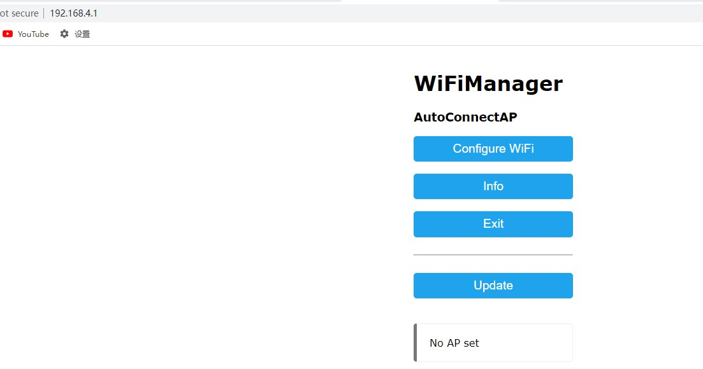
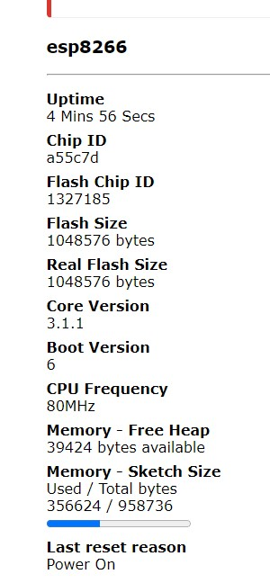

# 其他测试程序

`TODO：`

* 可以烧录一段串口定时自动收发数据的小程序在ESP8266-01S和Arduino里面。

  * Serial Event example

* 然后将两者的TX接RX，RX接TX。

通过Arduino IDE的串口查看器查看串口输出就可以验证。IDE自带的案例里就有现成的代码。在loop里稍微改动一下就可以实现。

### 配网功能实现

#### 目标

* 实现ESP8266的wifi配置功能
* 实现ESP8266自动连接WiFi

使用`WiFiManager`库配网

安装 <WiFiManager.h>  包
```c
#include <ESP8266WiFi.h>          
#include <DNSServer.h>
#include <ESP8266WebServer.h>
#include <WiFiManager.h>         
 
void setup() {
    Serial.begin(9600);       
    // 建立WiFiManager对象
    WiFiManager wifiManager;
    
    // 自动连接WiFi。以下语句的参数是连接ESP8266时的WiFi名称
    wifiManager.autoConnect("AutoConnectAP");
    
    // 如果您希望该WiFi添加密码，可以使用以下语句：
    // wifiManager.autoConnect("AutoConnectAP", "12345678");
    // 以上语句中的12345678是连接AutoConnectAP的密码
    
    // WiFi连接成功后将通过串口监视器输出连接成功信息 
    Serial.println(""); 
    Serial.print("ESP8266 Connected to ");
    Serial.println(WiFi.SSID());              // WiFi名称
    Serial.print("IP address:\t");
    Serial.println(WiFi.localIP());           // IP
}
 
void loop() {
  
}
 
```
编译上段代码并烧录进ESP8266-01S中。重启ESP8266 01S，使其进入工作模式。

* 电脑扫描WiFi，连接一个SSID叫AutoConnectAP的WIFI热点。

* 连接成功后会弹出配网的页面。如果没有自动弹出页面就在浏览器里访问192.168.4.1配置。

关于wifimanager库的更多操作请跳转去官方自行查阅。



在其中配置wifi热点，可以，让rsp8266连接到热点中

* 但是，esp8266的ip是0.0.0.0？？？？？？？？？？？？

电脑登陆tp-link检查ip是192.169.0.101，可以ping通




**ESP8266-WiFiManager-工作流程**


都实现，下面的问题是
* 如何建立ESP8266的wifi服务的客户端
* 
* ESP8266的wifi服务的客户端接收到请求后，如何将信息传递给Arduino


## 参考

http://www.taichi-maker.com/homepage/esp8266-nodemcu-iot/iot-c/esp8266-tips/wifimanager/