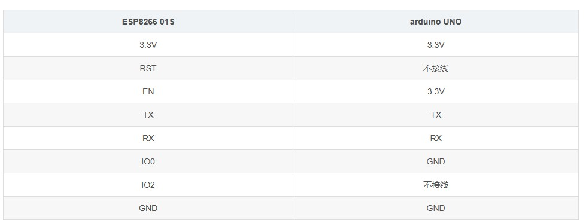
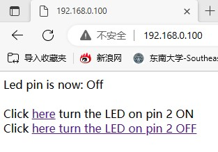
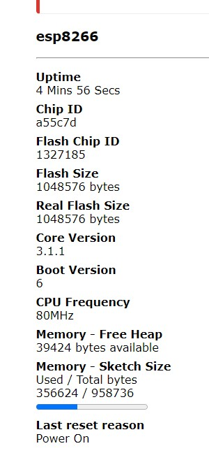

# 利用arduino给ESP8266 01S烧录程序

## 环境搭建：

将Arduino作为 USB-TTL下载器向ESP8266烧录代码

**所需硬件**

* Arduino UNO	1个
* ESP8266-01S	1个
* 面包板	1个
* 杜邦线	若干

要面包板的主要原因是因为Arduino上的3.3V和GND接口不够用，所以,要通过面包板并联一下。

**硬件连线**

 


`说明`: 上述搭建的环境是用来编译和烧录ESP8266-01S程序的。写好的程序只会借道Arduino的串口线写进ESP8266中去运行，并不会写进Arduino。这也就是为什么Arduino和ESP8266之间的串口是直接TX接TX，RX接RX的原因。

**实际连线**

按照表格提供的接线方式接通Arduino与ESP8266-01S之间的线路。

| ESP8266           |   面包板        | Arduino       |
| ----------------- | ---------------|----------------| 
| 3.3V（红色线）     | 电源 +（红色）  |               |
|                   | 电源 +（红色）  |  3.3V （红色线）  |
| EN（橙色）         | 电源 +（红色）  |                 |  
| TX（黄色）         |                |    TX            |  
| RX（蓝色）         |                |    RX            |
| IO0（白色）        | 电源 -（蓝色）  |                 |
| GND（白色）        | 电源 -（蓝色）  |                 |
|                   | 电源 -（蓝色）  |   GND （黑色）    |


连线方案中，

* 3.3V和GND的接线用面包板并联转接一下

* 续烧录过程中需要`拔插线`操作
  *  3.3V（红色线） 
  *  IO0（白色） 

  安排在2侧，方便后续烧录过程中的`拔插线`操作。


## 烧录步骤：

* **1.** 用Arduino IDE编译写好的程序。可以是毫无意义的空程序。只要能编译通过就可以，能烧录成功即可。

* **2.**  `拔出`ESP8266-01S的`3.3V`和`IO0`在面包板上的接线。

* **3.** 点Arduino IDE的上传按钮开始烧录。等待IDE提示连接开发板。

* **4.** 出现`Connecting…`这样的提示时，
  
  * 先把`IO0`**插回**原位`GND`，
  
  * 再把`3.3V`插回原位`3.3V` 

步骤`4`是关键

* **5.** 等待烧录完成，IDE会有烧录进度提示。烧录成功后提示： hardsetting via rst pin

* **6.**  烧录完成后再拔出`IO0`和`3.3V`。

* **7.** 再将`3.3V`插回原位（3.3V）。切记**不要再插回**`IO0`了。

### 验证烧录成功

烧录 `Lab_ESP8266_4_webled.ino` 到ESP8266

程序会让ESP8266连接无线路由。同时ESP8266提供web服务，控制IO2口连接的LEDd灯

* 板子上的IO0，IO2,是ESP3288提供的数字pin0，pin2,在pin2上连接一个led, 测试we控制

在无线路由的绑定ESP8266的MAC地址5C-CF-7F-A5-5C-7D的IP为192.168.0.100，方便以后使用




## 烧录原理

大致原因：

* IO0接地时启动ESP8266-01S，8266会进入下载模式，即可以接受烧录。
* IO0不接地时ESP82660-01S会进入正常工作模式，工作模式就不接受烧录。

而拔插3.3V相当于重启ESP8266-01S。所以,每次刷机都需要先拔出`IO0`和`3.3V`，然后先把IO0接地，再接通`3.3V`的供电。刷机完成后`IO0`空置，重启ESP8266-01S。

**过程中可能遇到的问题**

* 如果Arduino中本来就有串口读写的代码，有可能会导致烧录失败，所以烧录前先给Arduino里写入一个没有串口读写的程序。
* 这种刷机方式的成功率不算高，要多尝试几次。


## 其他测试程序

`TODO：`

* 可以烧录一段串口定时自动收发数据的小程序在ESP8266-01S和Arduino里面。

  * Serial Event example

* 然后将两者的TX接RX，RX接TX。

通过Arduino IDE的串口查看器查看串口输出就可以验证。IDE自带的案例里就有现成的代码。在loop里稍微改动一下就可以实现。

### 配网功能实现

#### 目标

* 实现ESP8266的wifi配置功能
* 实现ESP8266自动连接WiFi

使用`WiFiManager`库配网

安装 <WiFiManager.h>  包
```c
#include <ESP8266WiFi.h>          
#include <DNSServer.h>
#include <ESP8266WebServer.h>
#include <WiFiManager.h>         
 
void setup() {
    Serial.begin(9600);       
    // 建立WiFiManager对象
    WiFiManager wifiManager;
    
    // 自动连接WiFi。以下语句的参数是连接ESP8266时的WiFi名称
    wifiManager.autoConnect("AutoConnectAP");
    
    // 如果您希望该WiFi添加密码，可以使用以下语句：
    // wifiManager.autoConnect("AutoConnectAP", "12345678");
    // 以上语句中的12345678是连接AutoConnectAP的密码
    
    // WiFi连接成功后将通过串口监视器输出连接成功信息 
    Serial.println(""); 
    Serial.print("ESP8266 Connected to ");
    Serial.println(WiFi.SSID());              // WiFi名称
    Serial.print("IP address:\t");
    Serial.println(WiFi.localIP());           // IP
}
 
void loop() {
  
}
 
```
编译上段代码并烧录进ESP8266-01S中。重启ESP8266 01S，使其进入工作模式。

* 电脑扫描WiFi，连接一个SSID叫AutoConnectAP的WIFI热点。

* 连接成功后会弹出配网的页面。如果没有自动弹出页面就在浏览器里访问192.168.4.1配置。

关于wifimanager库的更多操作请跳转去官方自行查阅。


在其中配置wifi热点，可以，让rsp8266连接到热点中

* 但是，esp8266的ip是0.0.0.0？？？？？？？？？？？？

电脑登陆tp-link检查ip是192.169.0.101，可以ping通




**ESP8266-WiFiManager-工作流程**


都实现，下面的问题是
* 如何建立ESP8266的wifi服务的客户端
* 
* ESP8266的wifi服务的客户端接收到请求后，如何将信息传递给Arduino


## 参考

http://www.taichi-maker.com/homepage/esp8266-nodemcu-iot/iot-c/esp8266-tips/wifimanager/