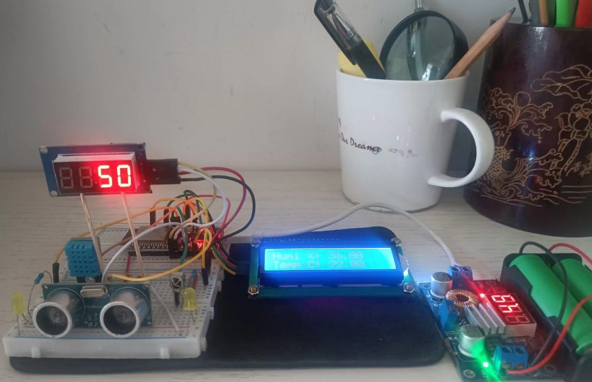
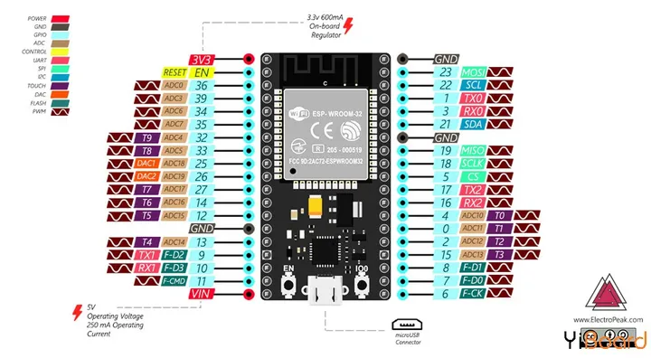

# ESP32综合实验

TODO: 

* WIFI的WebServer下，设备中有并行工作，如：web服务，接受红外信号，目前是串行的，对响应时间要求不高可以，要求高的话，需改为并行
* 系统架构和逻辑都实现，但没有加入电机控制代码
* 红外，蓝牙和WIFI多模式控制的代码执行- 后退时，LED开始闪烁几下后，一直亮



## 代码

代码模块化组织。组件代码以头文件的形式存在，合成为一个总的应用。

不是将使用代码合并到一个文件源码中，减少代码大量的代码合并工作，模块化组织使得可维护性更好

### 红外，蓝牙和WIFI多模式控制

`Lab_ESP32_Experiments_WIFI_BL.ino`

* 各元件：component_*.h
* 元件组：components.h
* 蓝牙：communication_bluetooth.h
* WIFI: communication_wifi.h

### 各种方案代码

* IRI控制：`Lab_ESP32_Experiment_IR.ino`,通过
 
* WIFI控制：`Lab_ESP32_Experiments_WIFI.ino`,通过

* 蓝牙控制：`Lab_ESP32_Experiments_bluetooth.ino`,通过

## 元件

* 红外
* LED
* 超声
* TM1637数码管
* 温湿度:DHT11
* 1602A I2C显示

## ESP32 

The ESP32 peripherals include:

* 18 Analog-to-Digital Converter (ADC) channels
* 3 SPI interfaces
* 3 UART interfaces
* 2 I2C interfaces
* 16 PWM output channels
* 2 Digital-to-Analog Converters (DAC)
* 2 I2S interfaces
* 10 Capacitive sensing GPIOs




there are pins with specific features that make them suitable or not for a particular project. The following table shows what pins are best to use as inputs, outputs and which ones you need to be cautious.

The pins highlighted in green are OK to use. The ones highlighted in yellow are OK to use, but you need to pay attention because they may have an unexpected behavior mainly at boot. The pins highlighted in red are not recommended to use as inputs or outputs

* 4,5,13-33 input/output 都可用

* 6,7,8,9,10,11 connected to the integrated SPI flash on the ESP-WROOM-32 chip and are not recommended for other uses. So, don’t use these pins in your projects:

* 34,35,36,39 input only. These pins don’t have internal pull-up or pull-down resistors. They can’t be used as outputs, so use these pins only as inputs:

* 2 connected to on-board LED, `must be left floating or LOW to enter flashing mode`

板子的左侧不可用：9,10,11,34,35,36,39，余下可用的GPIO是8个
板子的右侧不可用：2,6,7,8

* 参考： https://randomnerdtutorials.com/esp32-pinout-reference-gpios/

## 元件连接

板子的左侧可用的8个GPIO全部已经使用
```c
#define LED_LEFT_PIN 25
#define LED_RIGHT_PIN 12

#define DHTPIN 13

#define IR_RECEIVE_PIN 14

#define CLK 26
#define DIO 27

int trigPin = 32; // Trigger
int echoPin = 33; // Echo
```

* 1602A I2C 使用右侧GPIO 21，22(板子的SDA,SCL)

I2C LCD	ESP32
GND -> GND
VCC -> VIN
SDA	-> GPIO 21
SCL	-> GPIO 22

`注意`：用USB给ESP32供电时，可以从VIN取5V的电，ESP32的输出3.3V驱动1602A电压低，显示不清楚

## ESP蓝牙控制

ESP蓝牙控制：`Lab_ESP32_Experiments_bluetooth.ino`,通过

* ESP32 Bluetooth Classic With Arduino – Complete Guide
  * https://deepbluembedded.com/esp32-bluetooth-classic-with-arduino-complete-guide/

* 手机端软件： “Serial Bluetooth Terminal”

## ESP32 Bluetooth With Android Smartphone (RX)

The ESP32 Bluetooth Receiver will Turn ON and OFF an LED based on the received string of data 

that will be sent from the Smartphone over Bluetooth communication.

上载代码到ESP32后， clicking the `EN` button on the ESP32 board after a new firmware (sketch) is uploaded

Make sure that you’ve reset your board by clicking the EN button on the ESP32 board after a new firmware (sketch) is uploaded. And also make sure that the serial port baud rate in Arduino IDE serial monitor matches the serial.begin() baud rate in your code.

不然，Arduino IDE Serial Monitor Blank or Printing Garbage

看见Arduino IDE Serial Monitor 输出后，在手机中和ESP32蓝牙配对

然后，使用“Serial Bluetooth Terminal“和ESP32通讯


##  程序过大问题的解决
 
WIFI和蓝牙的使用，其库都需要使用很多存储空间，其中，蓝牙更多

如果将WIFI和蓝牙合并：`Lab_ESP32_Experiments_WIFI_BL.ino`，编译后代码大，默认的Partition Scheme下超15%，无法编译通过

改变Partition Scheme,选择Huge APP(3MB)

* Sketch uses 1523121 bytes (48%) of program storage space. Maximum is 3145728 byte

## 问题

* Arduino UNO的analogwrite和digitalwrite不能同时使用控制LED
