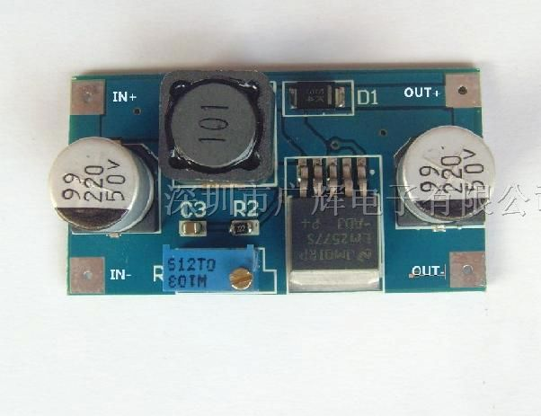
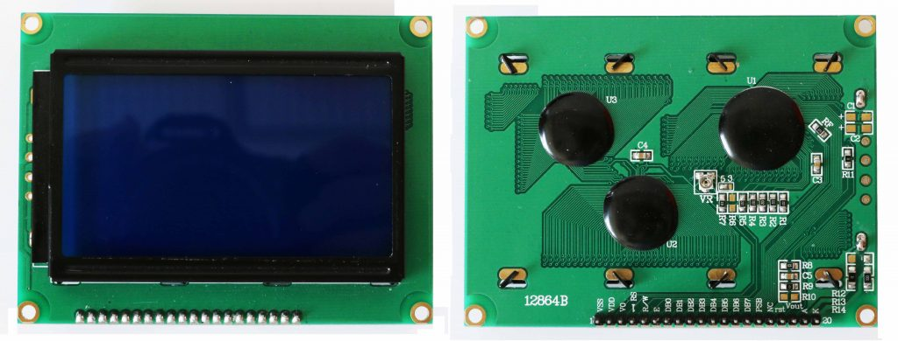

# ESP32气象站

*  本地DHT11测量温湿度
*  NTP时间
*  网络天气数据


## 元件

* 自制ESP32开发板
* LCD 12864
* 温湿度:DHT11(板载)
* 升压模块：3.7到5V
* 1节18650锂电池

### ESP32 


* 4,5,13,14,16-33 input/output 都可用, 其他有特定用途，

如: 2 connected to on-board LED, `must be left floating or LOW to enter flashing mode`

###  LM2577升压模块

Boosts a 3.7V input up to a 5V



###  DHT11
```c
#define DHTPIN 15
```


## LCD12864

屏型号：12864ZW, ZW - 带中文字库
* 128x64 with controller ST7920, (model 12864ZW).



SPI12864 SPI communication

```c
static const int latchPin = 25;  // RS
static const int dataPin = 33;   // R/W
static const int clockPin = 32;  // E
```

*  RS(CS)	-  H/L并行的指令/数据选择信号；串行的片选信号  
*  R/W(SID) -   H/L并行的读写选择信号; 串行的数据口   
*  E(CLK)-    H/L并行的使能;  串行的同步时钟

*  PSB -  H/L并/串行的接口选择; H-并行,L -串行

| LCD12864   | ESP32  |
|------------|----------|
|  VSS	     |  GND     |
|  VDD	     |  +5V     |
|  RS(CS)    |  25       |   
|  R/W(SID)  |  33	      | 
|  E(CLK)    |  32       |
|  PSB       |	GND     |
|  BLA       |	+5V     |
|  BLK       |	GND     |


### 库

本例使用`AdeeptLCD12864RSPI`


**备注**

测试U8glib库，可以编译上载，但不显示

```c
// SPI Com: SCK = en =32, MOSI = rw = 33, CS = di = 25
U8GLIB_ST7920_128X64_1X u8g(32, 33, 25);	
//U8GLIB_ST7920_128X64_4X u8g(32, 33, 25);	
```
## 使用NTP获取当前时间

NTP（Network Time Protocol，网络时间协议）

* WiFiUdp.h

* NTPClient库，获取网络时间
   * https://github.com/arduino-libraries/NTPClient/

*  `测试无效：`阿里云的NTP服务器地址通常为：time.aliyun.com或time.aliyuncs.com，端口通常为123。

* ESP32Time库，转换EpochTime到年月日，时分秒
   * https://github.com/fbiego/ESP32Time

```c
  WiFiUDP ntpUDP;
  // NTPClient(UDP& udp, const char* poolServerName, long timeOffset, unsigned long updateInterval);
  NTPClient timeClient(ntpUDP, "europe.pool.ntp.org", 28800, 60000);
  ESP32Time rtc(0);

  timeClient.begin();

  timeClient.update();
  unsigned long epochTime=timeClient.getEpochTime(); //return time in seconds since Jan. 1, 1970
  rtc.setTime(epochTime);
  
  LCDA.DisplayString(0, 2, (unsigned char *)rtc.getTime("%Y-%m-%d").c_str(),10);
  LCDA.DisplayString(3, 2, (unsigned char *)rtc.getTime("%H:%M:%S").c_str(), 8); 
```

##  网络天气数据

### How to use ArduinoJson with HTTPClient?

* https://arduinojson.org/v6/how-to/use-arduinojson-with-httpclient/


高德地图天气 API 免费版可用资源

* key: d4aa79aeab835f56274c27742bb731c
* 南京：city:32010

* https://restapi.amap.com/v3/weather/weatherInfo?key=d4aa79aeab835f56274c27742bb731cc&city=320100&extensions=all

extensions: 气象类型, 可选值：base/all, base:返回实况天气; all:返回预报天气

* base:返回实况天气

```c
  String weather = doc["lives"][0]["weather"];
  int temperature = doc["lives"][0]["temperature"];
  int humidity = doc["lives"][0]["humidity"];
  String winddirection = doc["lives"][0]["winddirection"];
  String windpower= doc["lives"][0]["windpower"];
```

```json
{
    "status": "1",
    "count": "1",
    "info": "OK",
    "infocode": "10000",
    "lives": [
        {
            "province": "江苏",
            "city": "南京市",
            "adcode": "320100",
            "weather": "多云",
            "temperature": "13",
            "winddirection": "北",
            "windpower": "≤3",
            "humidity": "75",
            "reporttime": "2024-10-29 20:01:42",
            "temperature_float": "13.0",
            "humidity_float": "75.0"
        }
    ]
}
```

* all:返回预报天气

```c
 // Extract weather information
      String date = doc["forecasts"][0]["casts"][0]["date"];
      String week = doc["forecasts"][0]["casts"][0]["week"];
      String dayweather = doc["forecasts"][0]["casts"][0]["dayweather"];
      float temperature = doc["forecasts"][0]["casts"][0]["daytemp"];
```
```json
{
    "status": "1",
    "count": "1",
    "info": "OK",
    "infocode": "10000",
    "forecasts": [
        {
            "city": "南京市",
            "adcode": "320100",
            "province": "江苏",
            "reporttime": "2024-10-29 19:34:38",
            "casts": [
                {
                    "date": "2024-10-29",
                    "week": "2",
                    "dayweather": "晴",
                    "nightweather": "晴",
                    "daytemp": "20",
                    "nighttemp": "10",
                    "daywind": "东北",
                    "nightwind": "东北",
                    "daypower": "1-3",
                    "nightpower": "1-3",
                    "daytemp_float": "20.0",
                    "nighttemp_float": "10.0"
                },
                {
                    "date": "2024-10-30",
                    "week": "3",
                    "dayweather": "晴",
                    "nightweather": "晴",
                    "daytemp": "21",
                    "nighttemp": "12",
                    "daywind": "东北",
                    "nightwind": "东北",
                    "daypower": "4",
                    "nightpower": "4",
                    "daytemp_float": "21.0",
                    "nighttemp_float": "12.0"
                },
                {
                    "date": "2024-10-31",
                    "week": "4",
                    "dayweather": "多云",
                    "nightweather": "小雨",
                    "daytemp": "21",
                    "nighttemp": "15",
                    "daywind": "东",
                    "nightwind": "东",
                    "daypower": "4",
                    "nightpower": "4",
                    "daytemp_float": "21.0",
                    "nighttemp_float": "15.0"
                },
                {
                    "date": "2024-11-01",
                    "week": "5",
                    "dayweather": "小雨",
                    "nightweather": "多云",
                    "daytemp": "19",
                    "nighttemp": "15",
                    "daywind": "北",
                    "nightwind": "北",
                    "daypower": "4",
                    "nightpower": "4",
                    "daytemp_float": "19.0",
                    "nighttemp_float": "15.0"
                }
            ]
        }
    ]
}
```

###  其他参考天气

#### 和风天气

已经要求付费，请求返回：`402` Payment Required

```js
//天气部分 -和风天气: cmh@seu.edu.cn,ps: hftq123456
    function TodayWeather(){
        var NowWeather = new XMLHttpRequest();
            NowWeather.open("GET","https://devapi.qweather.com/v7/weather/now?location=101190101&key=2d9a2cb5bf004272acf4b854fd55c398",true);
            
```json
{
    "code": "200",
    "updateTime": "2024-10-29T13:12+08:00",
    "fxLink": "https://www.qweather.com/weather/nanjing-101190101.html",
    "now": {
        "obsTime": "2024-10-29T13:10+08:00",
        "temp": "20",
        "feelsLike": "18",
        "icon": "100",
        "text": "晴",
        "wind360": "0",
        "windDir": "北风",
        "windScale": "3",
        "windSpeed": "13",
        "humidity": "42",
        "precip": "0.0",
        "pressure": "1016",
        "vis": "23",
        "cloud": "0",
        "dew": "10"
    },
    "refer": {
        "sources": [
            "QWeather"
        ],
        "license": [
            "CC BY-SA 4.0"
        ]
    }
}
```

####  OpenWeather weather data

* https://www.makerguides.com/simple-esp32-internet-weather-station/

