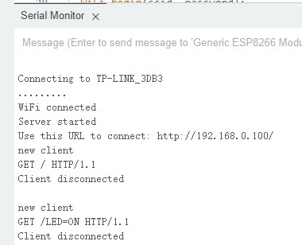

# ESP8266 01S程序web服务

烧录 `Lab_ESP8266_2_webled.ino` 到ESP8266

程序会让ESP8266连接无线路由。同时ESP8266提供web服务，控制IO2口连接的LEDd灯

* 板子上的IO0，IO2,是ESP3288提供的数字pin0，pin2,在pin2上连接一个led, 测试Web控制

在无线路由的绑定ESP8266的MAC地址5C-CF-7F-A5-5C-7D的IP为192.168.0.100，方便以后使用

## 参考

* https://randomnerdtutorials.com/esp8266-web-server/
