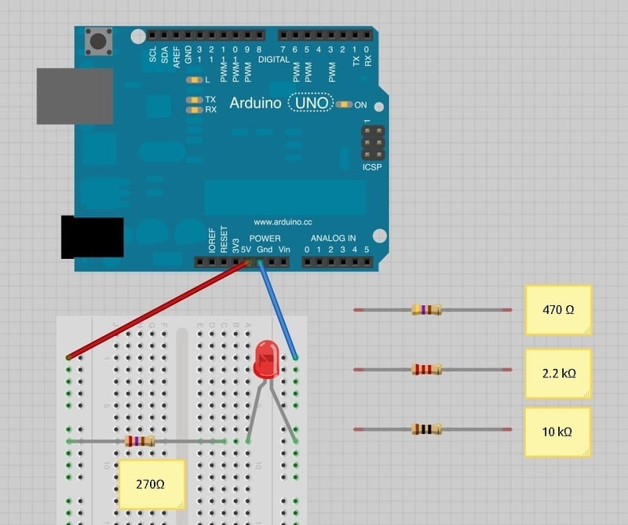
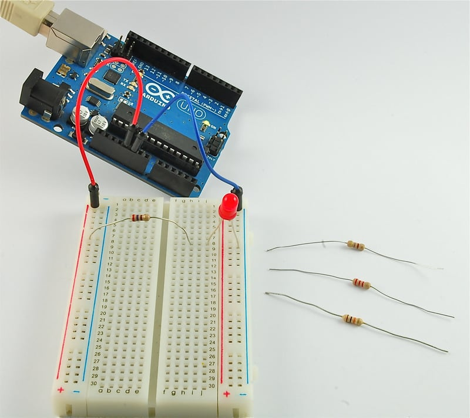
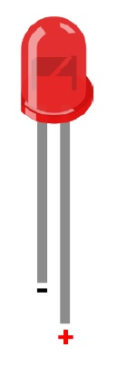
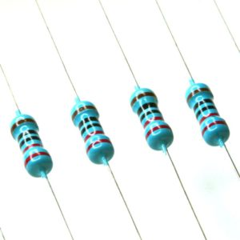
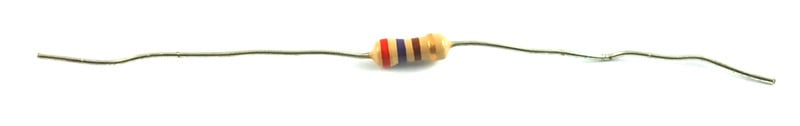
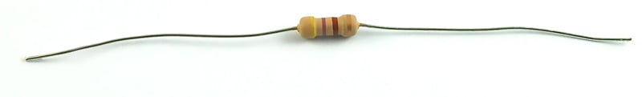
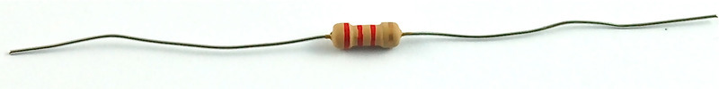
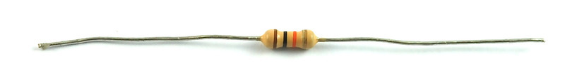

# LED


## 元件

## 电路图






220Ω电阻1个， LED1个


**实现了多个LED的分组，显示**

`待补充：运行情况`
### LED

发光二极管(LED)正负极

LED长脚（支架小）为正，短脚（支架大）为负



### 电阻

Each color has a number, as follows:
* Black 0
* Brown 1
* Red 2
* Orange 3
* Yellow 4
* Green 5
* Blue 6
* Purple 7
* Gray 8
* sWhite 9

* `220Ω电阻的五色环` 红 红  黑 黑  金 

 |  红  |红    | 黑   |  黑   |  金 |
 |:----:|:----:|:----:|:-----:|:---:|
 |  2   | 2     |  0   |  0    |  5% |

 s

* 270 Ω Resistor (red, purple, brown stripes) 



* 470 Ω Resistor (yellow, purple, brown stripes) 



* 2.2 kΩ Resistor (red, red, red stripes) 



* 10 kΩ Resistor (brown, black, orange stripes) 



## code

```c
/*
  Blink
*/

int led = 9;         // the PWM pin the LED is attached to
// the setup function runs once when you press reset or power the board
void setup() {
  // initialize digital pin LED_BUILTIN as an output.
  pinMode(led, OUTPUT);
}

// the loop function runs over and over again forever
void loop() {
  digitalWrite(led, HIGH);  // turn the LED on (HIGH is the voltage level)
  delay(1000);                      // wait for a second
  digitalWrite(led, LOW);   // turn the LED off by making the voltage LOW
  delay(1000);                      // wait for a second
}
```