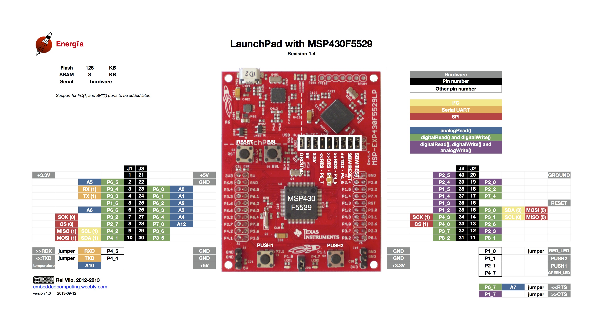

# Arduino MSP430实验室

## MSP430开发版

MSP430系列单片机是美国德州仪器(TI)1996年开始推向市场的一种16位超低功耗的混合信号处理器(Mixed Signal Processor)。称之为混合信号处理器，主要是由于其针对实际应用需求，把许多模拟电路、数字电路和微处理器集成在一个芯片上，以提供“单片”解决方案。

### MSP430F5529LP开发版



## 安装MSP430开发版串口驱动

* https://energia.nu/guide/install/windows/


安装LaunchPad CDC drivers zip file for Windows 32 and 64 bit

1. 下载energia_drivers http://s3.amazonaws.com/energiaUS/files/energia_drivers.zip 解压运行

或者

2. 下载eZ-FET http://energia.nu/files/ezFET-Lite.zip ，解压，然后用管理员权限运行DPinst64.exe安装驱动。

安装驱动后，可见2个串口设备，如下：


## 安装Arduino的MSP430开发版支持环境

参考改仓库

* https://github.com/Andy4495/TI_Platform_Cores_For_Arduino

配置`Standard Energia URL`: https://energia.nu/packages/package_energia_index.json

This is the official URL published by Energia, but specifies older board package versions.
This would only be used in specialized cases, and is mainly here for archival purposes.

然后，安装支持环境软件

## 实例-板载LED Blink


MSP430F5529LP板载LED

* LED1  Pin1.0: P1_0 or  RED_LED 
* LED2  Pin4.7: P4_7 or GREEN_LED (见上面的板子的Pin图)

### 使用Arduino lib

```c
/*
  Blink
    Turns the RED_LED and GREEN_LED on for one second, then off for one second, repeatedly.
*/

// the setup function runs once when you press reset or power the board
void setup() {
  // initialize digital pins RED_LED and GREEN_LED as an output.
  pinMode(RED_LED, OUTPUT);
  pinMode(GREEN_LED, OUTPUT);
  // pinMode(P4_7, OUTPUT);
}

// the loop function runs over and over again forever
void loop() {
  digitalWrite(RED_LED, HIGH);  // turn the LED on (HIGH is the voltage level)
  digitalWrite(GREEN_LED, HIGH);  
  delay(1000);                      // wait for a second
  digitalWrite(RED_LED, LOW);   // turn the LED off by making the voltage LOW
  digitalWrite(GREEN_LED, LOW);  
  delay(1000);                      // wait for a second
}
```

### 使用driverlib

```c
/******************************************************************************
*  GPIO - Blink LED
*
*  Description: This example demonstrates how to set a GPIO pin as an output
*  pin and toggle the output of the pin
*
*                                    MSP430
*                              -----------------
*                             |                 |
*                             |             P1.0|-->LED
*                             |                 |
*                             |                 |
*                             |                 |
*
* Tested On: MSP430F5529
* Author: Zack Lalanne
******************************************************************************/
#include <driverlib.h>

void setup()
{
    GPIO_setAsOutputPin(GPIO_PORT_P1, GPIO_PIN0);
    GPIO_setOutputLowOnPin(GPIO_PORT_P1, GPIO_PIN0);
}

void loop()
{
    // Wait for a second
    delay(1000);
    GPIO_toggleOutputOnPin(GPIO_PORT_P1, GPIO_PIN0);
}
```