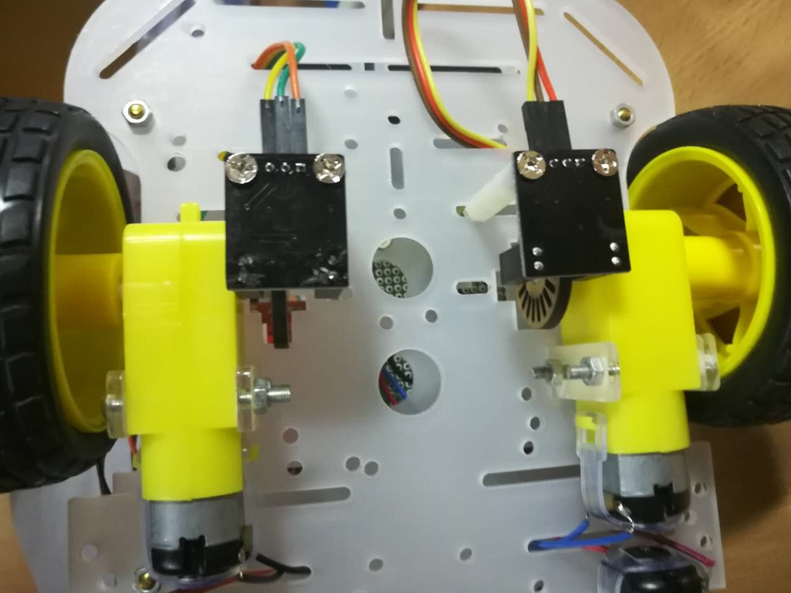
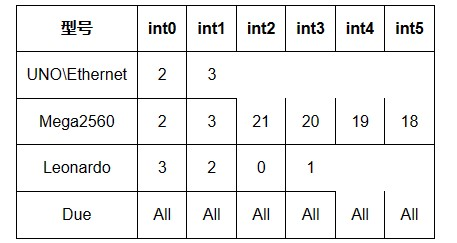

# 智能小车4- L298N控制智能小车直流电机测速


## 编码器测速模块

可以用于测速的模块很多，比如加速度计、激光、超声波、编码器等等。

由于我们对小车速度的测量精度要求不高，因此我们可以借助小车套件里面的码盘配上测速模块对其速度进行测量。  

准备材料

测速模块：  网上的测速模块有很多种外观，但是其工作原理类似，下面列出来了几种常见的测速模块，这些测速模块接线类似。  


驱动模块安装时需要注意，不能影响轮子的正常工作，不能触碰到轮轴上的码盘。 

编码器上有三个引脚分别是“VCC”,“GND”,“OUT”。

左右两边两个测速模块的

* VCC引脚接电源或开发板的“5V”或“3.3V”引脚

* “GND”接电源或开发板的“GND”引脚，

* 左边测速模块“OUT”接开发板的“3”引脚，

* 右边测速模块“OUT”接开发板的“2”引脚。

引脚接错的话可以再随后调试过程中换过来，也可以在代码里更改。  


 最终接线图如下

 


## 测速模块讲解
测速模块的工作原理比较简单，如下图所示，
  
  在于电机同轴的码盘上有很多开孔（光栅），编码器相当于光敏元件。码盘随着小车轮子的运动转动时，码盘（光栅）会不断遮挡光敏元件发出的光波，这时候编码器就会根据光栅的遮挡不断的产生方波信号，方波信号会从“OUT”引脚输出，我们只需不断检测“OUT”引脚的输出，根据方波信号的周期简介计算出小车运行的速度。小车上使用的码盘（光栅）精度不高，在某些高精度的编码器上光栅会更加密集，测量效果会更好。 

   

  由于要**不断检测编码器输出端**的输出，因此我们需要借助Arduino的**外部中断**来读取编码器的输出。
  
  Arduino开发板外部中断对应的引脚如下：

  

  由表中可以知道在此我们使用的Arduino UNO只有“2”，“3”引脚可以触发外部中断，
  
  因此在接线的时候我们便将左右两边的输出`OUT`引脚分别接在`2,3`引脚上。 
  
  在程序初始化阶段中调用函数`attachInterrupt(interrupt, function, mode)`可以对中断引脚初始化，其中 
  
  * interrupt： 要初始化的外部中断编号，由上表可知我们Arduino UNO只能使用外部中断0和外部中断1； 
  
  * function： 中断服务函数的名字，即当外部中断被触发时，将会自动调用这个函数； 
  
  * mode： 中断触发的方式，可选方式如下  

  

## 代码测试

基于lab_ls298n_two_wheel.ino修改lab_ls298n_speed_mersure_simple

测试左测传感器好的，右侧电源的VCC和GNA接触不良，传感器通电的led灯不亮，**`虚焊`**了,重新焊接修复

```c
/*
  车子速测试程序
 Motor Black -  High -> Forward
 Motor Red +  High -> Back 

*/

#define LeftForward 4   // Motor Black -     LS298N IN1 -> Arduino Pin4
#define LeftBack 5      // Motor Red     +     LS298N IN2 -> Arduino Pin5
#define RightForward 6  // Motor Black -     LS298N IN3 -> Arduino Pin6
#define RightBack 7     // Motor Red     +     LS298N IN4 -> Arduino Pin7

// 测速 left int1 pin3,
//      right: int0 pin2
int leftCounter = 0, rightCounter = 0;
unsigned long time = 0, old_time = 0;  // 时间标记
unsigned long time1 = 0;               // 时间标记
float lv, rv;                          //左、右轮速度

void setup() {
  // 测速
  Serial.begin(9600);
  attachInterrupt(0, RightCount_CallBack, FALLING);
  attachInterrupt(1, LeftCount_CallBack, FALLING);

  pinMode(LeftForward, OUTPUT);
  pinMode(LeftBack, OUTPUT);
  pinMode(RightForward, OUTPUT);
  pinMode(RightBack, OUTPUT);
  initCar();
  delay(2000);
}

void loop() {
  // 测速
  SpeedDetection();
  go();
  delay(2000);
  // back();
  // delay(2000);
  stopCar();
  delay(2000);
  turnLeft();
  delay(2000);
  stopCar();
  // turnRight();
  delay(2000);
  if (Serial.available() > 0) {
    char cmd = Serial.read();
    Serial.print(cmd);
    if (cmd == 0)
      stopCar();
  }
}


/*
 * *速度计算
 */
bool SpeedDetection() {
  time = millis();                   //以毫秒为单位，计算当前时间
  if (abs(time - old_time) >= 1000)  // 如果计时时间已达1秒
  {
    detachInterrupt(0);  // 关闭外部中断0
    detachInterrupt(1);  // 关闭外部中断1
    //把每一秒钟编码器码盘计得的脉冲数，换算为当前转速值
    //转速单位是每分钟多少转，即r/min。这个编码器码盘为20个空洞。
    lv = (float)leftCounter * 60 / 20;   //小车车轮电机转速
    rv = (float)rightCounter * 60 / 20;  //小车车轮电机转速
    Serial.print("left:");
    Serial.print(lv);  //向上位计算机上传左车轮电机当前转速的高、低字节
    Serial.print("     right:");
    Serial.println(rv);  //向上位计算机上传左车轮电机当前转速的高、低字节
    //恢复到编码器测速的初始状态
    leftCounter = 0;  //把脉冲计数值清零，以便计算下一秒的脉冲计数
    rightCounter = 0;
    old_time = millis();  // 记录每秒测速时的时间节点
    // 测速 left int1 pin3,
    //  right: int0 pin2
    attachInterrupt(0, RightCount_CallBack, FALLING);  // 重新开放外部中断0
    attachInterrupt(1, LeftCount_CallBack, FALLING);   // 重新开放外部中断0
    return 1;
  } else
    return 0;
}

/*
 * *左轮编码器中断服务函数
 */
void LeftCount_CallBack() {
  leftCounter++;
}

/*
 * *右轮编码器中断服务函数
 */
void RightCount_CallBack() {
  rightCounter++;
}

void initCar() {
  //默认全是低电平 停止状态
  digitalWrite(LeftForward, LOW);
  digitalWrite(LeftBack, LOW);
  digitalWrite(RightForward, LOW);
  digitalWrite(RightBack, LOW);
}

void go() {
  // 左轮前进
  digitalWrite(LeftForward, HIGH);
  digitalWrite(LeftBack, LOW);
  // 右轮前进
  digitalWrite(RightForward, HIGH);
  digitalWrite(RightBack, LOW);
}

void back() {
  //左轮后退
  digitalWrite(LeftForward, LOW);
  digitalWrite(LeftBack, HIGH);
  //右轮后退
  digitalWrite(RightForward, LOW);
  digitalWrite(RightBack, HIGH);
}

/* 左转 */
void turnLeft() {
  //左轮不动
  digitalWrite(LeftForward, LOW);
  digitalWrite(LeftBack, LOW);
  // 右轮前进
  digitalWrite(RightForward, HIGH);
  digitalWrite(RightBack, LOW);
}

/* 右转 */
void turnRight() {
  // 左轮前进
  digitalWrite(LeftForward, HIGH);
  digitalWrite(LeftBack, LOW);
  // 右轮不动
  digitalWrite(RightForward, LOW);
  digitalWrite(RightBack, LOW);
}

void stopCar() {
  initCar();
}


```

## 综合程序

* 红外控制
* ledf方向指示
* 超声避撞
* 编码轮测速

文件： Lab_LS298N_IRremote_leds_ultrasonic_speed.ino