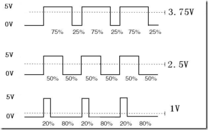
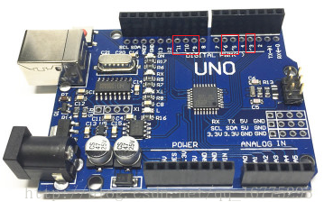

# 智能小车 5 - L298N控制智能小车PWM调速


https://cloud.tencent.com/developer/article/2158369

##  PWM调速

 在这一篇我们将对小车的行进速度进行调整，将驱动模块的作用发挥出来。首先大家要了解PWM这个概念。

PWM
  脉宽调制(PWM)基本原理：控制方式就是对逆变电路开关器件的通断进行控制，使输出端得到一系列幅值相等的脉冲，用这些脉冲来代替正弦波或所需要的波形。也就是在输出波形的半个周期中产生多个脉冲，使各脉冲的等值电压为正弦波形，所获得的输出平滑且低次谐波少。按一定的规则对各脉冲的宽度进行调制，即可改变逆变电路输出电压的大小，也可改变输出频率。




通俗一点讲那，就是当如果我们想输出5V电压时，只需一直输出高电平即可；当我们想输出3.75V电压时，那我们就需要在一个周期内（一个高电平和一个低电平为一个周期）3.75÷5=75%时间输出高电平，25%时间输出低电平；同理，如果想输出2.5V电压时，我们需要在一个周期内50%时间输出高电平，50%时间输出低电平


Arduino UNO开发板上只有带有“~”表示的引脚才具有PWM功能，因此我们在控制驱动时可以使用这几个引脚。 



如果想控制驱动的输出时，需要对驱动的“ENA”“ENB”进行控制，因此我们需要将图中被选中部分的两个跳线帽拔掉。并将“ENA”连接Arduino UNO开发板的“5”引脚，“ENB”连接“6”引脚。


```c
int leftCounter = 0, rightCounter = 0;
unsigned long time = 0, old_time = 0;  // 时间标记
unsigned long time1 = 0;               // 时间标记
float lv, rv;                          //左、右轮速度
#define STOP 0
#define FORWARD 1
#define BACKWARD 2
#define TURNLEFT 3
#define TURNRIGHT 4
#define CHANGESPEED 5
int leftMotor1 = 16;
int leftMotor2 = 17;
int rightMotor1 = 18;
int rightMotor2 = 19;
bool speedLevel = 0;
int leftPWM = 5;
int rightPWM = 6;
void setup() {

  // put your setup code here, to run once:
  Serial.begin(9600);
  attachInterrupt(0, RightCount_CallBack, FALLING);
  attachInterrupt(1, LeftCount_CallBack, FALLING);
  pinMode(leftMotor1, OUTPUT);
  pinMode(leftMotor2, OUTPUT);
  pinMode(rightMotor1, OUTPUT);
  pinMode(rightMotor2, OUTPUT);
  pinMode(leftPWM, OUTPUT);
  pinMode(rightPWM, OUTPUT);
}
void loop() {

  // put your main code here, to run repeatedly:
  SpeedDetection();
  if (Serial.available() > 0) {

    char cmd = Serial.read();
    Serial.print(cmd);
    motorRun(cmd);
    if (speedLevel)  //根据不通的档位输出不同速度
    {

      analogWrite(leftPWM, 120);
      analogWrite(rightPWM, 120);
    } else {

      analogWrite(leftPWM, 250);
      analogWrite(rightPWM, 250);
    }
  }
}
/* * *速度计算 */
bool SpeedDetection() {

  time = millis();                   //以毫秒为单位，计算当前时间
  if (abs(time - old_time) >= 1000)  // 如果计时时间已达1秒
  {

    detachInterrupt(0);  // 关闭外部中断0
    detachInterrupt(1);  // 关闭外部中断1
    //把每一秒钟编码器码盘计得的脉冲数，换算为当前转速值
    //转速单位是每分钟多少转，即r/min。这个编码器码盘为20个空洞。
    Serial.print("left:");
    lv = (float)leftCounter * 60 / 20;   //小车车轮电机转速
    rv = (float)rightCounter * 60 / 20;  //小车车轮电机转速
    Serial.print("left:");
    Serial.print(lv);  //向上位计算机上传左车轮电机当前转速的高、低字节
    Serial.print(" right:");
    Serial.println(rv);  //向上位计算机上传左车轮电机当前转速的高、低字节
    //恢复到编码器测速的初始状态
    leftCounter = 0;  //把脉冲计数值清零，以便计算下一秒的脉冲计数
    rightCounter = 0;
    old_time = millis();                               // 记录每秒测速时的时间节点
    attachInterrupt(0, RightCount_CallBack, FALLING);  // 重新开放外部中断0
    attachInterrupt(1, LeftCount_CallBack, FALLING);   // 重新开放外部中断0
    return 1;
  } else
    return 0;
}
/* * *右轮编码器中断服务函数 */
void RightCount_CallBack() {

  rightCounter++;
}
/* * *左轮编码器中断服务函数 */
void LeftCount_CallBack() {

  leftCounter++;
}
/* * *小车运动控制函数 */
void motorRun(int cmd) {

  switch (cmd) {

    case FORWARD:
      Serial.println("FORWARD");  //输出状态
      digitalWrite(leftMotor1, HIGH);
      digitalWrite(leftMotor2, LOW);
      digitalWrite(rightMotor1, HIGH);
      digitalWrite(rightMotor2, LOW);
      break;
    case BACKWARD:
      Serial.println("BACKWARD");  //输出状态
      digitalWrite(leftMotor1, LOW);
      digitalWrite(leftMotor2, HIGH);
      digitalWrite(rightMotor1, LOW);
      digitalWrite(rightMotor2, HIGH);
      break;
    case TURNLEFT:
      Serial.println("TURN LEFT");  //输出状态
      digitalWrite(leftMotor1, HIGH);
      digitalWrite(leftMotor2, LOW);
      digitalWrite(rightMotor1, LOW);
      digitalWrite(rightMotor2, HIGH);
      break;
    case TURNRIGHT:
      Serial.println("TURN RIGHT");  //输出状态
      digitalWrite(leftMotor1, LOW);
      digitalWrite(leftMotor2, HIGH);
      digitalWrite(rightMotor1, HIGH);
      digitalWrite(rightMotor2, LOW);
      break;
    case CHANGESPEED:
      Serial.println("CHANGE SPEED");  //输出状态
      if (speedLevel)                  //接收到换挡命令的时候切换档位
        speedLevel = 0;
      else
        speedLevel = 1;
      break;
    default:
      Serial.println("STOP");  //输出状态
      digitalWrite(leftMotor1, LOW);
      digitalWrite(leftMotor2, LOW);
      digitalWrite(rightMotor1, LOW);
      digitalWrite(rightMotor2, LOW);
  }
}


```