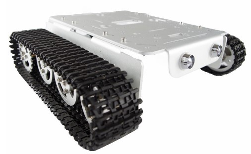
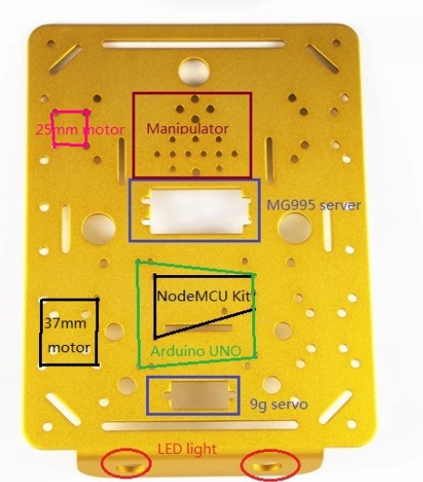
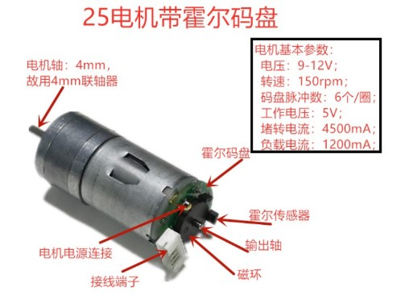
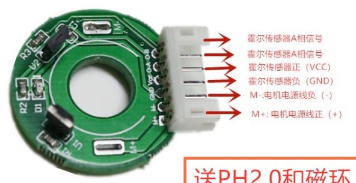
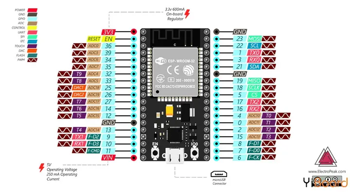
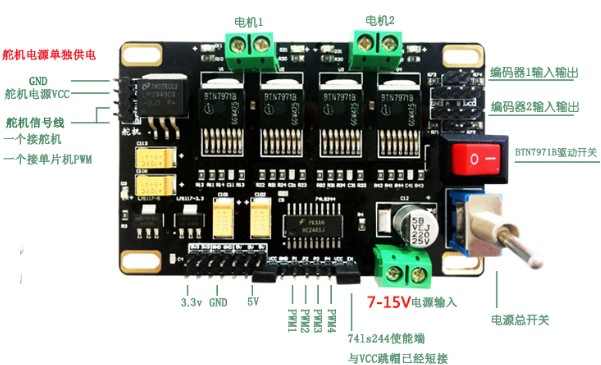
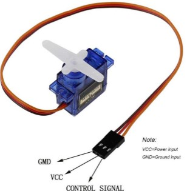
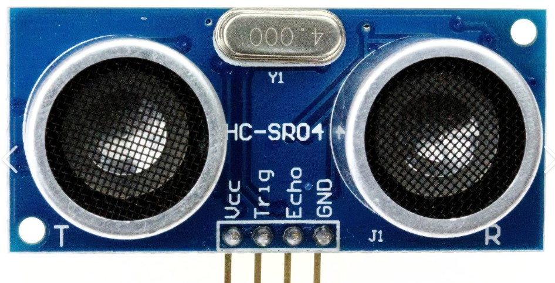

#  基于ESP32和飞思卡尔BTN7919B驱动模块的履带车

## 电源问题

锂电池：11.4V,4200mAh

* 现在测量电压7V,下降很多，需要充电

### 飞思卡尔BTN7919B的5V电源向ESP32供电

* 5V超声模块工作异常
* 启动WIFI，请求服务后，WIFI服务会退出

### Micro USB向ESP32供电

*  WIFI工作正常
* 5V超声模块正常

## T200金属履带式坦克底盘

* https://detail.1688.com/offer/571430740572.html



* 铝合金底板 x1
* 铝合金驱动器轮(带连轴器) x2
* 铝合金承重轮（带轴承） x6
* 电机 x2
* 塑料履带：4x75cm (宽*长度)

### 底板

底板配置安装孔：
 
* 25/37mm电机 - 可安装为4WD小车
* S90和MG995/996伺服电机
* Arduino UNO
* NodeMCU lit



### 直流有刷减速电机及霍尔码盘
   
* 12V330转25电机: HM-GM-25-370 12V330直流减速电机



* 霍尔码盘



## ESP32 



* Recommended PWM GPIO pins on the ESP32: 2,4,12-19,21-23,25-27,32-33

板子的左侧不可用：9,10,11,34,35,36,39，余下可用的GPIO是8个
板子的右侧不可用：2,6,7,8

## 飞思卡尔BTN7919B双驱动模块

BTN7919B双驱动板是：电源和电机驱动一体板

板子提供
* 输出：5V,3,3V电源
* 驱动: 2电机，1个舵机
* 编码器1/2输入输出
  


信号P1,p2,p3,p4都是PWM，对应out1（电机1- 右）,out2（电机2-左）

此外，还有舵机PWM

### 履带车电机连线

使用舵机时，电机不能调试：`舵机库的PMW冲突`

```c
 右电机 红线 -> 电机1 out1 线圈侧 -> BTN7919 PMW2 -> GPIO 33 黄色
 右电机 黑线 -> 电机1 out1 开关侧 -> BTN7919 PMW1 -> GPIO 32 绿色

 左电机 红线 -> 电机2 out2 开关侧 -> BTN7919 PMW4 -> GPIO 27 黄色
 左电机 黑线 -> 电机2 out2 线圈侧 -> BTN7919 PMW3 -> GPIO 26 绿色 
```

### 超声舵机连线

超声舵机S90连接到BTN7919B

舵机驱动库： 使用3.0.0， 不能更新到3.0.1

https://madhephaestus.github.io/ESP32Servo/annotated.html

* BTN7919B舵机PWM -> GPIO 15



* 超声传感器



| HC-SR04    |  MSP32    | 连线 |  
|-----------|------------|------|
| Trig      |  GPIO 18   | 白色 |
| Echo      |  GPIO 19   | 橙色 |

## LED

10mm Ultra-High Brightness 

```c
#define LED_LEFT_PIN 12
#define LED_RIGHT_PIN 23
```
电阻：820欧，可以降低电阻，增大亮度

* 目前，LED没有使用PMW，所以，只有`亮、灭`2种状态，不能调整亮度和闪烁

## I2C oled  

|I2C oled|	ESP32|
|------|------|
|GND   | GND  |
|VCC   | 3.3  |
|SCL   | GPIO 22|
|SDA   | GPIO 21|


