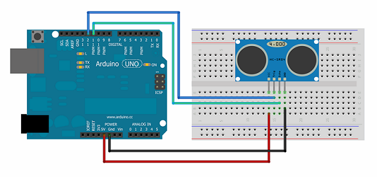
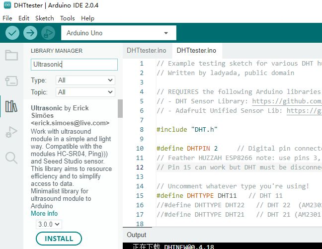

# Ultrasonic

## Ultrasonic

HC-SR04   

**测距失败**： 传感器坏了？？？

## 连接

 Module HR-SC04 (four pins)  attached to digital pins as follows:
 
 ---------------------    
 | HC-SC04 | Arduino |    
 |---------|---------|   
 |   Vcc   |   5V    |   
 |   Trig  |   12    | 
 |   Echo  |   13    | 
 |   Gnd   |   GND   |

## 库

Erick Simões (github: @ErickSimoes

