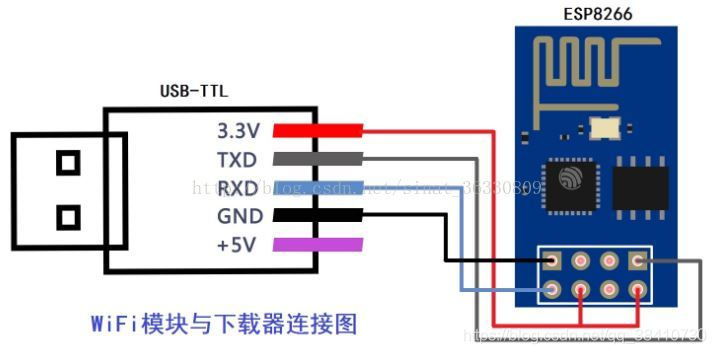

# WIFI ESP8266

ESP8266板子如何和Arduino板子协同工作？？？？

## ESP8266

## 连线

注意如果线路正常,则下图的ESP8266会先是蓝灯闪烁,然后红灯**闪亮**,表示进入wifi搜索模式

如果通电后,灯不亮,或者蓝灯以及红灯**一直亮等**,同时AT指令不生效,那么就要再次排查电路是否正确

## 测试

只要连接好VCC,GND和EN+10k上拉电阻,芯片就能产生WIFI热点：ESP-A55C7D，可以链接和相应

## 问题
采用AdaFruit的ESP8266库和测试代码，测试和Arduino的串口通信**失败**，

`硬件坏了`？ 但是`怎么会有热点`？ 

**`ESP8266的Arduino驱动或者连线错误`**

esp8266中使用的串口芯片是`ch340`,问题可能是和`ch340`通讯问题

## Arduino驱动

指南：

https://github.com/esp8266/Arduino/blob/master/doc/installing.rst

ESP8266驱动是板子驱动，不是传感器，其本身是一个单片机系统
https://github.com/esp8266/Arduino

### Installing with Boards Manager
Starting with 1.6.4, Arduino allows installation of third-party platform packages using Boards Manager. We have packages available for Windows, Mac OS, and Linux (32 and 64 bit).

* Install the current upstream Arduino IDE at the 1.8.9 level or later. The current version is on the Arduino website.
* Start Arduino and open the Preferences window.
Enter `https://arduino.esp8266.com/stable/package_esp8266com_index.json` into the File>Preferences>`Aditional Boards Manager` URLs field of the Arduino IDE. You can add multiple URLs, separating them with commas.

* Open Boards Manager from `Tools > Board` menu and install esp8266 platform (and don't forget to select your `ESP8266 board` from Tools > Board menu after installation).

* Start Arduino and open Preferences window.
* Enter https://arduino.esp8266.com/stable/package_esp8266com_index.json into Additional Board Manager URLs field. You can add multiple URLs, separating them with commas.
* Open Boards Manager from Tools > Board menu and find esp8266 platform.
Select the version you need from a drop-down box.
Click install button.

Don't forget to select your ESP8266 board from Tools > Board menu after installatio

安装要从github下载很多库，如`esp-quick-toolchain`，有时会链接困难失败，需要多安装几次

板子的库安装好后，有很对例程可以选择使用

从esp8266板子类中，选择适当的板子类型，

然后，使用例程测试,错误！

`A fatal esptool.py error occurred: Failed to connect to ESP8266: Timed out waiting for packet header`

https://www.instructables.com/Arduino-UNO-ESP8266-WiFi-Module/

* ESP8266 TX --> Arduino UNO TX
* ESP8266 GND --> Breadboard GND
* ESP8266 CH-PD --> Breadboard 3.3V
* ESP8266 GPIO2 --> Breadboard LED
* ESP8266 RST --> Breadboard RST button --> Arduino UNO GND
* ESP8266 GPIO0 --> Breadboard 3.3V/Breadboard FLASH button --> Arduino UNO GND
* ESP8266 VCC --> Breadboard 3.3V
* ESP8266 RX --> Arduino UNO RX
**代码是通过Arduino的串口上传到ESP8266**