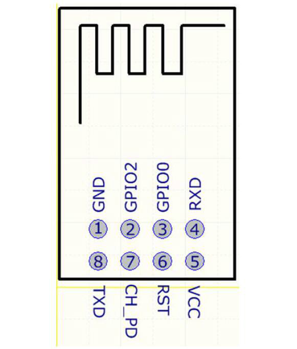

# 利用arduino给ESP8266 01S烧录程序

* https://blog.csdn.net/qq_30019617/article/details/109778468

* https://github.com/tzapu/WiFiManager

## 目标

* 实现ESP8266的wifi配置功能
* 实现ESP8266自动连接WiFi

都实现，下面的问题是
* 如何建立ESP8266的wifi服务的客户端
* 
* ESP8266的wifi服务的客户端接收到请求后，如何将信息传递给Arduino

## ESP8266





## ESP8266板子如何和Arduino板子

ESP8266驱动是板子驱动，不是传感器，其本身是一个单片机系统

ESP8266板子如何和Arduino板子协同工作

* ESP8266和Arduino板子之间串口通信

需要向ESP8266和Arduino板分别烧录代码，向ESP8266烧录代码需要USB-TTL模块（下载器）


注意:如果线路正常,则下图的ESP8266会先是蓝灯闪烁,然后红灯**闪亮**,表示进入wifi搜索模式

如果通电后,灯不亮,或者蓝灯以及红灯**一直亮等**,同时AT指令不生效,那么就要再次排查电路是否正确

##  ESP的WIFI热点

只要连接好VCC,GND和EN+10k上拉电阻,芯片就能产生芯片ID名的WIFI热点：ESP-A55C7D，可以链接和pingt通


`说明一下`: 上述搭建的环境是用来编译和烧录ESP8266-01S程序的。写好的程序只会借道arduino的串口线写进ESP8266中去运行，并不会写进arduino。这也就是为什么arduino和8266之间的串口是直接TX接TX，RX接RX的原因。

## 烧录步骤：

**步骤1**  按照表格提供的接线方式接通Arduino与ESP8266-01S之间的线路。

* 3.3V和GND的接线最好用面包板并联转接一下，方便后续操作。参考下图：红线和黑线分别是3.3V和GND。

 

 **步骤2** 用Arduino IDE编译写好的程序。可以是毫无意义的空程序。只要能编译通过就可以，现在只是讲烧录步骤，能烧录成功即可。

**步骤3**  `拔出`ESP8266-01S的`3.3V`和`IO0`在面包板上的接线。

**步骤4** 点Arduino IDE的上传按钮开始烧录。等待IDE提示连接开发板。

**步骤5** 提示出现`Connecting…`这样的提示时，先把`IO0`**插回**原位`GND`，再把`3.3V`插回原位`3.3V` 

**步骤6** 等待烧录完成，IDE会有烧录进度提示。

**步骤7**  烧录完成后再拔出IO0和3.3V。

**步骤8** 再将3.3V插回原位（3.3V）。切记**不要再插回**IO0了。

这么做的大致原因：
* IO0接地时启动ESP8266-01S，8266会进入下载模式，即可以接受烧录。
* IO0不接地时ESP82660-01S会进入正常工作模式，工作模式就不接受烧录。

而拔插3.3V相当于重启ESP8266-01S。所以,每次刷机都需要先拔出IO0和3.3V，然后先把IO0接地，再接通3.3V的供电。刷机完成后IO0空置，重启ESP8266-01S。


* 步骤5是关键，这样可以烧录成功，后面是 hardsetting via rst pin


### 烧录过程中可能遇到的问题：

* 如果arduino中本来就有串口读写的代码，有可能会导致烧录失败，所以烧录前先给arduino里写入一个没有串口读写的程序。
* 这种刷机方式的成功率不算高，要多尝试几次。

### 验证烧录成功

因为ESP8266-01S在正常工作模式下可以通过串口收发数据。所以,

* 可以烧录一段串口定时自动收发数据的小程序在ESP8266-01S和Arduino里面。

  * Serial Event example

* 然后将两者的TX接RX，RX接TX。

通过Arduino IDE的串口查看器查看串口输出就可以验证。IDE自带的案例里就有现成的代码。在loop里稍微改动一下就可以实现。

## 配网功能实现

使用`WiFiManager`库配网

安装 <WiFiManager.h>  包
```
#include <ESP8266WiFi.h>          
#include <DNSServer.h>
#include <ESP8266WebServer.h>
#include <WiFiManager.h>         
 
void setup() {
    Serial.begin(9600);       
    // 建立WiFiManager对象
    WiFiManager wifiManager;
    
    // 自动连接WiFi。以下语句的参数是连接ESP8266时的WiFi名称
    wifiManager.autoConnect("AutoConnectAP");
    
    // 如果您希望该WiFi添加密码，可以使用以下语句：
    // wifiManager.autoConnect("AutoConnectAP", "12345678");
    // 以上语句中的12345678是连接AutoConnectAP的密码
    
    // WiFi连接成功后将通过串口监视器输出连接成功信息 
    Serial.println(""); 
    Serial.print("ESP8266 Connected to ");
    Serial.println(WiFi.SSID());              // WiFi名称
    Serial.print("IP address:\t");
    Serial.println(WiFi.localIP());           // IP
}
 
void loop() {
  
}
 
```
编译上段代码并烧录进ESP8266-01S中。重启ESP8266 01S，使其进入工作模式。

* 电脑扫描WiFi，连接一个SSID叫AutoConnectAP的WIFI热点。

* 连接成功后会弹出配网的页面。如果没有自动弹出页面就在浏览器里访问192.168.4.1配置。

关于wifimanager库的更多操作请跳转去官方自行查阅。


在其中配置wifi热点，可以，让rsp8266连接到热点中

* 但是，esp8266的ip是0.0.0.0？？？？？？？？？？？？

电脑登陆tp-link检查ip是192.169.0.101，可以ping通


## 参考

http://www.taichi-maker.com/homepage/esp8266-nodemcu-iot/iot-c/esp8266-tips/wifimanager/