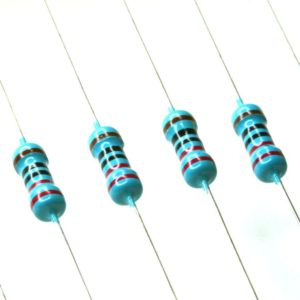

# PowerBox: 基于电子分压电压和电流感应电阻的电功率测量

电功率测量设备实时计算输出下列结果:

*	有效功率（W）、视在功率（VA）、功率因数、能源消耗(kWh)
*	电压均方根（V）、电流均方根（A）  

在测量基础上,进一步配置了继电器，可以控制电源的开关，实现用电控制。

## 交流电基本概念

在交流电路中，电压、电流和功率定义如下：

$v(t)=Vcos({\omega}t)$	 
$i(t)=Icos({\omega}t-\theta)$	 
$p(t)=v(t){\times}i(t)=VIcos({\omega}t)cos({\omega}t-\theta)$	 

当负载是纯电阻时候，电压和电流是同相的,当存在电感和电容负载时，电流电压不同相。

使用几个三角恒等式后，功率可以表示如下：

$p(t)={\frac{VI}{2}}cos({\theta})[1+cos(2{\omega}t)]+{\frac{VI}{2}}sin({\theta})sin(2{\omega}t)$	

有功功率$P$，是流向负载的能量。它是电力公司向家庭用户收费的部分。它可以表示为：

$P=V_{rms}I_{rms}cos({\theta})$
 
无功功率$Q$，是在电感和电容负载中来回流动的能量。总体上说，无功功率不被消耗。它可以表示为：

$Q=V_{rms}I_{rms}sin({\theta})$

两者合在一起，有功功率和无功功率构成复合功率。它是电力公司提供的实际功率。可以表示成：
 
$S=P+jQ$ 

复合功率的幅度称为视在功率$|S|$，单位为伏安($VA$)。
功率因数$PF$，是效率的量度，定义为：
 
$PF=cos({\theta})={\frac{P}{|S|}}$

## 电压和电流测量原理

电功率关键测量参数是：电压和电流。交流电的电压和电流测量方法很多，其中，基于霍尔电流传感器、电压传感器的测量方法是被使用广泛的一类方法。有成熟的商业集成电路（如Allegro MicroSystems的AS712等），可以直接得到电流，电压数据。

从学习角度出发，这里不使用基于霍尔电流传感器、电压传感器测量方法，使用简单电子元件-电阻为基础的测量方法：

1. **电压测量**： 用一组非常`大电阻`（如1MΩ）和一个相对很`小的电阻`（如1kΩ）串联在火线和零线之间，通过测量大电阻和小电阻连接点和零线之间的小电压，实现安全可靠的大电压间接测量

 

2. **电流测量**：在零线中插入一个非常小电阻值的`感应电阻`。流经小电阻的电流将在小电阻两端产生很小的电压差。通过测量这个小电压，应用欧姆定律计算通过零线的电流。

测量电路图如下：


* 所有测量信号经`光隔离`后进入单片机计算交流电数据

* 用接在火线上的`继电器`控制电源的接通和断开

## 电流测量

**电流感应电阻**: 电流测量需要的电流感应电阻，也称采样电阻（Sampling resistor）.

采样电阻是一个阻值较小的电阻，串联在电路中用于把电流转换为电压信号进行测量。


这里采用电阻0.2Ω，因此，该电流感应电阻的从压降计算电流的公式如下： 

$$I_{line}=\frac{V_{current-sense}}{_{current-sense}}=\frac{V_{current-sense}}{0.2Ω}$$

由于电阻非常小，很少的功率是被它消耗的。我们仔细校定它和其他电路元件的额定功率，该电阻的额定功率被确定为3W。

* 蚌埠市金盾电子有限公司立式模压精密低阻值线绕电阻器BWL系列取样电阻

## 电压测量

**分压电阻**: 计算分析降压电阻消耗的功率是0．03W（参见2.4.1.1），可使用普通的低功率(1/8W)电阻



220V交流电峰值电压310V，电压测量中使用的光耦可接受输入电压是-0.2V - +0.2V，需要分压比例为: 
                 
${\frac{0.2}{310}}{\approx}{\frac{1}{1500}}$

使用一个2MΩ的电阻和两个1kΩ的电阻串联，实现2002：1的降压(比1500：1比例更大，以提高系统安全性)，310V峰峰值被分降至0.109V峰峰值，降到光耦可以接受的信号电平范围内。
由分压器的电压计算交流电压的算式如下：

$V_{line}=2002V_{divider}$

电路接通时，在没有并联负载的情况下，流经2MΩ的电阻的电流是0.17mA，功率0.03W，分压电阻消耗的很小，对测量负载电流和功率的影响很低，可以保证测量结果的精度（1-2%）。

## 光耦

测量系统中的光耦起隔离交直流电压、放大和输入信号水平的作用。以光耦输出信号水平在ATMEGA328数模转换器范围（0~5V）内为选取依据，采用Avago公司HCPL-7520线性光耦。
电压、电流都经HCPL-7520光隔离，放大，方案安全性很高。


### 隔离、放大和偏置

Avago HCPL-7520线性光耦，有一个对应输入范围从-256mV到256mV的线性转换特性曲线。


不同的输入信号被芯片偏转$V_{ref}/2$，增益$V_{ref}/0.512$后输出。$V_{ref}$被设定到MCU的Vcc。从光耦的输出电压计算HCPL-7520输入电压的公式如下：

$V_{in}={\frac{0.512}{V_{ref}}}(V_{out}-{\frac{V_{ref}}{2}})$

将等式上式与分压器和电流感应的计算公式合，得从输入单片机的电压水平，计算电流、电压算式如下：

$$V_{line}=2002*0.512*{\frac{(V_{out,voltage}-\frac{V_{ref}}{2})}{{V_{ref}}}}$$
$$I_{line}=5*0.512*{\frac{(V_{out,voltage}-\frac{V_{ref}}{2})}{{V_{ref}}}}$$

### ADC采样

光耦输出的被测量电流、电压参数的信号电平分别被连接到ATMEGA328端口A.0和A.1。ATMEGA328模拟端口电压范围为`0~5V`，对应10位ADC转换，数字量范围是`0~1023`,因此，由单片机端口采集到的数据推算光耦输出信号电平的算式如下：

$V_{out.opt.ana}=5*{\frac{V_{out.opt.digital}}{1023}}$


### 电流和电压均方根和功率计算

每毫秒采集的电压和电流数据样本，计算平方，积累到1000个样本后求和。平方和除以1000开根号后就得到电流电压的均方根值。公式如下：

$V_{rms}= $

## 继电器

继电器有`电磁`和`固态`两大类。电磁继电器一般由电磁铁,衔铁,弹簧片，触点 等组成的，其工作电路由低压控制电路和高压工作电路两部分构成。固态继电器是具有隔离功能的无触点电子开关，在开关过程中无机械接触部件，因此固态继电器除具有与电磁继电器一样的功能外，还具有逻辑电路兼容，耐振耐机械冲击，安装位置无限制，具有良好的防潮防霉防腐蚀性能，在防爆和防止臭氧污染方面的性能也极佳，输入功率小，灵敏度高，控制功率小，电磁兼容性好，噪声低和工作频率高等特点。

因电磁继电器较大，这里使用较小的固态继电器：夏普S216S02。

光电隔离继电器额定为240 VAC和16A

我们在火线上使用此继电器开关。


## 显示
 
 单片机通常的显示方式有数码管和液晶。数码管亮度高，但是显示比较多数据需要很多管子，不太方便。本设计需要显示数据稍多，宜采用16X02字符显示能力的1602液晶屏。
 
 ## Powerbox实现
 
### 连接图

 

### 实例


### 建议修改的新连接方式


新连接方式的插头和接线板的线独立在板子两端更合理

2接线柱版本


3接线柱版本


## 焊接新电路板

焊接的新电路板

* 使用Arduino Pro Mini
* 220V到5V的电源用于给单片机供电

所有元件都焊接在一个万能板上


### 新电路板代码

* `PowerBox_power_mini.ino`

新电路板代码`不含`和上位机串口通讯的代码

### 电流和电压信号连接

* I -> A1
* U -> A0

### LCD连接

**问题** 原芯片代码执行时不显示：原因是原芯片代码中定义的LCD和Mini芯片不一致

**解决**：新电路板LCD的D4,D5,D6,D7和Pro Mini的连接和LCD库例程不一样

D4,D5,D6,D7连接的是P4,P5,P6,P7

新代码如下，解决显示问题

```c
const int rs = 12, en = 11, d4 = 4, d5 = 5, d6 =6, d7 = 7;
LiquidCrystal lcd(rs, en, d4, d5, d6, d7);
```
### 继电器连接

P3 -> Arduino Pro Mini P8

**问题**：新和原芯片中代码，测试中继电器都一直是断开的，P8为HIGH也不通

**原因**：继电器的P3焊脚松了，信号没有送到继电器，重新焊接，就好了。

### 电流和电压信号数据

* 电压正常

* 电流一直很小，是电路板焊接问题，没有接受到电流信号。
 
**解决**：对电流光耦输出信号到到单片机A1的对应管脚`加焊`。

**提示**：电路板焊接了不少针脚，用了较多`细线`，这样焊接及后期使用中容易出现线路接触不良、断开等问题，焊接时需要细心。
