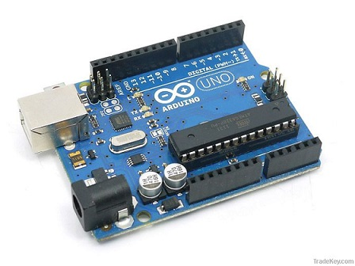
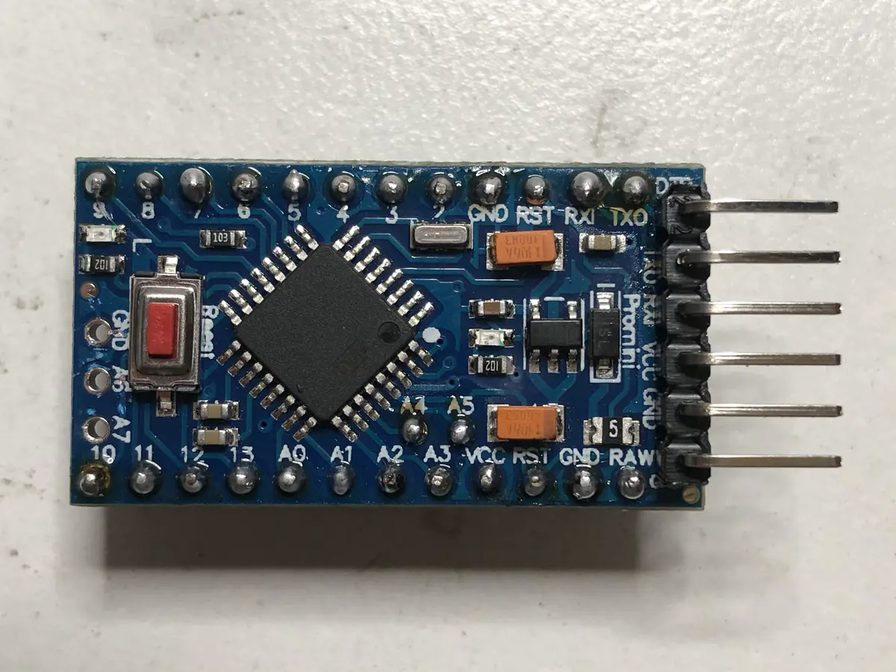
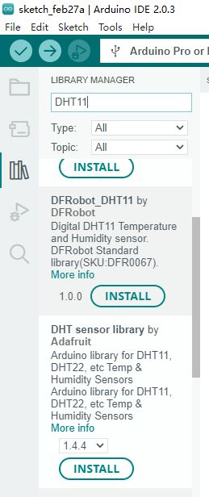
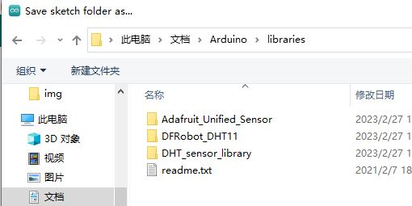
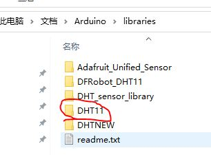

# Arduino实验室

## 开发版

Arduino有很多类型开发版，本实验室使用其中的2种：`Auduino Uno`和 `Arduino Pro Mini`

* Auduino Uno

* [Arduino Pro Mini](./ArduinoMiniPro初步.md)

## 1 Install the Arduino Software

### 1.1 IDE

安装新版:**IDE 2.***
* Windows https://www.arduino.cc/en/Guide/Windows

* Linux https://www.arduino.cc/en/Guide/Linux

### 1.2 安装软件库

* https://docs.arduino.cc/software/ide-v2/tutorials/ide-v2-installing-a-library

#### 1.2.1 安装在线库

#### 1.2.2 安装本地库

* Importing a .zip Library

* 拷贝库文件目录到IDE的库安装目录下，然后，重启动IDE

## 实验连线

实验使用Arduino Uno

使用连线将

1. 多个传感器放在一个面板上，
2. 多个传感器电源都连接到面包板的电源针排，Arduino通过电源针排，给传感器供电

这样多个传感器的供电连线简单

3. 各传感器的数据针，在使用时连接Arduino的响应针脚，不使用时间插入面包版的空针脚，避免连线混乱

## 实验

1. [LED](./Lab_LED.md)

2. [LM35](./Lab_LM35.md)

3. [DHT11实验](./Lab_DHT11.md)

4. [土壤湿度](./Lab_Soil_Moisture.md)

5.  超声 可能 传感器 坏了

* OneWire

* PID

## 参考

* https://arduinogetstarted.com/arduino-tutorials