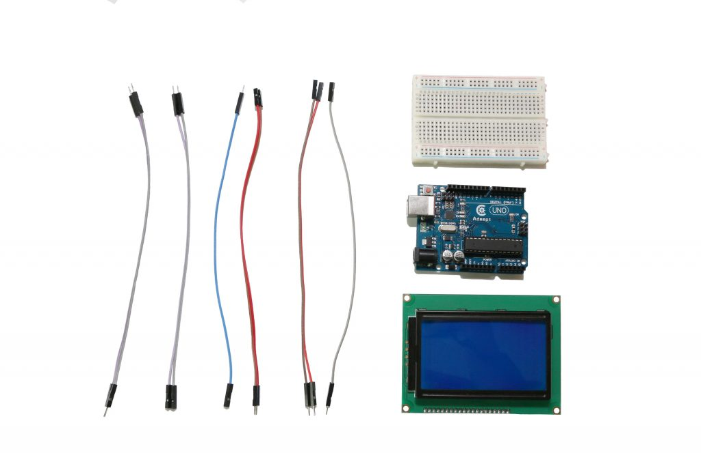
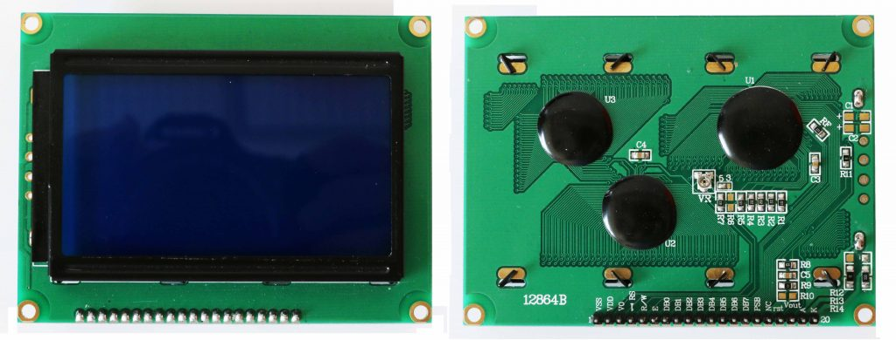
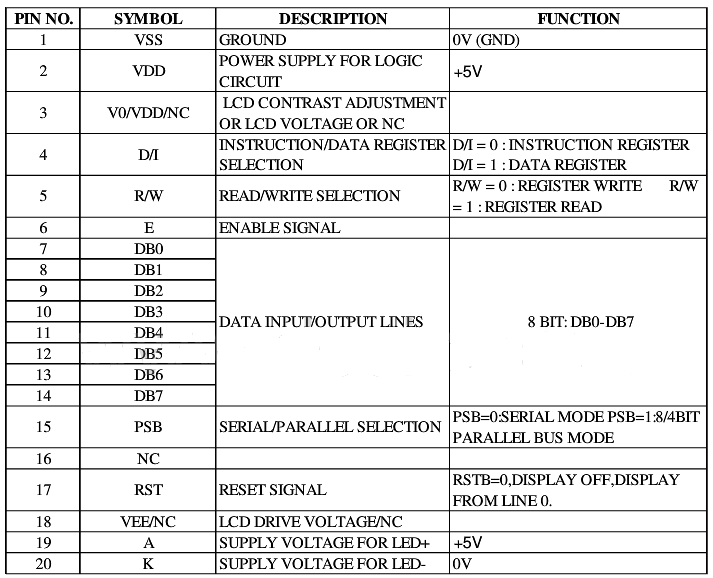
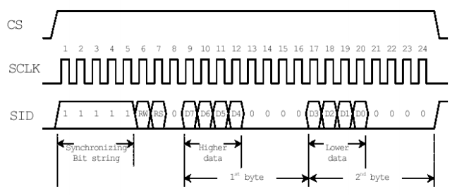
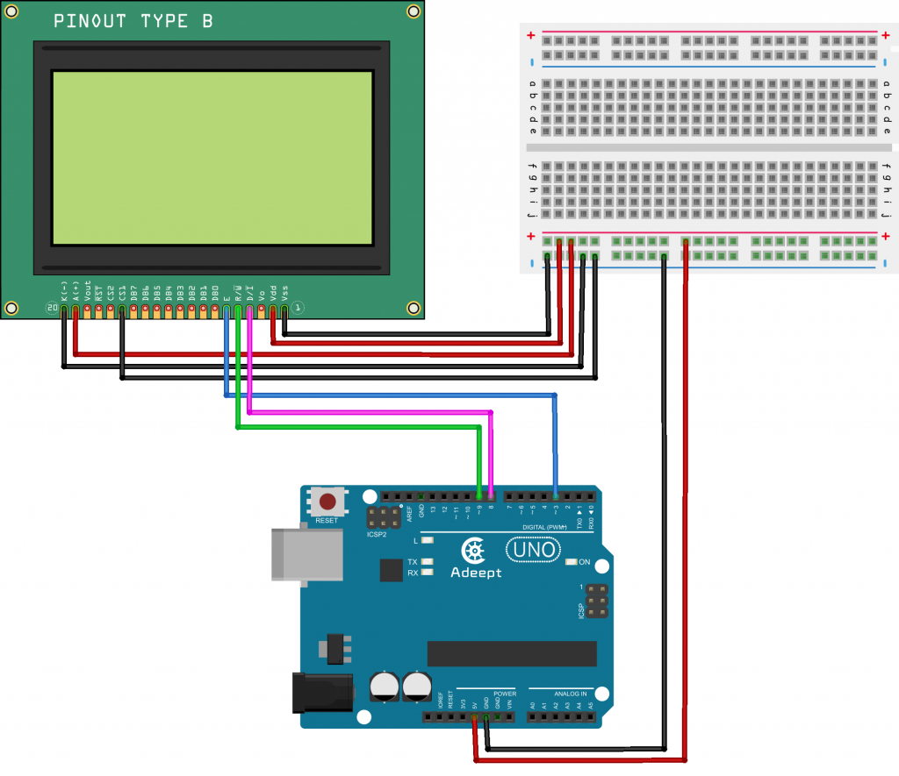
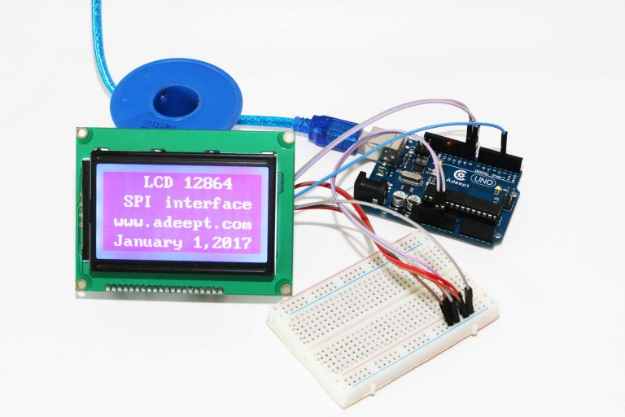
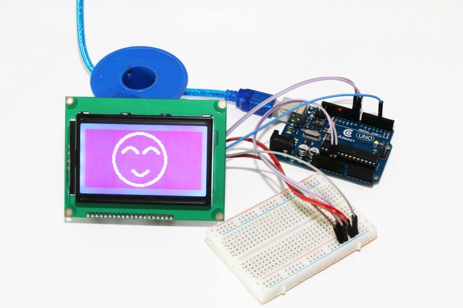

# LCD12864 SPI Communication For Arduino

128X64显示分辨率为128×64，内置8192个16*16点汉字，和128个16*8点ASCII字符集。利用该模块灵活的接口方式和简单、方便的操作指令。可以显示8×4行16×16点阵的汉字。也可完成图形显示。

* `实例可以显示中文，但是和代码的内容不一样，原因不明`

https://www.adeept.com/blog/tutorials/lcd12864-spi-communication-for-arduino.html

The number of  UNO or mega2560 IO above ports are limited. We often need a lot of IO resources when do some complex experiments. On a blog we use the LCD12864 parallel communication interface which  occupies a lot of IO resources. In order to save the UNO and mega2560 the IO resources, Adeept uses a SPI communication
We provide the AdeeptLCD12864RSPI library which is easy to control with the LCD12864.
Components

– 1 * Adeept UNO R3 Board
– 1 * LCD 12864 Module
– 1 * Breadboard
– 1 * USB Cable
– 2 * Male To Male Jumper Wires
– 8 * Male To Female Jumper Wires



## Experimental Principle 





SPI12864 SPI communication timing diagram



## Experimental Procedures

### Step 1: Build the circuit



## Step 2: Program  AdeeptLCD12864SPI.ino   Adeept_LCD12864RSPI Library

Adeept_LCD12864RSPI Library

https://www.adeept.com/blog/wp-content/uploads/2018/08/AdeeptLCD12864RSPI.zip

```c
/***********************************************************
File name:   AdeeptLCD12864SPI.ino
Website: www.adeept.com
E-mail: support@adeept.com
Author: Tom
Date: 2017/01/04
***********************************************************/
#include "AdeeptLCD12864RSPI.h"
#define AR_SIZE( a ) sizeof( a ) / sizeof( a[0] )

unsigned char show0[]="LCD 12864";         //Test the code
unsigned char show1[]="SPI interface";
unsigned char show2[]=" www.adeept.com";
unsigned char show3[]=" January 1,2017";
unsigned char logo0[]={
      0x00,0x00,0x00,0x00,0x00,0x00,0x00,0x00,
      0x00,0x00,0x00,0x00,0x00,0x00,0x00,0x00,
      0x00,0x00,0x00,0x00,0x00,0x00,0x00,0x00,
      0x00,0x00,0x00,0x00,0x00,0x00,0x00,0x00,
      0x00,0x00,0x00,0x00,0x00,0x00,0x01,0xFF,
      0x80,0x00,0x00,0x00,0x00,0x00,0x00,0x00,
      0x00,0x00,0x00,0x00,0x00,0x00,0x1F,0xFF,
      0xF8,0x00,0x00,0x00,0x00,0x00,0x00,0x00,
      0x00,0x00,0x00,0x00,0x00,0x00,0xFF,0xFF,
      0xFF,0x00,0x00,0x00,0x00,0x00,0x00,0x00,
      0x00,0x00,0x00,0x00,0x00,0x03,0xFE,0x00,
      0x7F,0xC0,0x00,0x00,0x00,0x00,0x00,0x00,
      0x00,0x00,0x00,0x00,0x00,0x0F,0xF0,0x00,
      0x0F,0xF0,0x00,0x00,0x00,0x00,0x00,0x00,
      0x00,0x00,0x00,0x00,0x00,0x1F,0x80,0x00,
      0x01,0xF8,0x00,0x00,0x00,0x00,0x00,0x00,
      0x00,0x00,0x00,0x00,0x00,0x3E,0x00,0x00,
      0x00,0x7C,0x00,0x00,0x00,0x00,0x00,0x00,
      0x00,0x00,0x00,0x00,0x00,0xF8,0x00,0x00,
      0x00,0x1F,0x00,0x00,0x00,0x00,0x00,0x00,
      0x00,0x00,0x00,0x00,0x01,0xF0,0x00,0x00,
      0x00,0x0F,0x80,0x00,0x00,0x00,0x00,0x00,
      0x00,0x00,0x00,0x00,0x03,0xE0,0x00,0x00,
      0x00,0x07,0xC0,0x00,0x00,0x00,0x00,0x00,
      0x00,0x00,0x00,0x00,0x07,0xC0,0x00,0x00,
      0x00,0x01,0xE0,0x00,0x00,0x00,0x00,0x00,
      0x00,0x00,0x00,0x00,0x07,0x80,0x00,0x00,
      0x00,0x00,0xE0,0x00,0x00,0x00,0x00,0x00,
      0x00,0x00,0x00,0x00,0x0F,0x00,0x00,0x00,
      0x00,0x00,0xF0,0x00,0x00,0x00,0x00,0x00,
      0x00,0x00,0x00,0x00,0x1E,0x00,0x00,0x00,
      0x00,0x00,0x78,0x00,0x00,0x00,0x00,0x00,
      0x00,0x00,0x00,0x00,0x3C,0x00,0x00,0x00,
      0x00,0x00,0x3C,0x00,0x00,0x00,0x00,0x00,
      0x00,0x00,0x00,0x00,0x38,0x00,0x40,0x00,
      0x00,0x80,0x1C,0x00,0x00,0x00,0x00,0x00,
      0x00,0x00,0x00,0x00,0x78,0x03,0xF8,0x00,
      0x07,0xF0,0x1E,0x00,0x00,0x00,0x00,0x00,
      0x00,0x00,0x00,0x00,0x70,0x07,0xFE,0x00,
      0x0F,0xFC,0x0E,0x00,0x00,0x00,0x00,0x00,
      0x00,0x00,0x00,0x00,0xF0,0x1F,0xBF,0x00,
      0x3F,0x7E,0x0F,0x00,0x00,0x00,0x00,0x00,
      0x00,0x00,0x00,0x00,0xE0,0x3E,0x0F,0x80,
      0x7C,0x1F,0x07,0x00,0x00,0x00,0x00,0x00,
      0x00,0x00,0x00,0x00,0xE0,0x7C,0x07,0xC0,
      0xF8,0x0F,0x87,0x00,0x00,0x00,0x00,0x00,
      0x00,0x00,0x00,0x01,0xE0,0xF8,0x01,0xE1,
      0xF0,0x03,0xC3,0x80,0x00,0x00,0x00,0x00,
      0x00,0x00,0x00,0x01,0xC0,0xF0,0x01,0xE1,
      0xE0,0x03,0xC3,0x80,0x00,0x00,0x00,0x00,
      0x00,0x00,0x00,0x01,0xC0,0xE0,0x00,0xE1,
      0xC0,0x01,0xC3,0x80,0x00,0x00,0x00,0x00,
      0x00,0x00,0x00,0x01,0xC0,0x00,0x00,0x00,
      0x00,0x00,0x03,0x80,0x00,0x00,0x00,0x00,
      0x00,0x00,0x00,0x03,0x80,0x00,0x00,0x00,
      0x00,0x00,0x01,0xC0,0x00,0x00,0x00,0x00,
      0x00,0x00,0x00,0x03,0x80,0x00,0x00,0x00,
      0x00,0x00,0x01,0xC0,0x00,0x00,0x00,0x00,
      0x00,0x00,0x00,0x03,0x80,0x00,0x00,0x00,
      0x00,0x00,0x01,0xC0,0x00,0x00,0x00,0x00,
      0x00,0x00,0x00,0x03,0x80,0x00,0x00,0x00,
      0x00,0x00,0x01,0xC0,0x00,0x00,0x00,0x00,
      0x00,0x00,0x00,0x03,0x80,0x00,0x00,0x00,
      0x00,0x00,0x01,0xC0,0x00,0x00,0x00,0x00,
      0x00,0x00,0x00,0x03,0x80,0x00,0x00,0x00,
      0x00,0x00,0x01,0xC0,0x00,0x00,0x00,0x00,
      0x00,0x00,0x00,0x03,0x80,0x00,0x00,0x00,
      0x00,0x00,0x01,0xC0,0x00,0x00,0x00,0x00,
      0x00,0x00,0x00,0x03,0x80,0x00,0x00,0x00,
      0x00,0x00,0x01,0xC0,0x00,0x00,0x00,0x00,
      0x00,0x00,0x00,0x03,0x80,0x00,0x00,0x00,
      0x00,0x00,0x01,0xC0,0x00,0x00,0x00,0x00,
      0x00,0x00,0x00,0x03,0x80,0x00,0x00,0x00,
      0x00,0x00,0x01,0xC0,0x00,0x00,0x00,0x00,
      0x00,0x00,0x00,0x01,0xC0,0x00,0x00,0x00,
      0x00,0x00,0x01,0x80,0x00,0x00,0x00,0x00,
      0x00,0x00,0x00,0x01,0xC0,0x00,0x00,0x00,
      0x00,0x00,0x03,0x80,0x00,0x00,0x00,0x00,
      0x00,0x00,0x00,0x01,0xC0,0x00,0x00,0x00,
      0x00,0x00,0x03,0x80,0x00,0x00,0x00,0x00,
      0x00,0x00,0x00,0x01,0xE0,0x00,0x00,0x00,
      0x00,0x00,0x03,0x80,0x00,0x00,0x00,0x00,
      0x00,0x00,0x00,0x00,0xE0,0x00,0x00,0x00,
      0x00,0x00,0x07,0x00,0x00,0x00,0x00,0x00,
      0x00,0x00,0x00,0x00,0xE0,0x00,0x00,0x00,
      0x00,0x00,0x07,0x00,0x00,0x00,0x00,0x00,
      0x00,0x00,0x00,0x00,0xF0,0x00,0x0C,0x00,
      0x0C,0x00,0x0F,0x00,0x00,0x00,0x00,0x00,
      0x00,0x00,0x00,0x00,0x70,0x00,0x1E,0x00,
      0x1E,0x00,0x0E,0x00,0x00,0x00,0x00,0x00,
      0x00,0x00,0x00,0x00,0x78,0x00,0x1F,0x00,
      0x3E,0x00,0x1E,0x00,0x00,0x00,0x00,0x00,
      0x00,0x00,0x00,0x00,0x38,0x00,0x07,0x80,
      0xF8,0x00,0x1C,0x00,0x00,0x00,0x00,0x00,
      0x00,0x00,0x00,0x00,0x3C,0x00,0x03,0xE1,
      0xF0,0x00,0x3C,0x00,0x00,0x00,0x00,0x00,
      0x00,0x00,0x00,0x00,0x1E,0x00,0x01,0xFF,
      0xE0,0x00,0x78,0x00,0x00,0x00,0x00,0x00,
      0x00,0x00,0x00,0x00,0x0F,0x00,0x00,0xFF,
      0x80,0x00,0xF0,0x00,0x00,0x00,0x00,0x00,
      0x00,0x00,0x00,0x00,0x07,0x00,0x00,0x3F,
      0x00,0x00,0xF0,0x00,0x00,0x00,0x00,0x00,
      0x00,0x00,0x00,0x00,0x07,0x80,0x00,0x00,
      0x00,0x01,0xE0,0x00,0x00,0x00,0x00,0x00,
      0x00,0x00,0x00,0x00,0x03,0xE0,0x00,0x00,
      0x00,0x07,0xC0,0x00,0x00,0x00,0x00,0x00,
      0x00,0x00,0x00,0x00,0x01,0xF0,0x00,0x00,
      0x00,0x0F,0x80,0x00,0x00,0x00,0x00,0x00,
      0x00,0x00,0x00,0x00,0x00,0xF8,0x00,0x00,
      0x00,0x1F,0x00,0x00,0x00,0x00,0x00,0x00,
      0x00,0x00,0x00,0x00,0x00,0x3E,0x00,0x00,
      0x00,0x7E,0x00,0x00,0x00,0x00,0x00,0x00,
      0x00,0x00,0x00,0x00,0x00,0x1F,0x80,0x00,
      0x01,0xF8,0x00,0x00,0x00,0x00,0x00,0x00,
      0x00,0x00,0x00,0x00,0x00,0x0F,0xE0,0x00,
      0x07,0xF0,0x00,0x00,0x00,0x00,0x00,0x00,
      0x00,0x00,0x00,0x00,0x00,0x03,0xFE,0x00,
      0x3F,0xC0,0x00,0x00,0x00,0x00,0x00,0x00,
      0x00,0x00,0x00,0x00,0x00,0x00,0xFF,0xFF,
      0xFF,0x00,0x00,0x00,0x00,0x00,0x00,0x00,
      0x00,0x00,0x00,0x00,0x00,0x00,0x1F,0xFF,
      0xF8,0x00,0x00,0x00,0x00,0x00,0x00,0x00,
      0x00,0x00,0x00,0x00,0x00,0x00,0x01,0xFF,
      0x80,0x00,0x00,0x00,0x00,0x00,0x00,0x00,
      0x00,0x00,0x00,0x00,0x00,0x00,0x00,0x00,
      0x00,0x00,0x00,0x00,0x00,0x00,0x00,0x00,
      0x00,0x00,0x00,0x00,0x00,0x00,0x00,0x00,
      0x00,0x00,0x00,0x00,0x00,0x00,0x00,0x00
};

void setup()
{
LCDA.Initialise(); // The screen is initialized
delay(100);
}

void loop()
{
LCDA.CLEAR();//Clear screen
delay(100);
LCDA.DisplayString(0,2,show0,AR_SIZE(show0));//The first line of the third grid starts, showing
delay(100);
LCDA.DisplayString(1,1,show1,AR_SIZE(show1));//The first line of the second line starts, display
delay(100);
LCDA.DisplayString(2,0,show2,AR_SIZE(show2));//The third line of the first grid, display text
delay(100);
LCDA.DisplayString(3,0,show3,AR_SIZE(show3));//The third line of the first grid, display text
delay(5000);
LCDA.CLEAR();//Clear screen
delay(100);
LCDA.DrawFullScreen(logo0);
delay(5000);
}
```

### Step 3: Compile and download the sketch to the UNO R3 board.





## Temperature and humidity displayed on the LCD12864

* https://www.adeept.com/blog/projects/temperature-and-humidity-displayed-on-the-lcd12864.html

```c
/***********************************************************
DHT11 Sensor with   LCD 12864 
  DFRobot_DHT11.h
  AdeeptLCD12864RSPI.h
***********************************************************/

#include <DFRobot_DHT11.h>
DFRobot_DHT11 DHT;
#define DHT11_PIN 7

#include "AdeeptLCD12864RSPI.h"
#define AR_SIZE(a) sizeof(a) / sizeof(a[0])

unsigned char show0[] = "DHT11 sensor";  //Test the code
unsigned char show1[] = "Humi:       %";
unsigned char show2[] = "Temp:       C";
unsigned char show3[] = " Cheng Maohua";

void setup() {

  Serial.begin(9600);
  LCDA.Initialise();  // The screen is initialized
  delay(100);
  // LCDA.CLEAR();//Clear screen
  delay(100);
  LCDA.DisplayString(0, 1, show0, AR_SIZE(show0));  //Display: DHT11 sensor
  delay(100);
  LCDA.DisplayString(1, 1, show1, AR_SIZE(show1));  //Display: Humi:     %
  delay(100);
  LCDA.DisplayString(2, 1, show2, AR_SIZE(show2));  //Display: Temp:     C
  delay(100);
  LCDA.DisplayString(3, 1, show3, AR_SIZE(show3));  //Display: www.adeept.com
}

void loop() {
  char strhumidity[5];
  char strTemperature[5];

  DHT.read(DHT11_PIN);
  Serial.print("temp:");
  Serial.print(DHT.temperature);
  Serial.print("  humi:");
  Serial.println(DHT.humidity);
  dtostrf(DHT.temperature, 5, 2, strTemperature);                //Converts a floating-point number to a string
  LCDA.DisplayString(1, 4, (unsigned char *)strTemperature, 6);  //Display humidity data
  dtostrf(DHT.humidity, 5, 2, strhumidity);                      //Converts a floating-point number to a string
  LCDA.DisplayString(2, 4, (unsigned char *)strhumidity, 6);     //Display humidity data
  delay(1000);
}
```

## 问题12864ZW不能调对比度

`电位器连接连接VO，但是，不能调对比度？`

-  原因是：12864ZW屏在硬件上做死的，没有驱动芯片的电路，是不好调整的

现在的屏型号是：12864ZW,

 * 128x64 with controller ST7920, (model 12864ZW).

 * https://forum.arduino.cc/t/lcd-128x64-st7920-using-u8glib/130825/9


* 原因：看其PCB板，
I can see why the contrast adjustment doesn't work. The `Vo` pin is not connected on your board because jumper `J1` is open (same as on mine), 

but unlike my board, yours does not have the 10K pot - although the pads have been tinned as though it should have been fitted.
Similarly, the Vout pin is not connected - it goes to the resistor at position R12, which is not fitted.

The best suggestion I have is to source a pot of the correct size to fit at VR1, and remove the 0 ohm resistor R6 which is shorting it out.
The pot on my board has a resistance of 18K end to end but is set at 2K. So a 10K pot (which is what the ST7920 datasheet shows) would be fine.