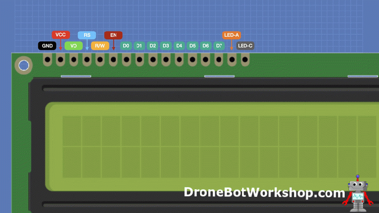
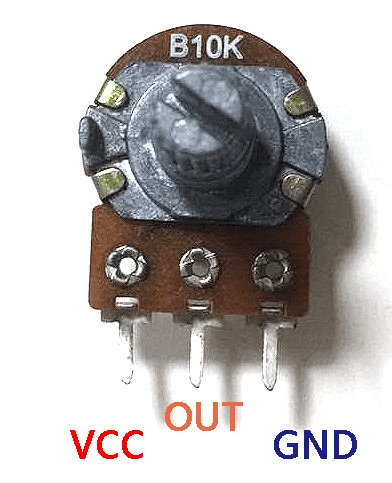
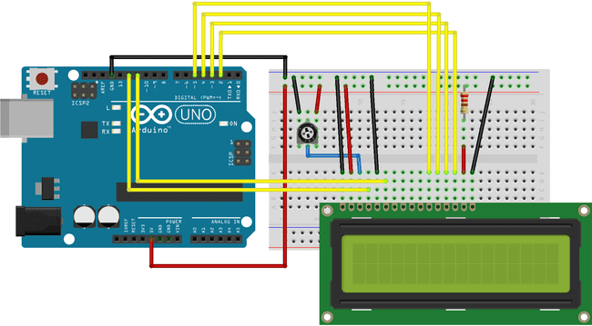
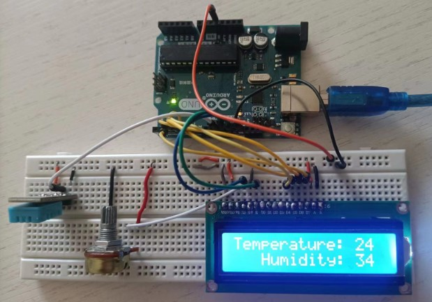

# LCD1602A综合示例

使用LCD1602A显示温湿度

## 元件

* LCD 1602A
* DHT11
* 电位器/电阻

## LCD 1602A

LCD模块种类超多，大小通常以“行数x字符”数来表示，比如2x16，2x8,4x20等等。

大部分LCD模块都是由背光+液晶模块组成，利用Arduino驱动也很方便。

接口方式有很多种：4位或者8位并行，3-wire，串口，I2C和SPI，LCD模块的价格也跟接口的难易程度成反比，也就是说采用4位或者8位并行的是最便宜的

市面上比较便宜的基本采用Hitachi HD44780芯片(或者兼容)方案，从外观上看，板上有16个针脚的就是这类LCD，16个pin有些是一排的，有些是双排的。
国产HJ1602A是一种工业字符型液晶蓝色2x16的点阵LCD，采用4位并行接口，能够同时显示16x2即32个字符。（ 16列2行）：
* 显示内容为2行，每行显示16个字符，每个字符大小为5×8点阵。

下面是16个针脚对应的Arduino的针脚以及它们的作用：



| 编号 | 名称	  | 说明      |
|------|--------|-----------|
|  1	 | Vss	   | 接地 (0V)  |
|  2	 | Vdd	   | 电源 (+5V) |
|  3	 | VO     | 显示对比度控制|
|  4	 | RS	   | Register Select 寄存器选择 |   
|  5	 | RW	   | Read/Write mode允许寄存器写入| 
|  6   |	E	     | Enable/Disable LCD |
|  7	 | D0	   |  Bit 0 LSB |
|  8	 | D1	   |  Bit 1     |
|  9	 | D2	   |  Bit 2     |
|  10	 | D3     |	Bit 3     |
|  11	 | D4	   |  Bit 4     |
|  12	 | D5	   |	Bit 5     |
|  13	 | D6	   |	Bit 6     |
|  14	 | D7	   |	Bit 7 MSB |
|  15	 |	A	     |	背光(电源正极) |
|  16	 | K	     |	背光(GND)      |

* RS:  1: D0 – D7 当做资料解释 ; 0: D0 – D7 当做指令解
* VO/Contrast ： 显示对比度控制，接地表示最大对比度,可以不用电位器，使用一个适当电阻值的电阻
* RW: 1:从 LCD 读取资料;   0: 写资料到 LCD 

## 电位器Potentiometer



## LCD1602A连接Arduino

| 1602A     | Arduino  |
|-----------|----------|
| RS        |  12      |
| E/enable  |  11      | 
| D4        |   5      |
| D5        |   4      |
| D6        |   3      |
| D7        |   2      |
| R/W       | GND      |
| VSS(GND)  | GND      |
| VCC       | +5V      |
| VO        | potentiometer out |
| A         | 1K -> +5V  |
| K         | GND  |

* 背光正`A`连接10k电阻会减低背光，可以不用电阻，使用最大背光



* https://docs.arduino.cc/learn/electronics/lcd-displays/

## DHT11温湿度传感器


传感器驱动：DFRobot的DHT11库

DHT11和Arduino连线

| DHT11  | Arduino |
|--------|---------|
| GND    |  GND    |
| VCC    |  +5V    | 
| Out    |  Pin 10 |


##  温湿度显示在LCD 1602A上代码

```c
/*
LCD1602A + DHT11
   based on
      1. DFRobot DHT11
      2. Arduino Examples:LiquidCrystal LCD1602A
*/

#include <DFRobot_DHT11.h>
DFRobot_DHT11 DHT;
#define DHT11_PIN 10

#include <LiquidCrystal.h>
const int rs = 12, en = 11, d4 = 5, d5 = 4, d6 = 3, d7 = 2;
LiquidCrystal lcd(rs, en, d4, d5, d6, d7);

void setup(){
  Serial.begin(9600);
  lcd.begin(16, 2);
  lcd.print("Welcome to ");
  lcd.setCursor(0,1);    
  lcd.print(" Arduino World!");
  delay(2000);
}

void loop(){
  DHT.read(DHT11_PIN);
  Serial.print("temp:");
  Serial.print(DHT.temperature);
  Serial.print("  humi:");
  Serial.println(DHT.humidity);
  lcd.clear();
  lcd.setCursor(0,0); 
  lcd.print("Temperature: ");
  lcd.print(DHT.temperature);
  lcd.setCursor(3,1); 
  lcd.print("Humidity: ");
  lcd.print(DHT.humidity);
  delay(1000);
}
```



## Reference

* https://dronebotworkshop.com/ir-remotes/

